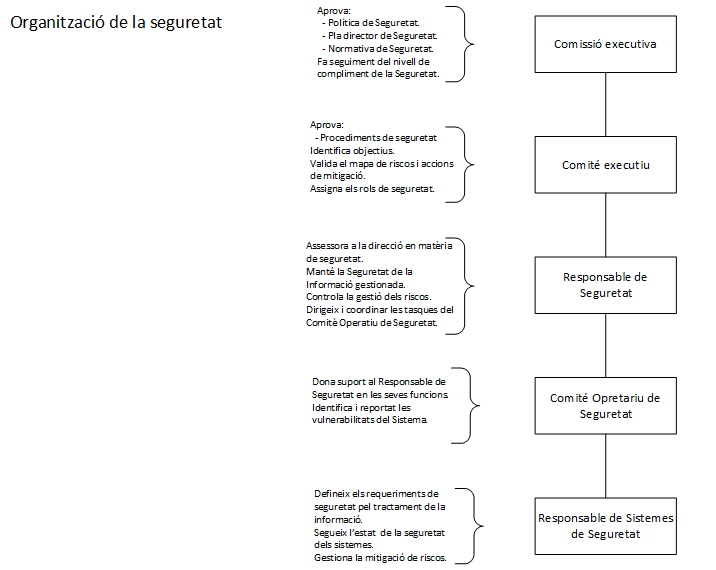

Seguretat : Organització de la seguretat  

1.  [Seguretat](index.md)
2.  [Pàgina d'inici de la Unitat de Seguretat](15368362.md)
3.  [Arquitectura de Seguretat](Arquitectura-de-Seguretat_24216213.md)

Seguretat : Organització de la seguretat
========================================

Created by Ivan Caballero, last modified on 25 septiembre 2019

La estructura organitzativa de seguretat té la finalitat de coordinar i aprovar tots els aspectes relacionats amb la Seguretat de la Informació, gestionats o supervisats pel Consorci AOC així com tot el personal implicat o que faci ús dels mateixos.

Resumidament, l’ estructura organitzativa de seguretat del Consorci AOC és la següent:

  

  

_Font de la imatge: \\\\endreca\\seguretat\\PLA DIRECTOR DE SEGURETAT\\ENS\\\[OP.PL.2\] ARQUITECTURA DE SEGURIDAD\\Diagrama arquitectura seguretat.vsdx_

La descripció detallada de la estructura organitzativa de seguretat del Consorci AOC esta a la Política de Seguretat en vigor: [Política de Seguretat a la Intranet](https://intranet.aoc.cat/pages/viewpage.action?pageId=65753)

Attachments:
------------

 [image2019-9-25\_14-27-7.png](attachments/28704890/64981491.png) (image/png)  
 [image2019-9-25\_14-27-7.png](attachments/28704890/28704892.png) (image/png)  

Document generated by Confluence on 07 junio 2025 00:08

[Atlassian](http://www.atlassian.com/)