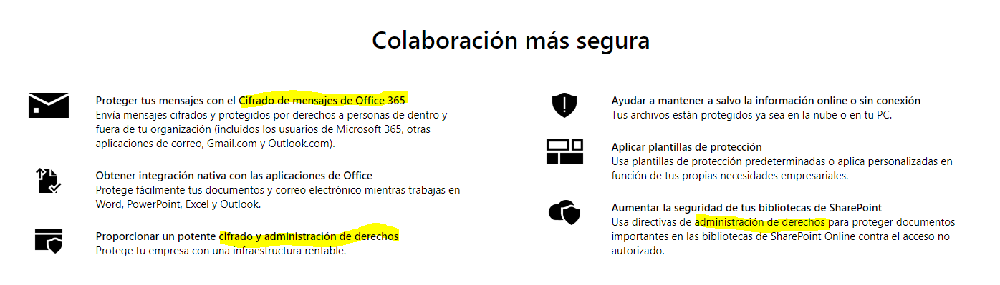
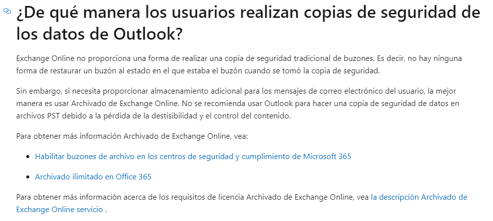
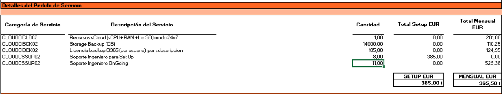
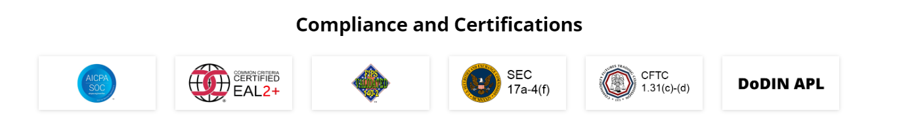
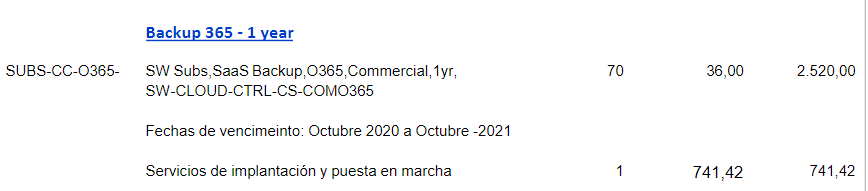
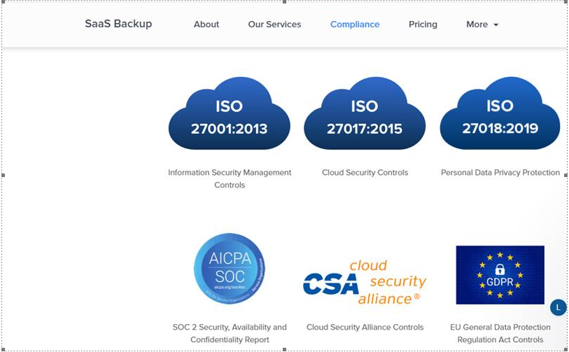

Seguretat : Comparació de solucions de Backup d'Office 365  

1.  [Seguretat](index.md)
2.  [Pàgina d'inici de la Unitat de Seguretat](15368362.md)
3.  [Projectes Unitat de Seguretat](Projectes-Unitat-de-Seguretat_41517821.md)
4.  [Backup d'Office 365](64979561.md)

Seguretat : Comparació de solucions de Backup d'Office 365
==========================================================

Created by Ivan Caballero, last modified on 19 enero 2022

  

Motivació
---------

L'Office 365 no incorpora una solució de backup. La protecció d'informació que ofereix està encaminada a la encriptació, al control d'accés i a la compartició.

  

Font: [https://www.microsoft.com/es-es/microsoft-365/business/azure-information-protection-for-microsoft-365?activetab=pivot%3aoverviewtab](https://www.microsoft.com/es-es/microsoft-365/business/azure-information-protection-for-microsoft-365?activetab=pivot%3aoverviewtab)

  

Microsoft avisa de que no ofereix còpies de seguretat o són molt bàsiques: 

  

  

Proposta Mediacloud (Commvault)
-------------------------------

[https://blog.mdcloud.es/las-tres-caracteristicas-clave-del-servicio-backup-para-office-365/](https://blog.mdcloud.es/las-tres-caracteristicas-clave-del-servicio-backup-para-office-365/)

La solució Comvault amb l'emmagatzemament en mediacloud està certificat en nivell ALT.

  

  

Proposta de ncora (Cohesity)
----------------------------

Cohesity: [https://ncora.com/webinar-backup-ms365-con-cohesity/](https://ncora.com/webinar-backup-ms365-con-cohesity/)

*   Molt granural
*   El backups són sempre incrementals
*   Pot fer backup de tot tipus d'entorns, Azure, on-premise, màquines virtuals, etc.
*   Immutable (protecció ransomware)

  

### Certificacions de seguretat de Cohesity.

*   No hi ha cap referència a RGDP. No indica que es pugui escollir la ubucació de les dades.
*   Té el certificat Common Criteria EAL2

Proposta de idgrup (NetApp)
---------------------------

[PRE-058419 - Backup 365 - NetApp SaaS.pdf](attachments/41519319/41519322.pdf)

[IDB\_PRESUPUESTOS.365-presu.pdf](attachments/41519319/41519321.pdf)

  

  

  

Certificacions de seguretat
---------------------------

[https://cloud.netapp.com/saas-backup](https://cloud.netapp.com/saas-backup)

  

  

Xifrat de dades.
----------------

Xifrat en trànsit amb TLS i xifrat en repòs.

La clau de xifrat en principi és d'ells (per acabar de confirmar):

[https://us.saasbackup.netapp.com/resources/trustcenter?hsCtaTracking=751d1cfb-2f6f-474c-859a-6404c6fa9cd1%7C66942063-339e-4242-925c-0c0619b02c73](https://us.saasbackup.netapp.com/resources/trustcenter?hsCtaTracking=751d1cfb-2f6f-474c-859a-6404c6fa9cd1%7C66942063-339e-4242-925c-0c0619b02c73)

_Data Encryption_

_For customer backup data in transit, NetApp SaaS Backup uses Transport Layer Security (TLS) for communication between the vendor's SaaS Service to NetApp SaaS Backup Service when backing up data. The backup data of our customers at rest is stored in the target destination and encrypted using AES 256 encryption algorithm._

GDPR
----

### Ubicació de dades

Es pot escollir. Es fa en Storage S3 de Amazon en DataCenters europeus.

Puedes verlo aquí en el punto 2 y 2.2 : [https://www.netapp.com/us/media/wp-7306.pdf](https://www.netapp.com/us/media/wp-7306.pdf)

### Purga de datos

Podemos guardar los datos de los usuarios eliminados o podemos purgarlos.

Los usuarios eliminados no ocupan subscripción, aunque guardemos sus datos.

  

  

Se pueden recuperar copias de fechas de concretas. Ilimitadas ya que no borrar ningún incremental.

  

Proposta de Gigas (Veeam)
-------------------------

Solució Gigas´La empresa té la certificación del ENS en nivell MIG per "Soporte Técnico, Administración de Sistemas, Desarrollo".

[https://gigas.com/g-backup-form.html](https://gigas.com/g-backup-form.html)

La empresa ens ha asegurat que la seva sol·lució de backup en el seu CPD està certificat en un nivell MIG i la ISO27001.

El cost anual per 75 usuari i 3TB es de 5000 euros/any: (\\\\endreca\\TECNOLOGIA\\CONTRACTACIO\\2021\\AOC-2021-xx Backup Office 365)

L'oferta inclou:

*   105 llicències, 3,2 TBytes d'espai per a backups (dades origen)
*   Suport
*   Espai addicional 25€/TB/mes menys el 30% de descomte

Propostes econòmiques
---------------------

  

  

  

Attachments:
------------

 [image2020-10-9\_11-5-35.png](attachments/41519319/41519320.png) (image/png)  
 [IDB\_PRESUPUESTOS.365-presu.pdf](attachments/41519319/41519321.pdf) (application/pdf)  
 [PRE-058419 - Backup 365 - NetApp SaaS.pdf](attachments/41519319/41519322.pdf) (application/pdf)  
 [image2021-2-2\_15-39-3.png](attachments/41519319/41520722.png) (image/png)  
 [image2021-5-27\_9-31-28.png](attachments/41519319/41523398.png) (image/png)  
 [image2021-5-27\_9-39-59.png](attachments/41519319/41523399.png) (image/png)  
 [image2021-10-14\_12-51-20.png](attachments/41519319/61931874.png) (image/png)  
 [image2021-10-14\_13-7-10.png](attachments/41519319/61931876.png) (image/png)  
 [g-backup.pdf](attachments/41519319/61931877.pdf) (application/pdf)  
 [Oferta 1 año de permanencia (Pago Mensual)\_Consorci Administració Oberta de Catalunya\_22-10-2021\_gigas.pdf](attachments/41519319/64978947.pdf) (application/pdf)  
 [image2021-11-1\_8-24-15.png](attachments/41519319/64979055.png) (image/png)  

Document generated by Confluence on 07 junio 2025 00:08

[Atlassian](http://www.atlassian.com/)