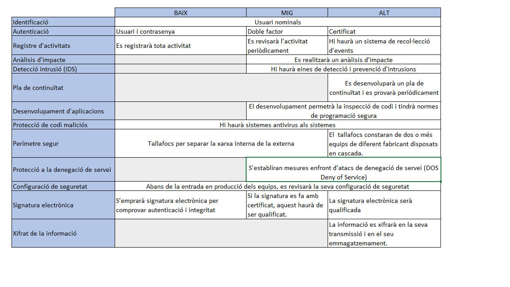

Seguretat : Taules d'aplicabilitat i mesures segons nivells  

1.  [Seguretat](index.md)
2.  [Pàgina d'inici de la Unitat de Seguretat](15368362.md)
3.  [Valoració de serveis i mesures de seguretat](41519900.md)

Seguretat : Taules d'aplicabilitat i mesures segons nivells
===========================================================

Created by Ivan Caballero, last modified on 15 diciembre 2020

  

  

IMPORTANT: Abast del document

Aquest document és un **resum** de les mesures més tècniques del ENS i CESICAT.

La totalitat de les mesures estan a:

 [Mesures complertes de seguretat segons valoració](41519898.md)

Aplicabilitat de mesures

Les mesures són acumulatives, i per tant els serveis de nivell mig han de complir les mesures de nivell baix i mig, i els serveis de nivell alt, han de complir les mesures de nivell baix, mig i alt

Resum en mode taula
-------------------

Mesures de seguretat per sistemes de nivell baix
------------------------------------------------

Id

Mesura

Descripció

op.acc.1

Identificació

Cada entitat (usuari o procés) que accedeix al sistema tindrà un identificador singular de manera que es pugui saber qui el rep, quins drets té, que ha fet i quan. No podrà haver usuaris genèrics.

op.acc.5

Mecanismes d'autenticació

L'autenticació podrà ser amb usuari i contrasenya. La contrasenya tindrà regles bàsiques de qualitat (longitud mínima, caducitat, etc.)

op.exp.8

Registre de l'activitat dels usuaris

Per sistemes de nivell baix en Traçabilitat.

Es registrarà l’activitat dels usuaris en el sistema. El registre indicarà:

*   Qui realitza l’activitat, quan i sobre quina informació, inclòs els operadores i administradors quan accedeixin a la configuració.
*   Les activitats realitzades amb èxit i intents fracassats.

op.exp.6

Protecció codi maliciós

Hi haurà mecanismes de prevenció i reacció de virus, malware i spyware

[mp.com](http://mp.com).1

Perímetre segur

Es disposarà d'un sistema de tallafocs que separi la xarxa interna de l'interna. El tallafocs només deixarà transitar els fluxos prèviament autoritzats.

op.exp.2

Configuració de seguretat

Abans de la entrada en producció dels equips, es revisarà la seva configuració, de forma que s'eliminin comptes i contrasenyes estandard, s'elimini serveis no necessaris, s'apliqui la regla de seguretat per defecte.

[mp.info](http://mp.info).4

Firma electrònica

Per sistemes de nivell baix en Integritat i Autenticitat.

S’emprarà signatura electrònica com instrument per comprovar autenticació de la procedència i la integritat de la informació i evitar el repudi.

mp.per.4

Formació

Es formarà regularment al personal en els àmbits de les seves funcions: configuració de sistemes, etc.

Mesures de seguretat per sistemes de nivell mig
-----------------------------------------------

Id

Mesura

Descripció

op.acc.5

Mecanismes d'autenticació

L'accés serà amb doble factor d’autenticació o certificat

op.exp.8

Registre de l'activitat dels usuaris

Per sistemes de nivell Mig en Traçabilitat.

Es revisaran informalment els registres d’activitat buscant patrons anormals.

op.cont.1

Anàlisis d'impacte

Per sistemes de nivell Mig en Disponibilitat.

Es realitzarà un anàlisis d’impacte per determinar els requisits de disponibilitat de cada servei i elements que són crítics per la prestació del servei.

op.mon.1

Detecció d'intrusió

Hi haurà eines de detecció i prevenció d’intrusions

mp.sw.1

Desenvolupament d'aplicacions

S’aplicarà una metodologia de desenvolupament reconeguda que:

*   Tingui en compte els aspectes de seguretat al llarg de tot el període de vida.
*   Permeti la inspecció del codi font.
*   Inclogui normes de programació segura.

mp.sw.2

Acceptació de posada en producció

Abans de la posada en producció del sistema es farà un anàlisis de vulnerabilitats i un anàlisis de penetració.

[mp.info](http://mp.info).4

Firma electrònica

Per sistemes de nivell Mig en Integritat i Autenticitat.

S’emprarà signatura electrònica com instrument per comprovar autenticació de la procedència i la integritat de la informació i evitar el repudi.

*   Si la signatura està basada en certificats, aquest hauran de ser qualificats.
*   Es garantirà la verificació i validació de la signatura durant el temps requerit per l’activitat administrativa
*   Quan es rebin documents signats, es verificarà la signatura en el moment de la recepció

mp.s.8

Protecció a la denegació de servei

S'establiran mesures preventives i reactives enfront d'atacs de denegació de servei (DOS Deny of Service). Per a això:

*   Es planificarà i dotarà al sistema de la capacitat amb folgança.
*   Es desplegaran tecnologies per a prevenir els atacs coneguts

Mesures de seguretat per sistemes de nivell alt
-----------------------------------------------

Id

Mesura

Descripció

op.acc.5

Mecanismes d'autenticació

Accés amb doble factor d’autenticació, i un dels factors ha de ser un certificat.

op.exp.8

Registre de l'activitat dels usuaris

Per sistemes de nivell Mig en Traçabilitat.

Hi haurà un sistema automàtic de recol·lecció de registres i correlació d’events,  és a dir, una consola de seguretat centralitzada.

op.cont.2

Pla de continuïtat

Per sistemes de nivell Mig en Disponibilitat.

Es desenvoluparà un pla de continuïtat amb les accions a executar es cas d’interrupció del servei amb els següents aspectes:

*   S’identificarà funcions, responsabilitats i activitats.
*   Hi haurà una previsió de medis alternatius per poder seguir prestant el servei.
*   Les persones involucrades rebran formació específica en el pla de continuïtat.

op.cont.3

Proves periòdiques

Per sistemes de nivell Mig en Disponibilitat.

Es realitzaran proves periòdiques del pla de continuïtat

[mp.com](http://mp.com).1

Perímetre segur

El sistema de tallafocs constarà de dos o més equips de diferent fabricant disposats en cascada.

mp.sw.2

Acceptació de posada en producció

Abans de la posada en producció del sistema es farà un Anàlisis de coherència  en la integració de processos i es considerà la realització d'una auditoria del codi font.

[mp.info](http://mp.info).3

Xifrat de la informació

Per sistemes de nivell Alt en Autenticitat

La informació es xifrarà en la seva transmissió i en el seu emmagatzemament.

[mp.info](http://mp.info).4

Firma electrònica

Per sistemes de nivell Alt en Integritat i Autenticitat

La signatura electrònica serà qualificada

Attachments:
------------

 [image2020-11-20\_12-6-44.png](attachments/41519877/41519972.png) (image/png)  
 [Resum executiu taules d'aplicabilitat.bmp](attachments/41519877/41519981.bmp) (image/bmp)  

Document generated by Confluence on 07 junio 2025 00:08

[Atlassian](http://www.atlassian.com/)