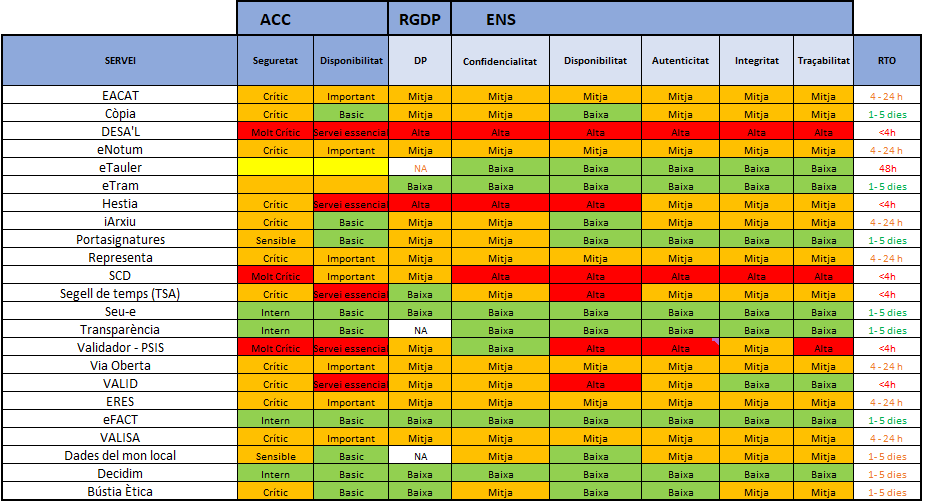

Seguretat : Valoració de serveis i mesures de seguretat  

1.  [Seguretat](index.md)
2.  [Pàgina d'inici de la Unitat de Seguretat](15368362.md)

Seguretat : Valoració de serveis i mesures de seguretat
=======================================================

Created by Ivan Caballero, last modified on 09 octubre 2024

  

Resultat de la valoració dels sistemes i la informació:
=======================================================

  

[https://llicenciesaoc.sharepoint.com/:f:/s/CiberseguretatAOC/Ej04dmjQSmxamtP-kbrVzi4BckW0tRwxw3\_NjRtff78iiQ?e=8BLo5U](https://llicenciesaoc.sharepoint.com/:f:/s/CiberseguretatAOC/Ej04dmjQSmxamtP-kbrVzi4BckW0tRwxw3_NjRtff78iiQ?e=8BLo5U)

> Metodologia

La metodologia aplicada per a la valoració dels serveis han sigut les següents:

*   Per valorar les dades i els serveis s'han seguit la guia "GUIT049-C Guia de classificació dels tractaments d'informació" de l'Agència de Ciberseguretat de Catalunya i la guia "803\_ENS-valoracion" del Centre Criptològic Nacional.
*   Per la valoració en Dades Personals, s'ha seguit la metodologia definida per l'Agència de Ciberseguretat de Catalunya a la seva guia "Marc de Ciberseguretat per a la Protecció de Dades (MCPD)".
*   La dimensió Negoci la fixe la Direcció del l'AOC per determinar els serveis que considera més crítics. 

La documentació resultant de les valoracions és a la carpeta: [Categorització de serveis](https://llicenciesaoc.sharepoint.com/:f:/s/CiberseguretatAOC/Ej04dmjQSmxamtP-kbrVzi4BckW0tRwxw3_NjRtff78iiQ?e=C7BdN1)

Observacions
============

En els serveis on el Consorci AOC no controla la informació que els clients afegeixen al sistema, davant de la dificultat per valorar la informació, s'ha optat per categoritzar els serveis com nivell MIG.

Els serveis on s'ha seguit aquesta metodologia són:

*   iArxiu
*   eNotum
*   Còpia
*   Via Oberta
*   ERES
*   Valisa

  

Requeriments de seguretat.

Segons la valoració del servei, cal aplicar les següents mesures de mitigació del risc que són obligatòries.

Les mesures aplicables per cada nivell de valoració estan definides a la pàgina: [Taules d'aplicabilitat i mesures segons nivells](41519877.md)

  

Attachments:
------------

 [Quadre resum CESICAT - ENS\_v5.bmp](attachments/41519900/41519914.bmp) (image/bmp)  
 [Quadre resum CESICAT - ENS\_v6.bmp](attachments/41519900/41519962.bmp) (image/bmp)  
 [Quadre resum CESICAT - ENS\_v6.1.jpg](attachments/41519900/64981388.jpg) (image/jpeg)  
 [Quadre resum CESICAT - ENS\_v6.1.jpg](attachments/41519900/41519964.jpg) (image/jpeg)  
 [image2024-1-19\_17-7-3.png](attachments/41519900/100008935.png) (image/png)  
 [image2024-3-26\_10-5-27.png](attachments/41519900/100009920.png) (image/png)  
 [image2024-4-3\_6-29-13.png](attachments/41519900/100009952.png) (image/png)  
 [image2024-6-5\_13-34-42.png](attachments/41519900/100010612.png) (image/png)  

Document generated by Confluence on 07 junio 2025 00:08

[Atlassian](http://www.atlassian.com/)