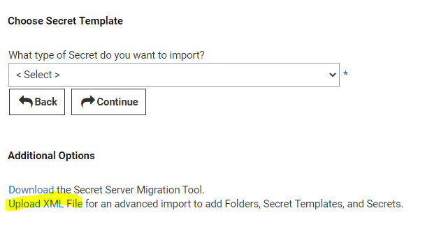

Seguretat : Importació de Secret desde KeePass  

1.  [Seguretat](index.md)
2.  [Pàgina d'inici de la Unitat de Seguretat](15368362.md)
3.  [Procediments Unitat de Seguretat](Procediments-Unitat-de-Seguretat_81856210.md)
4.  [PAM - Manuals i Procediments](PAM---Manuals-i-Procediments_93356107.md)
5.  [Manual de l'administrador](64979218.md)

Seguretat : Importació de Secret desde KeePass
==============================================

Created by Ivan Caballero, last modified on 24 noviembre 2021

  

*   Exportar la carpeta del KeePass Original en un temporal –> botó dret sobre la carpeta i Export Group
*   Arreglar nom duplicats. El nom del secret no pot estar duplicat.
*   Exportar en format XML
*   Estandaritzar el XML amb el Secret Server Migration Tool.
    *   Es pot descarregar Migration Tool desde: [https://docs.thycotic.com/ss/10.9.0/secret-import-and-export/secret-server-migration-tool](https://docs.thycotic.com/ss/10.9.0/secret-import-and-export/secret-server-migration-tool)
*   Importar l'arxiu XML des de Secret Server - Admin - See All - Import XML o anar a [https://pam.aoc.cat/SecretServer/app/#/admin/export-import/secrets](https://pam.aoc.cat/SecretServer/app/#/admin/export-import/secrets)
    *   Seleccionar import

  

Attachments:
------------

 [image2021-11-24\_5-39-15.png](attachments/41521906/64979220.png) (image/png)  

Document generated by Confluence on 07 junio 2025 00:08

[Atlassian](http://www.atlassian.com/)