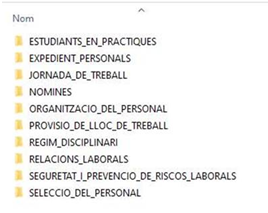

Seguretat : 20210603 Incidències i consultes  

1.  [Seguretat](index.md)
2.  [Pàgina d'inici de la Unitat de Seguretat](15368362.md)
3.  [Projectes Unitat de Seguretat](Projectes-Unitat-de-Seguretat_41517821.md)
4.  [Seguretat en Office 365](Seguretat-en-Office-365_64979340.md)
5.  [Projecte de securització d'office 365](64979342.md)

Seguretat : 20210603 Incidències i consultes
============================================

Created by Ivan Caballero, last modified on 13 julio 2021

Veure com està l'usuari Admin global del Tenant. Hauria d'estar Deshabilitat i amb la contrasenya controlada.
-------------------------------------------------------------------------------------------------------------

L'usuari Administrador@aoc.onmicrosoft.com ja està deshabilitat. No tenim la contrasenya de l'usuari. La restauració de la contrasenya s'hauria de fer a Microsoft.

Consulta sobre obertura d'arxius ubicats al sharepoint des de pàgines web. (Veure missatge de Jordi Fernandez).
---------------------------------------------------------------------------------------------------------------

Aquest punt ja es va aclarir.

Necessitat d'un Backup extern
-----------------------------

Hi ha 2 papeleres, una de primer nivell, on tenen accés els usuaris i un  altre de segon nivell on no tenen accés.

Como tenemos que gestionar los grupos de TEAMS para que no se nos descontrolen. Los sitios de sharepoint también estan abriertos a los usuarios
-----------------------------------------------------------------------------------------------------------------------------------------------

Cuando una persona quiera crear un equipo de 365:

*   Flujo de aprovadores en PowerApps. El usuario hace una petición en PowerApps y alguien la aprueba y se crea automàticament.
*   Petición via tiquet

El grupo con permisos para crear equipos es Admins\_O365\_Groups à aquí tienen que estar como miembros los que tengan permisos para crear equipos de 365 (Teams, Sharepoint, etc.)

La restricción no está aplicada y ahora cualquier usuario puede crear equipos.

_Nota: los grupos de Seguridad se creac en el centro de administración, no en el Azure._

Avís a usuaris per missatges a la cua de quarantena
---------------------------------------------------

  

  

Repositori de RRHH seguretat ampliada.
--------------------------------------

El repositori de RRHH és el que té dades més sensibles del Consorci AOC.

Quina configuració de seguretat ampliada es proposa? Per exemple:

*   Accés només pel grup de RRHH.
*   Administració només pel grup de RRHH. En cas de necessiten que ens puguin donar accés temporal.
*   Que els documents no puguin sortir de sharepoint. Que no es puguin compartir.
*   Traçabilitat d'accessos

  

Les carpetes de RRHH són les següents:

  

Les més crítiques:

*   Expedients personals
*   Nomines
*   Regim Disciplinari
*   Relacions laborals

  

No hi ha cap restricció especial dins de RRHH. Els permisos estan posats per a que només RRHH tingui accés.

No es poden aplicar més mesures ???

Descativar la creació de grups.
-------------------------------

Adjunto os remito código de PowerShell con el bloqueo de creación de Grupos O365, para evitar la creación de Equipos dentro de Teams: [CAOC365GroupCreators.txt](attachments/41522550/41523821.txt)

Recordando que es necesario que tengáis los CMDLETS específicos de Azure instalados en el PC que ejecute las sentencias y además, modificar la variable $AllowGroupCreation  al valor = "False" para bloquear dicha edición.

  

Propostes dels manuals de CCN
-----------------------------

Se recomienda la detección de amenazas en tiempo real, accesible desde el Centro de Seguridad y cumplimiento de Office 365.

Se ha activado el registro de auditoría.  → Sí

Como evitar que los usuaris instalen aplicaciones de terceros en el TEAMS: En la directives  de TEAMS està que solo se pueden añadir aplicaciones de Microsoft. Las de terceros estan desactivades.

Cerrar sesiones inactivas en Sharepoint.  → Sí, ya està activado. En Directivas – control de acceso. Se cierra en 30 minutos.

Activació de consola de seguretat Cloud Security:
-------------------------------------------------

  

La consola està en aquesta URL:

[Panel - Cloud App Security - Microsoft Cloud App Security](https://llicenciesaoc.portal.cloudappsecurity.com/#/dashboard)

Aquí s'envien els events que s'han de tractar.

  

Esta consola se puede ver por la licencia: Microsoft 365 E5 Security

La licencia Microsoft 365 E5 Security da estas propiedades:

Azure Active Directory Premium P2

Microsoft 365 Defender

**Microsoft Cloud App Security**

Microsoft Defender For Endpoint

Microsoft Defender for Identity

Microsoft Defender for Office 365 (Plan 2)

Office 365 SafeDocs

  

Se puede añadir eventos de otros dispositives de Seguridad, correla los eventos y da un informe mas completo. És la creación de instantaneas:

[Crear nuevo informe de instantáneas - Cloud App Security - Microsoft Cloud App Security](https://llicenciesaoc.portal.cloudappsecurity.com/#/discovery/create-new-report/)

  

En “Investigar” estan las cosas que se tienen que mirar.

En Directivas està lo que

  

Consejos:

Las consolas de Security  y Cloud Prtections son las mas usades:

[https://security.microsoft.com/security-recommendations](https://security.microsoft.com/security-recommendations)

[https://security.microsoft.com/homepage](https://security.microsoft.com/homepage)

El de cloud security engloba los 3 centros de Seguridad.: [Panel - Cloud App Security - Microsoft Cloud App Security](https://llicenciesaoc.portal.cloudappsecurity.com/#/dashboard)

  

Consola de compliment
---------------------

[Inicio - Cumplimiento de Microsoft 365](https://compliance.microsoft.com/homepage)

Consola Microsoft 365 Defender
------------------------------

En aquesta consola es pot veure la evolució de la puntuació de seguretat:

[Inicio - Seguridad de Microsoft 365](https://security.microsoft.com/homepage)

Attachments:
------------

 [image2021-4-20\_12-57-54.png](attachments/41522550/41522605.png) (image/png)  
 [CAOC365GroupCreators.txt](attachments/41522550/41523821.txt) (text/plain)  

Document generated by Confluence on 07 junio 2025 00:08

[Atlassian](http://www.atlassian.com/)