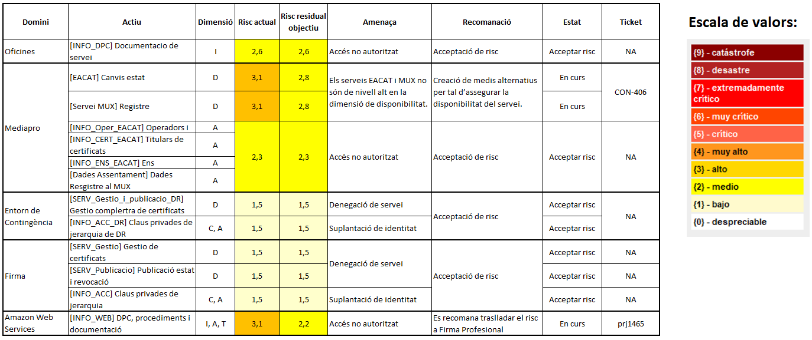

Seguretat : 2021-05-21 Comitè Executiu de Seguretat  

1.  [Seguretat](index.md)
2.  [Pàgina d'inici de la Unitat de Seguretat](15368362.md)
3.  [Actes de reunió](26317880.md)
4.  [Comitè Executiu de Seguretat](81855049.md)

Seguretat : 2021-05-21 Comitè Executiu de Seguretat
===================================================

Created by Ivan Caballero, last modified on 21 mayo 2021

Data

21-may-2021

Assistents
----------

*   [Rubén Cortés](https://confluence.aoc.cat/display/~rcortes)
*   [Usuario desconocido (marderiu)](https://confluence.aoc.cat/display/~marderiu)
*   [Marga Bonmatí Pérez](https://confluence.aoc.cat/display/~MBonmati)
*   [Ignasi Albors](https://confluence.aoc.cat/display/~ialbors)
*   [Ivan Caballero](https://confluence.aoc.cat/display/~icaballero)

Ordre del dia
-------------

*   Aprovar l'actualització de l'Anàlisi de Riscos del servei SCD, on s'ha calculat el "Risc residual objectiu" a petició de l'auditor de eIDAS.

Acta
----

El passat dia 9 de març de 2021, el Comitè Executiu va aprovar el nivell de risc residual del servei SCD, que consta en el Anàlisis de Riscos del servei.

En l'auditoria d'eIDAS feta en el mes de març, va sortir una no conformitat per que en l'anàlisi de riscos faltava el càlcul del Risc Residual Objectiu, que és el càlcul de risc on s'arribarà una vegada implementades les mesures de seguretat proposades en el pla de tractament de riscos.

S'ha fet el càlcul del Risc Residual Objectiu i s’ha afegit a l’informe d’Anàlisis de Riscos.

  

El comitè Executiu de Seguretat ratifica el nivell de risc residual en 3, com es va aprovar en l'anàlisi de riscos del dia 9 de març, i per tant cal tractar els riscos iguals o superiors a 3.

El comitè Executiu de Seguretat aprova el Pla de Tractament de Riscos:

  

El Comitè Executiu de Seguretat **aprova el risc residual objectiu en 2,8.**

  

  

El/La Responsable de Seguretat del Consorci AOC,

  

Rubén Cortés Domingo.

  

Attachments:
------------

 [image2021-5-14\_10-57-26.png](attachments/41523129/41523131.png) (image/png)  
 [Captura.PNG](attachments/41523129/41523134.png) (image/png)  

Document generated by Confluence on 07 junio 2025 00:08

[Atlassian](http://www.atlassian.com/)