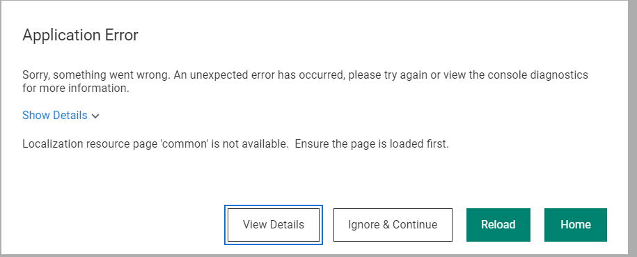
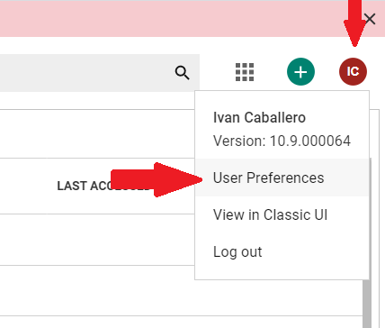
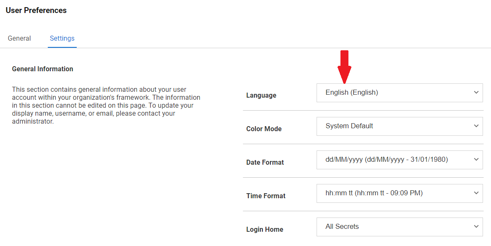

Seguretat : Com resoldre error d'aplicació per idioma  

1.  [Seguretat](index.md)
2.  [Pàgina d'inici de la Unitat de Seguretat](15368362.md)
3.  [Procediments Unitat de Seguretat](Procediments-Unitat-de-Seguretat_81856210.md)
4.  [PAM - Manuals i Procediments](PAM---Manuals-i-Procediments_93356107.md)
5.  [Manual de l'administrador](64979218.md)

Seguretat : Com resoldre error d'aplicació per idioma
=====================================================

Created by Ivan Caballero, last modified on 25 agosto 2021

  

En l'inici de sessió dona aquest error. Deixa continuar.

Aquest error es produeix perque l'idioma del navegador no està suportat.

  

Accedir a les preferències d'usuari, a la cantonada dreta superior:

  

  

A la pestanya de settings, fixar l'idioma a anglés. 

  

Attachments:
------------

 [image2021-6-7\_13-24-31.png](attachments/41523464/41523465.png) (image/png)  
 [image2021-6-7\_13-27-30.png](attachments/41523464/41523466.png) (image/png)  
 [image2021-6-7\_13-32-48.png](attachments/41523464/41523467.png) (image/png)  
 [image2021-6-7\_13-34-8.png](attachments/41523464/41523468.png) (image/png)  
 [image2021-6-7\_13-36-19.png](attachments/41523464/41523470.png) (image/png)  
 [image2021-6-7\_13-37-36.png](attachments/41523464/41523471.png) (image/png)  

Document generated by Confluence on 07 junio 2025 00:08

[Atlassian](http://www.atlassian.com/)