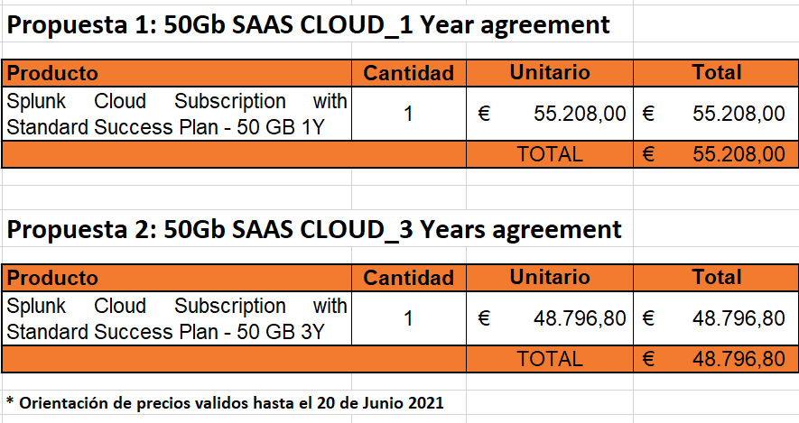
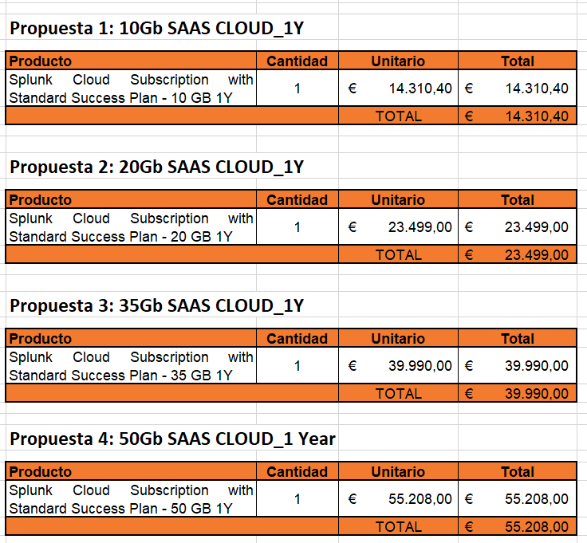

Seguretat : Proposta econòmica  

1.  [Seguretat](index.md)
2.  [Pàgina d'inici de la Unitat de Seguretat](15368362.md)
3.  [Projectes Unitat de Seguretat](Projectes-Unitat-de-Seguretat_41517821.md)
4.  [Desplegament de SIEM](Desplegament-de-SIEM_41520158.md)
5.  [SPLUNK](SPLUNK_41523625.md)

Seguretat : Proposta econòmica
==============================

Created by Ivan Caballero, last modified on 19 julio 2021

Proposta 1
----------

  

Proposta per aquests actius:

*   Número de equipos Palo Alto (modelo a poder ser)

*   2x PA850 (Oficinas)
*   2x PA3020 (En producción)

*   Volumen de usuarios detrás del Palo Alto (usuarios hacia internet)

*   120 (usuarios de oficinas que acceden a Internet)

*   Volumen aproximado de “clientes” que acceden externamente a vuestros servicios (clientes de internet a vuestro CPD)

*   Este datos es difícil de calcular. Nuestros cliente potenciales son millones. Hacemos más de 800.000 transacciones diarias de todo tipo, así que es difícil de calcular. ¿No se podría mirar el tamaña del log en el mismo Palo Alto?

*   Número aproximado de equipos de usuarios (PC’s)

*   100

*   El Antivirus que tenéis Fabricante y producto: Trendmicro ApexOne o Officescan, Kaspersky, McAfee..

*   Kaspersky Security Server 10

*   Número aproximado de usuarios (cuentas de Active Directory)

*   180

*   Número de Servidores Windows

*   100

*   Número de Servidores Linux

*   300

  

Proposta: [AOC\_SIEM.xlsx](attachments/41523629/41523630.xlsx)

  

Proposta 2
----------

  

Jo et diría que en una fase inicial, dependent si aneu al de 10Gb o al de 20Gb, podrem incorporar firewall + av + active directori. 

El que té molt impacte en el vostre cas és la part de servidors, ens vau reportar uns 400 (300 linux + 100 windows). 

Preus de subscripció de 1 any de servei serveis SAAS. Tots els connectors per ingesta + SIEM Essentials + InfoSec sense cost.

Attachments:
------------

 [AOC\_SIEM.xlsx](attachments/41523629/41523630.xlsx) (application/vnd.openxmlformats-officedocument.spreadsheetml.sheet)  
 [image2021-6-17\_11-10-41.png](attachments/41523629/41523631.png) (image/png)  
 [image2021-7-19\_8-40-18.png](attachments/41523629/41523863.png) (image/png)  

Document generated by Confluence on 07 junio 2025 00:08

[Atlassian](http://www.atlassian.com/)