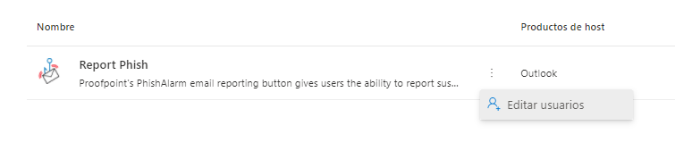

Seguretat : Configuració del Add-in Phish Alarm  

1.  [Seguretat](index.md)
2.  [Pàgina d'inici de la Unitat de Seguretat](15368362.md)
3.  [Projectes Unitat de Seguretat](Projectes-Unitat-de-Seguretat_41517821.md)
4.  [Servei de formació i conscienciació en Ciberseguretat](41523634.md)

Seguretat : Configuració del Add-in Phish Alarm
===============================================

Created by Ivan Caballero, last modified on 17 junio 2021

Instal·lación del Add-in en el Outlook
--------------------------------------

  

Anar a la consola de Aplicacions integrades

[Centro de administración de Microsoft 365](https://admin.microsoft.com/AdminPortal/Home#/Settings/IntegratedApps)

  

  

Editar l'Add-in:

  

Indicar els usuaris que han de tenir el Add-in.

Configuració de l'Add-in
------------------------

Amb un usuari administrador de l'eina PSAT, accedir a la URL de configuració de PhishAlarm.

  

[https://aoc.ws02-securityeducation.com/phishalarm-analyzer/settings/admin-comm](https://aoc.ws02-securityeducation.com/phishalarm-analyzer/settings/admin-comm)

  

A la pestanya End-user comunication es poden configurar els missatge que rep l'usuari:

  

Missatge original: El correo se reenviará, incluidos los adjuntos al buzón de Seguridad. Estás seguro de que deseas informar sobre este correo electrónico?

Canvi: El correu es reenviarà, inclosos els seus adjunts, a la bústia [seguretat@aoc.cat](mailto:seguretat@aoc.cat) per ser analitzat. No interactuïs amb el missatge fins a rebre el diagnòstic per part de la Unitat de Seguretat. Estàs segur que vols informar sobre aquest correu electrònic?

  

Missatge de correu phising potencial

Gracias por informar sobre un correo electrónico sospechoso. Se ha enviado a tu equipo de seguridad para su revisión en profundidad. Tus acciones están ayudando a mantener segura tu empresa.

Canvi: Gràcies per informar sobre un correu electrònic sospitós. S'ha enviat a la unitat de Seguretat del Consorci AOC per a la seva revisió en profunditat. Les teves accions estan ajudant a mantenir segura la teva empresa.

  

Simulated Phish Notification Settings
-------------------------------------

Gracias por detectar un posible phishing. Tus acciones están ayudando a mantener segura la empresa.

  

Gràcies per detectar un possible phishing. Les teves accions estan ajudant a mantenir segura l'empresa.

  

Training Email Notification Settings
------------------------------------

Gracias por detectar un correo electrónico de formación en ciber seguridad enviado por Proofpoint Security Awareness Training. Tus acciones están ayudando a mantener segura la empresa.

  

  

  

  

Attachments:
------------

 [image2021-6-17\_11-36-12.png](attachments/41523636/41523637.png) (image/png)  
 [image2021-6-17\_11-37-15.png](attachments/41523636/41523638.png) (image/png)  
 [image2021-6-17\_12-11-36.png](attachments/41523636/41523639.png) (image/png)  
 [image2021-6-17\_12-30-37.png](attachments/41523636/41523641.png) (image/png)  

Document generated by Confluence on 07 junio 2025 00:08

[Atlassian](http://www.atlassian.com/)