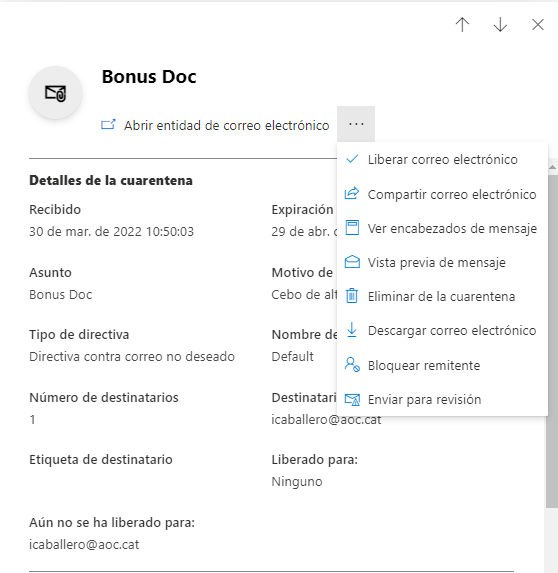
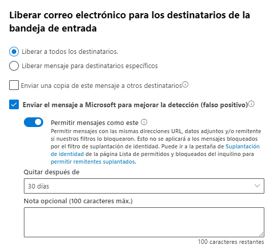

Seguretat : Excepcions a directrius de seguretat d'Office 365 per phishing simulat  

1.  [Seguretat](index.md)
2.  [Pàgina d'inici de la Unitat de Seguretat](15368362.md)
3.  [Projectes Unitat de Seguretat](Projectes-Unitat-de-Seguretat_41517821.md)
4.  [Servei de formació i conscienciació en Ciberseguretat](41523634.md)

Seguretat : Excepcions a directrius de seguretat d'Office 365 per phishing simulat
==================================================================================

Created by Ivan Caballero, last modified on 05 abril 2022

Poden haver regles a 2 nivells:

Regla de fluxe de correu. A la consola d'Exchange: [Exchange admin center (microsoft.com)](https://admin.exchange.microsoft.com/#/transportrules)

Regla de protecció a Windows Defender: [Directivas de correo electrónico no deseado - Seguridad de Microsoft 365](https://security.microsoft.com/antispam)

Regla:
------

PSAT WhiteListSi el mensaje...  
las direcciones IP del remitente pertenecen a uno de estos intervalos: '52.30.130.201' o '54.229.2.165' o '52.16.190.81' o '52.17.45.98'Hacer lo siguiente…  
Establecer el nivel de confianza de correo no deseado (SCL) en '-1'

S'aplica aquest procediment:
----------------------------

Bon tarda Ivan  
Afrontarem el problema des d'una altra perspectiva. En comptes de crear una norma anti spam, el que farem és crear una regla de correu dient que tots els emails que vinguin de les adreces de PSAT els marqui com que no són SPAM.  
Els passos que hem de realitzar són:

1.  Sign-In to the Office 365 Admin portal.
2.  Navigate to **Admin > Exchange**  
    _This will launch Exchange Admin Center_
3.  Navigate to mail **flow > rules**.
4.  Click **+** icon to access the pull down menu.
5.  Select **By-pass spam filtering**.
6.  In the new rule window, complete the required fields:

*   Enter a value for Name (e.g. By-pass Spam filtering for PSAT)
*   For Apply this rule if… select **The sender...IP address is in any of these ranges or exactly matches**.
*   Add IP address to the IP address list:  
    52.17.45.98  
    52.16.190.81  
    54.229.2.165  
    52.30.130.201

*   Type in the address followed by the **+** icon.
*   Repeat for each IP address.

*   Ensure **Set the spam confidence level (SCL)** to is selected in the _Do the following_... menu

*   _Do the following > Modify the message proprieties > set the spam confidence level > bypass spam filtering_

1.  Click **Save**

Quan hagis pogut fer les modificacions ens ho fas saber i enviarem una altra prova.

Moltes gràcies.

  

Alvaro Llobet 

**Área Sistemas & Response** 

Missatges amb adjunts
=====================

Els missatge amb adjunts van a la cua de quarantena, encara que vinguin de les IPs que estan com excepció.

Hemos podido comprobar que la regla que detecta el mensaje y lo envía a la cuarentena es la regla de ficheros adjuntos del Defender: Safe Attachments ([Datos adjuntos seguros - Seguridad de Microsoft 365](https://security.microsoft.com/safeattachmentv2)).  
La regla no se puede desactivar, pero se puede poner que no haga nada cuando encuentre un fichero con Malware. Hemos comprobado que así sí llegan los mensajes.  
No hemos podido poner excepciones por IP ni por remitente así que lo hemos dejado por imposible, y lo que haremos es modificar el mensaje de phishing simulado para que no lleve el adjunto.

La regla Safe Attachments no se ha modificado.

Trobar els missatges a la quarantena
------------------------------------

Si la regla no funciona el missatge pot anar a la quanrantena de l'usuari o a la quarantena general → [https://security.microsoft.com/quarantine?viewid=Email](https://security.microsoft.com/quarantine?viewid=Email)

Els missatges es poden alliberar des de la quarantena.

Des de dins del missatge es pot escollir alliberar.

  

  

i alhora d'alliberar es pot indicar que Microsoft confii en les URLs del missatge durant 30 dies.

  

Attachments:
------------

 [image2022-3-31\_11-33-11.png](attachments/41523897/64980858.png) (image/png)  
 [image2022-3-31\_11-33-57.png](attachments/41523897/64980859.png) (image/png)  

Document generated by Confluence on 07 junio 2025 00:08

[Atlassian](http://www.atlassian.com/)