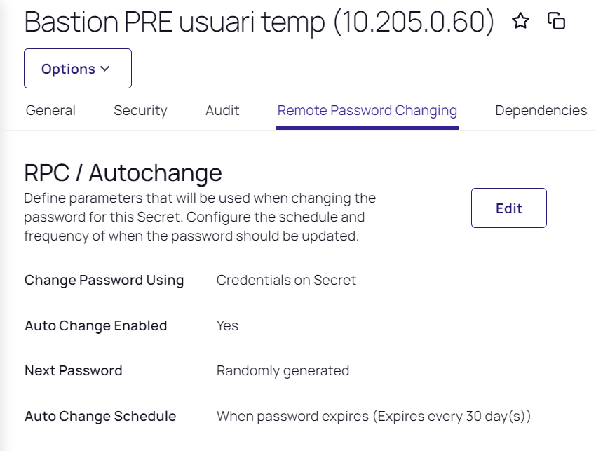

Seguretat : Com configurar la rotació de contrasenyes  

1.  [Seguretat](index.md)
2.  [Pàgina d'inici de la Unitat de Seguretat](15368362.md)
3.  [Procediments Unitat de Seguretat](Procediments-Unitat-de-Seguretat_81856210.md)
4.  [PAM - Manuals i Procediments](PAM---Manuals-i-Procediments_93356107.md)
5.  [Manual de l'administrador](64979218.md)

Seguretat : Com configurar la rotació de contrasenyes
=====================================================

Created by Ivan Caballero, last modified on 27 agosto 2023

La rotació de contrasenyes es configura a nivell de plantilla i cal que estigui activada en el secret.

Tenim 2 configurades:

*   AOC - Unix Account (SSH) - Rotació de contrasenya
*   AOC - Windows Account - Rotació de contrasenya

  

L'activació de la rotació automàtica es fa des de dins del secret "Remote Password Changing"

  

  

Per errors en la rotació de contrasenya:
----------------------------------------

[https://thycotic.force.com/support/s/article/Remote-Password-Changing-Errors](https://thycotic.force.com/support/s/article/Remote-Password-Changing-Errors)

El servidor frontal PAM ha de tenir connectivitat als següents ports:

*   3389 (RDP)
*   TCP/UDP 445 (SMP)
*   TCP/UDP 49152-65535

NOTA: en ocasions s'ha detectat que forçant un primer vanvi de contrasenya en el servidor destí, depress ha funcionat el rotat des de el servidor PAM.

Veure les contrasenyes rotades en els darrers 90 dies:

[https://pam.aoc.cat/SecretServer/app/#/reports/report/60/detail](https://pam.aoc.cat/SecretServer/app/#/reports/report/60/detail)

Attachments:
------------

 [image2021-8-31\_10-29-48.png](attachments/41524087/41524088.png) (image/png)  
 [image2023-8-27\_13-13-47.png](attachments/41524087/93357073.png) (image/png)  

Document generated by Confluence on 07 junio 2025 00:08

[Atlassian](http://www.atlassian.com/)