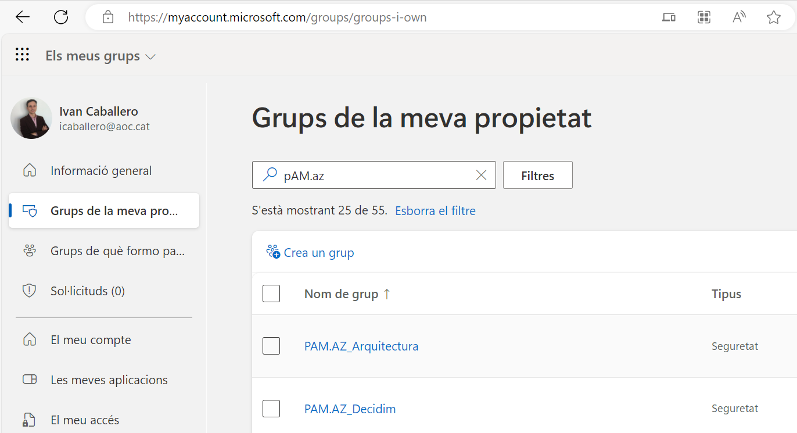
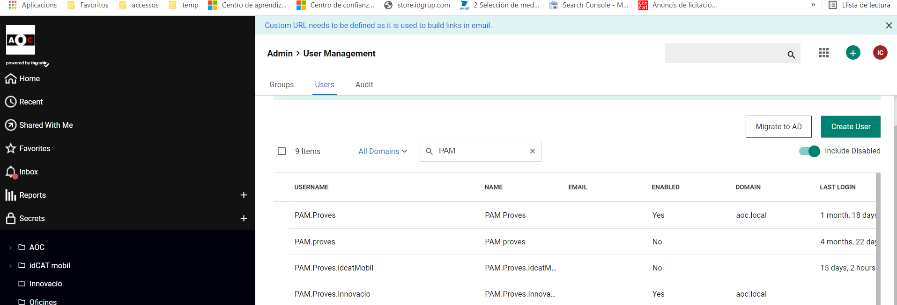
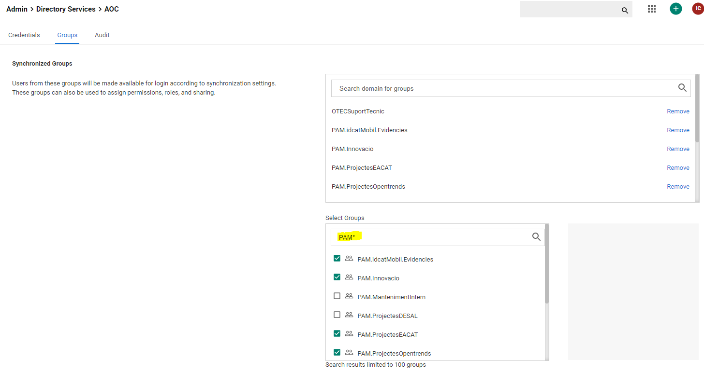
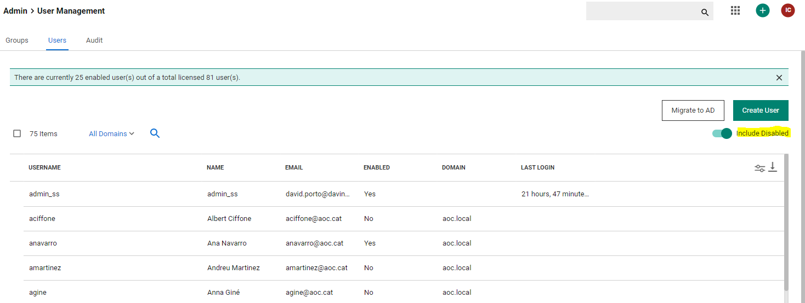

Seguretat : Com donar d'alta a nous usuaris  

1.  [Seguretat](index.md)
2.  [Pàgina d'inici de la Unitat de Seguretat](15368362.md)
3.  [Procediments Unitat de Seguretat](Procediments-Unitat-de-Seguretat_81856210.md)
4.  [PAM - Manuals i Procediments](PAM---Manuals-i-Procediments_93356107.md)
5.  [Manual de l'administrador](64979218.md)

Seguretat : Com donar d'alta a nous usuaris
===========================================

Created by Ivan Caballero, last modified on 25 enero 2024

  

/\*<!\[CDATA\[\*/ div.rbtoc1749247718573 {padding: 0px;} div.rbtoc1749247718573 ul {list-style: disc;margin-left: 0px;} div.rbtoc1749247718573 li {margin-left: 0px;padding-left: 0px;} /\*\]\]>\*/

*   [Alta d'un usuari en un grup existent.](#Comdonard'altaanoususuaris-Altad'unusuarienungrupexistent.)
*   [Alta de nous grups](#Comdonard'altaanoususuaris-Altadenousgrups)

Els usuaris s'han d'importar des de l'AD. Per importar-los han d'estar presents en algun dels grups que el PAM sincronitza desde l'AD.

### Alta d'un usuari en un grup existent.

*   Els grups que donen accés al PAM, són el PAM.AZ\_\*. Són grups d'Azure.
*   Cal afegir a l'usuari al grup corresponent. Ho poden fer els propietaris dels grups des de la URL [My Groups - Grups de la meva propietat (microsoft.com)](https://myaccount.microsoft.com/groups/groups-i-own)

  

*   Aquests grups es sincronitzen en el SecretServer amb els permisos que li corresponen, i estan presents en l'aplicació empresarial PAM1.

  

*   Des del SecretServer, executar una sincronització amb l'AD per a que l'usuari nou es carregui en la llista d'usuaris.
*   Anar a la gestió d'usuari del PAM: [https://pam.aoc.cat/SecretServer/app/#/admin/user-management/user](https://pam.aoc.cat/SecretServer/app/#/admin/user-management/users)  
    *   Comprovar que s'ha sincronitzat l'usuari i que l'usuari està en estat Enables

  

  

### Alta de nous grups

Si el grup és nou, s'ha de demanar a Manteniment Inter que el creï a l'Azure, amb el mateix format que els altres. Important que el propietari del grup sigui Seguretat.

Anar al PAM, a la secció Admin/Directory Services/AOC/Groups

[https://pam.aoc.cat/SecretServer/app/#/admin/directory-services/domain/1/groups](https://pam.aoc.cat/SecretServer/app/#/admin/directory-services/domain/1/groups)

Cercar el grup nou dins de "Selected grups" i seleccionar-lo per indicar que és dels grups que es sincronitzen.

  

  

En la cerca mantenir sempre "\*" per a que trobi el nom del grup.

Anar a la secció d'usuaris: [https://pam.aoc.cat/SecretServer/app/#/admin/user-management/users](https://pam.aoc.cat/SecretServer/app/#/admin/user-management/users)

Activar "include Disabled"

  

Cercar els usuaris nous:

*   activar l'usuari
*   Multifactor Authentication - TOTP Authenticator

  

  

Attachments:
------------

 [image2021-9-11\_8-44-19.png](attachments/61931582/61931583.png) (image/png)  
 [image2021-9-11\_15-26-12.png](attachments/61931582/61931585.png) (image/png)  
 [image2021-11-3\_12-25-41.png](attachments/61931582/64979063.png) (image/png)  
 [image2021-11-3\_12-26-33.png](attachments/61931582/64979064.png) (image/png)  
 [image2021-11-3\_13-10-45.png](attachments/61931582/64979073.png) (image/png)  
 [image2021-11-3\_13-13-17.png](attachments/61931582/64979074.png) (image/png)  
 [image2024-1-25\_11-45-9.png](attachments/61931582/100008964.png) (image/png)  

Document generated by Confluence on 07 junio 2025 00:08

[Atlassian](http://www.atlassian.com/)