Seguretat : Manual d'usuari de l'eina PAM (Privileged Access Management)  

1.  [Seguretat](index.md)
2.  [Pàgina d'inici de la Unitat de Seguretat](15368362.md)
3.  [Procediments Unitat de Seguretat](Procediments-Unitat-de-Seguretat_81856210.md)
4.  [PAM - Manuals i Procediments](PAM---Manuals-i-Procediments_93356107.md)

Seguretat : Manual d'usuari de l'eina PAM (Privileged Access Management)
========================================================================

Created by Ivan Caballero, last modified by Rafael Carrasco on 26 agosto 2024

  

/\*<!\[CDATA\[\*/ div.rbtoc1749247717033 {padding: 0px;} div.rbtoc1749247717033 ul {list-style: disc;margin-left: 0px;} div.rbtoc1749247717033 li {margin-left: 0px;padding-left: 0px;} /\*\]\]>\*/

*   [Informació sobre l'eina PAM (Privileged Access Management)](#Manuald'usuaridel'einaPAM\(PrivilegedAccessManagement\)-Informaciósobrel'einaPAM\(PrivilegedAccessManagement\))
    *   [Organització actual](#Manuald'usuaridel'einaPAM\(PrivilegedAccessManagement\)-Organitzacióactual)
    *   [Responsabilitat de les credencials](#Manuald'usuaridel'einaPAM\(PrivilegedAccessManagement\)-Responsabilitatdelescredencials)
*   [Accés al servei i entorn d'usuari](#Manuald'usuaridel'einaPAM\(PrivilegedAccessManagement\)-Accésalserveiientornd'usuari)
    *   [Login](#Manuald'usuaridel'einaPAM\(PrivilegedAccessManagement\)-Login)
        *   [Accés usuaris interns:](#Manuald'usuaridel'einaPAM\(PrivilegedAccessManagement\)-Accésusuarisinterns:)
        *   [Accés usuaris externs:](#Manuald'usuaridel'einaPAM\(PrivilegedAccessManagement\)-Accésusuarisexterns:)
*   [Com instal·lar i configurar l'Add-on "Secret Server web password filler"](#Manuald'usuaridel'einaPAM\(PrivilegedAccessManagement\)-Cominstal·lariconfigurarl'Add-on"SecretServerwebpasswordfiller")
    *   [Configuració del plugin al navegador](#Manuald'usuaridel'einaPAM\(PrivilegedAccessManagement\)-Configuraciódelpluginalnavegador)
    *   [Entorn d'usuari](#Manuald'usuaridel'einaPAM\(PrivilegedAccessManagement\)-Entornd'usuari)
    *   [Tipus plantilles i creació de secrets](#Manuald'usuaridel'einaPAM\(PrivilegedAccessManagement\)-Tipusplantillesicreaciódesecrets)
    *   [Execució dels launchers](#Manuald'usuaridel'einaPAM\(PrivilegedAccessManagement\)-Execuciódelslaunchers)
*   [Configuracions aconsellades i altres funcionalitats](#Manuald'usuaridel'einaPAM\(PrivilegedAccessManagement\)-Configuracionsaconselladesialtresfuncionalitats)
    *   [Com compartir recursos en connexions RDP](#Manuald'usuaridel'einaPAM\(PrivilegedAccessManagement\)-ComcompartirrecursosenconnexionsRDP)
*   [Suport](#Manuald'usuaridel'einaPAM\(PrivilegedAccessManagement\)-Suport)

Informació sobre l'eina PAM (Privileged Access Management)
----------------------------------------------------------

L’eina PAM (Privileged Access Management) és una eina que la principal missió que té és la de ser el repositori centralitzat de secrets.

Aquest rol abans el teníem en fitxer KeePass, però ha quedat obsolet e insegur.

Eines PAM com la que tenim desplegada al Consorci AOC ens ajuden a mantenir centralitzades les credencials, xifrades de manera segura, amb un accés granular per cada usuari i/o grups d’usuaris, amb rotació de contrasenyes, funcionalitats com els launchers d’aplicació, auditoria i traçabilitat dels secrets i l’ús que es fa dels mateixos, ens ajuda a nivell de compliment normatiu, i un llarg etcètera.

  

### Organització actual

Tindrem una distribució dels secrets lo més semblant al Organigrama d’Operacions, és a dir unes carpetes base per cada Unitat, amb privilegis de propietaris pels members de la Unitat específica i amb capacitats per fer i desfer a nivells inferiors.

També podran compartir els ramals que convinguin amb alters Unitats i/o grups de treball que considerin oportú.

Les Unitats i la distribució de carpetes al PAM a data d’avui són:

*   Arquitectura
*   Mateniment Intern
*   Projectes
*   Qualitat
*   Seguretat
*   Sistemes
*   Suport Tècnic

### Responsabilitat de les credencials

Cada Unitat serà responsable de tots i cadascún dels secrets que contenen, i dels que es vagin generant de nou.

Tota la informació generada, ja siguin les pròpies credencials com tota la resta d’informació enmagatzamada com poden ser noms de servidors, adreces IP, URLs, usuaris, dominis, comentaris, … són considerades dades en tots els casos, i el propietari de les dades són les Unitats que les generen.

 S’han de fer ús de les bones pràctiques alhora:

*   d’establir una plantilla adhient per a cada secret
*   creant-los en la seva carpeta d'Unitat.
*   amb quin equip de treball es comparteixen tot seguint una política base de minims privilegis

Accés al servei i entorn d'usuari
---------------------------------

### Login

El PAM està integrat al AzureAD com a Gestor d’Identitats, amb lo que caldrà fer servir les credencials del AzureAD per fer-ne login a la URL d’accés.

 Si no s’ha fet mai login, demanarà configurar el de doble factor d’accés, recomanem Microsoft Authenticator.

#### Accés usuaris interns:

Al servei PAM s'accedeix per la URL [https://pam.aoc.cat/](https://pam.aoc.cat/) , amb l'usuari de domini.

Cal tenir la VPN activada.

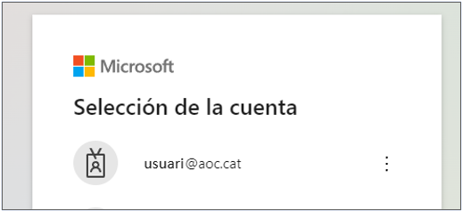

#### Accés usuaris externs:

Els usuaris externs accedieixen per la mateixa URL [https://pam.aoc.cat/](https://pam.aoc.cat/) , amb el seu usuari corporatiu d'Office 365. Si la persona no té aquest usuari, Manteniment Intern li farà un usuari convidat.

Cal tenir la VPN activada.

Com instal·lar i configurar l'Add-on "Secret Server web password filler"
------------------------------------------------------------------------

L'extensió de navegador "Secret Server web password filler" és necessària per poder fer servir Launchers del tipus Web Password en l'eina PAM.

L'extensió es pot descarregar des del següent enllaç. Escollir la extensió segons el navegador.

[https://docs.thycotic.com/wpf/2.0.0/getting-started/install.md](https://docs.thycotic.com/wpf/2.0.0/getting-started/install.md) 

### Configuració del plugin al navegador

Clicar sobre l'icona de l'extensió en el navegador:

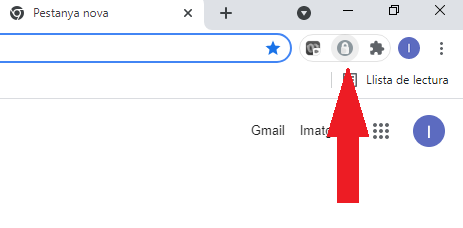

  

Afegir l'adreça del servidor de SecretServer ([https://pam.aoc.cat/SecretServer](https://pam.aoc.cat/SecretServer)) i el domini (Local).

Activar "Use Secret Server to login" 

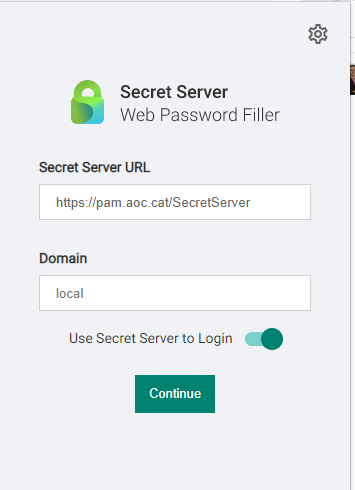

  

El login es pot fer indistintament des del frontal web ([https://pam.aoc.cat](https://pam.aoc.cat)) o des de la extensió. Si es fa des del el frontal, la extensió també es logarà i viceversa.

Les preferències recomanades són les següents:

  

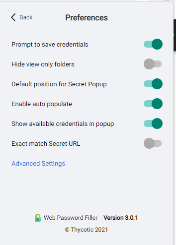

  

 Amb el login del frontal i la extensió, es pot anar a un Launcher del tipus Web Password i accedir a una web sense coneixer la contrasenya.

### Entorn d'usuari

Com hem explicat al primer punt tindrem una estructura de carpetes lo més semblant al Organigrama d’Operacions.

Són aquestes carpetes:

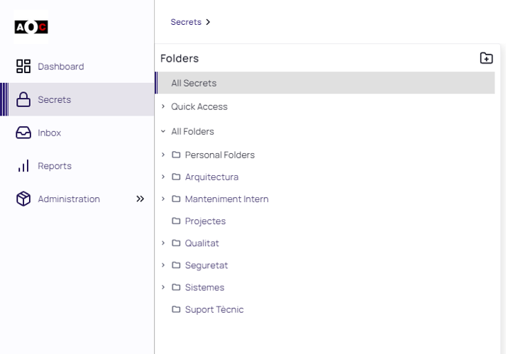

  

A més tindrem una carpeta per cada usuari anomenada Personal Folder, aquí podrem crear-nos i administrar els nostres secrets i accessos personals.  
Només serà accessible per l’usuari propietari.

Segons la pertinença a grups que tindrà l’usuari amb el que hem fet login, tindrem una visibilitat i accions específiques que podrem fer amb els secrets.

És possible que poguem veure credencials en alguns secrets i en altres poden no ser visibles, encara que podríem executar els launchers (simplement queden ocultes).

### Tipus plantilles i creació de secrets

Per cada tipus de secrets existeixen unes plantilles diferents, és a dir un secret d’accés SSH a un entorn Linux tindrà una plantilla per aquest sistema, diferent per un accés d’entorn Windows.

Els més comuns són:

*   AOC - Active Directory Account
*   AOC - Amazon IAM Console Password
*   AOC - HTTP
*   AOC - Oracle SQLDeveloper
*   AOC - Oracle Toad
*   AOC - SQL Account
*   AOC - Unix Account (SSH)
*   AOC - Unix Account (SSH) - Rotació de contrasenya
*   AOC - Web Password (with account or domain)
*   AOC - Web Password + Account or domain
*   AOC - Windows Account
*   AOC - Windows Account - Rotació de contrasenya
*   Web Password

  

Es poden crear secrets al personal folder de cadascun dels usuaris, amb una visibilitat i accés limitats, o bé a un folder dintre de qualsevol de l’estructura de carpetes d’Unitats.

Básicament:

*   Create secret (a d’alt a la dreta)

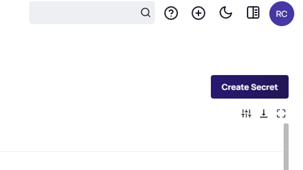

  

*   Choose Secret Template

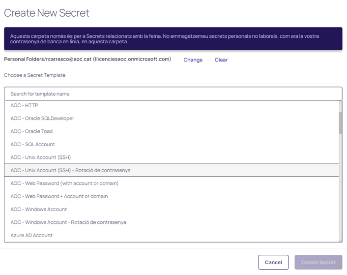

  

*   Omplir les dades relatives al nou secret

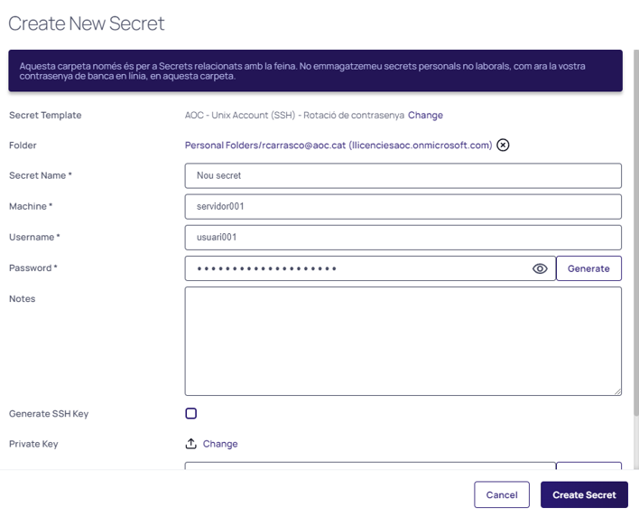

  

*   Guardar el secret amb –> Create Secret

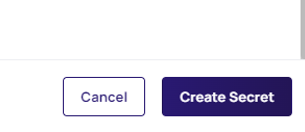

  

### Execució dels launchers

Els launchers són la manera de poder fer-ne servir els secrets del repositori fins al sistema destí mitjançant la crida a un client per tal d’executar-lo i aconseguir crear una sessió.

  

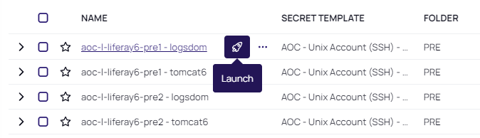

  

Segons el tipus de secret tindrem uns tipus de Launcher o d’altres, de fet segons el tipus de secret i la seva plantilla podem tenir a l’abast més d’un Launcher pel secret, se’ns demanarà quin volem fer servir quan executem el botó del Launcher.

  

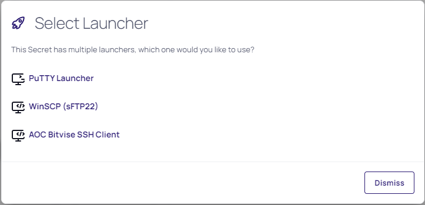

  

 Si apareix aquest missatge hem de permetre que la web obri l'aplicació:

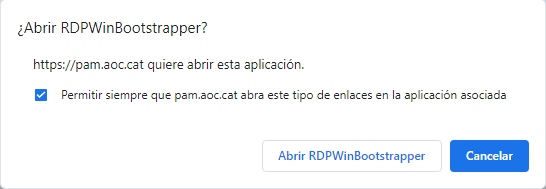

  

 I finalment aconseguim sessió:

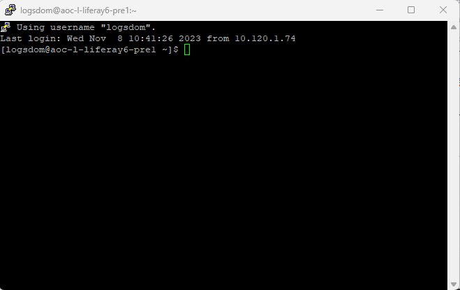

Configuracions aconsellades i altres funcionalitats
---------------------------------------------------

### Com compartir recursos en connexions RDP

Després de fer login, a la part superior dreta, clic sobre la icona d' Usuari > User Preferences > Settings tab

  

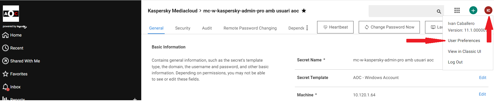

  

  

Activar les opcions dels recursos que es vulguin compartir amb el RDP:

  

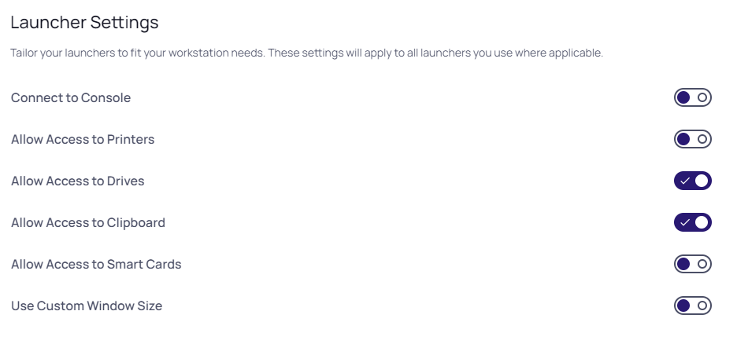

  

El secret també ha de tenir configurada el "Allow Access to Clipboard" i "Allow Access to Drives" a Yes.

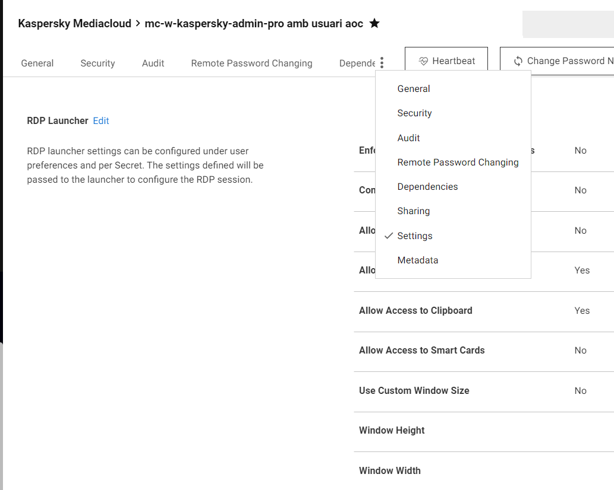

  

Quan s'accedeixi a un servidor per RDP, en l'exprorador d'arxius del servidor, es podran trobar les unitats del PC que s'ha connectat. 

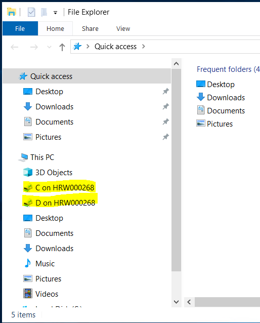

  

Suport
------

Podeu crear-nos un JIRA al projecte de Seguretat (SEG) per qualsevol incident, tasca o consulta, i/o per millorar aquest manual d’usuari.

Igualment podeu adreçar-vos a la bústia de correu [seguretat@aoc.cat](mailto:seguretat@aoc.cat).

Documentació oficial: [https://docs.thycotic.com/wpf/3.0.0](https://docs.thycotic.com/wpf/3.0.0)

  

Attachments:
------------

 [image2022-4-10\_6-16-29.png](attachments/64979217/64981897.png) (image/png)  
 [image2022-4-10\_6-20-24.png](attachments/64979217/64981898.png) (image/png)  
 [image2022-4-10\_6-24-10.png](attachments/64979217/64981899.png) (image/png)  
 [image2021-9-15\_15-39-14.png](attachments/64979217/64981900.png) (image/png)  
 [image2021-9-15\_15-36-46.png](attachments/64979217/64981901.png) (image/png)  
 [image2021-9-15\_15-50-48.png](attachments/64979217/64981902.png) (image/png)  
 [image2022-7-21\_11-35-30.png](attachments/64979217/64982024.png) (image/png)  
 [image2023-11-8\_11-42-6.png](attachments/64979217/100008352.png) (image/png)  
 [image2023-11-8\_12-24-13.png](attachments/64979217/100008354.png) (image/png)  
 [image2023-11-8\_12-26-27.png](attachments/64979217/100008355.png) (image/png)  
 [image2023-11-8\_12-27-12.png](attachments/64979217/100008356.png) (image/png)  
 [image2023-11-8\_12-27-52.png](attachments/64979217/100008357.png) (image/png)  
 [image2023-11-8\_12-28-38.png](attachments/64979217/100008358.png) (image/png)  
 [image2023-11-8\_12-35-46.png](attachments/64979217/100008359.png) (image/png)  
 [image2023-11-8\_12-36-28.png](attachments/64979217/100008360.png) (image/png)  
 [image2023-11-8\_12-37-4.png](attachments/64979217/100008361.png) (image/png)  
 [image2023-11-8\_12-38-29.png](attachments/64979217/100008362.png) (image/png)  
 [image2023-11-8\_12-39-13.png](attachments/64979217/100008363.png) (image/png)  

Document generated by Confluence on 07 junio 2025 00:08

[Atlassian](http://www.atlassian.com/)