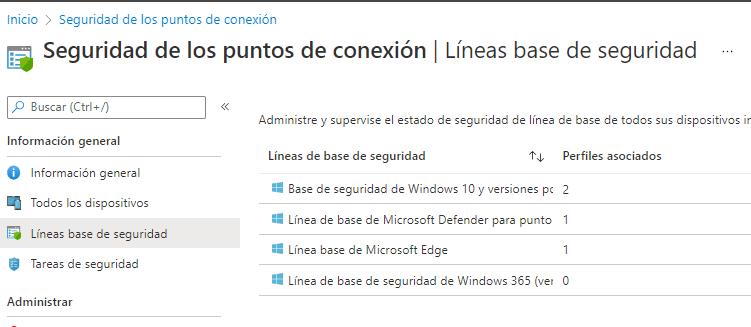

Seguretat : Bastionat d'equips de treball (línies base de seguretat)  

1.  [Seguretat](index.md)
2.  [Pàgina d'inici de la Unitat de Seguretat](15368362.md)
3.  [Projectes Unitat de Seguretat](Projectes-Unitat-de-Seguretat_41517821.md)
4.  [Seguretat en Office 365](Seguretat-en-Office-365_64979340.md)
5.  [Desplegament d' Intune](64979693.md)

Seguretat : Bastionat d'equips de treball (línies base de seguretat)
====================================================================

Created by Ivan Caballero, last modified on 11 marzo 2022

/\*<!\[CDATA\[\*/ div.rbtoc1749247733015 {padding: 0px;} div.rbtoc1749247733015 ul {list-style: disc;margin-left: 0px;} div.rbtoc1749247733015 li {margin-left: 0px;padding-left: 0px;} /\*\]\]>\*/

*   -)
*   [Politiques de compliment per Windows 10 i superiors.](#Bastionatd'equipsdetreball\(líniesbasedeseguretat\)-PolitiquesdecomplimentperWindows10isuperiors.)
*   [Linies base de Seguretat per Windows 10 i superiors.](#Bastionatd'equipsdetreball\(líniesbasedeseguretat\)-LiniesbasedeSeguretatperWindows10isuperiors.)
*   [Xifrat de discos amb Bitlocker.](#Bastionatd'equipsdetreball\(líniesbasedeseguretat\)-XifratdediscosambBitlocker.)
*   [Altres configuracions de seguretat.](#Bastionatd'equipsdetreball\(líniesbasedeseguretat\)-Altresconfiguracionsdeseguretat.)

------------------------------------------------------------------------------------------------------------------------------------------------------------------------------------------------------------------------------------------------------------------------------------------------------------------------------------------------------------------------------------------------------------------------------------------------------------------------------------------------------------------------------------------------------------------------------------------------------------------------------------------------------------------------------------------------------------------------------------------------------------------------------------------------------------------------------------------------------------

Politiques de compliment per Windows 10 i superiors.
----------------------------------------------------

  

  

Hi ha una vista amb les màquines "no compliance":

[Monitor - Centro de administración de Microsoft Endpoint Manager](https://endpoint.microsoft.com/#blade/Microsoft_Intune_DeviceSettings/DevicesMonitorMenu/noncompliantDevices/defaultId/noncompliantDevices)

  

  

Hi ha una directiva de compliment que serveix per monitoritzar (CAOC - Cumplimiento W10 01)

  

Des de <[https://endpoint.microsoft.com/#blade/Microsoft\_Intune\_DeviceSettings/ConfigurationMenuBlade/overview/configurationId/d16fefdb-1f3b-44d6-aedf-ad0a618823e8/policyType/35/policyJourneyState/1](https://endpoint.microsoft.com/#blade/Microsoft_Intune_DeviceSettings/ConfigurationMenuBlade/overview/configurationId/d16fefdb-1f3b-44d6-aedf-ad0a618823e8/policyType/35/policyJourneyState/1)\>

  

:

[Directivas de cumplimiento - Centro de administración de Microsoft Endpoint Manager](https://endpoint.microsoft.com/#blade/Microsoft_Intune_DeviceSettings/DevicesComplianceMenu/policies)

  

Es revisa de moment:

*   Antivurs
*   Xifrat

  

En el caso de que no cumpla le da unos dias para que cumpla. Ara:

*   Al 10è dia ho posa com no compliance
*   Al 15è dia envia mail a l'usuari i oficines

  

Es poden posar múltiples polítiques de cumpliment per usuaris.

  

  

A Dispositivos - Windows: hi ha una camp "cumplimiento". Els no conforme són els que no estan conforme i estan dins del periode que no es fa cap acció.

Linies base de Seguretat per Windows 10 i superiors.
----------------------------------------------------

  

Hi ha 4 linies base definides.

Linia base per punt de conexió: per reduir la superficie d'atac.

 - Reglas de reducción de la superficie expuesta a ataques: Aquesta és la important. És el comportament perillòs de programes.

  

Per activar la linia base, es fa en cada linia base:

[Seguridad de los puntos de conexión - Centro de administración de Microsoft Endpoint Manager](https://endpoint.microsoft.com/#blade/Microsoft_Intune_Workflows/SecurityManagementMenu/securityBaselines)

Dins hi ha un menú d'assignacions.

Actualment està assignat al grup "Test Linea base de Seguretat Dispositius", que són 12 usuaris de diferents àres.

Cal posar "todos los dispositivos".

  

  

  

Xifrat de discos amb Bitlocker.
-------------------------------

Es fa des de Seguridad de los puntos de conexión - Administrar - Cifrado de dico

  

[Seguridad de los puntos de conexión - Centro de administración de Microsoft Endpoint Manager](https://endpoint.microsoft.com/#blade/Microsoft_Intune_Workflows/SecurityManagementMenu/diskencryption)

  

El usuaris asignats estan en un grup.

  

Per saber si un equip està xifrat es fa des de Dispositius.

Altres configuracions de seguretat.
-----------------------------------

  

  

Attachments:
------------

 [image2022-3-11\_9-21-51.png](attachments/64979725/64980699.png) (image/png)  
 [image2022-3-11\_9-25-2.png](attachments/64979725/64980700.png) (image/png)  

Document generated by Confluence on 07 junio 2025 00:08

[Atlassian](http://www.atlassian.com/)