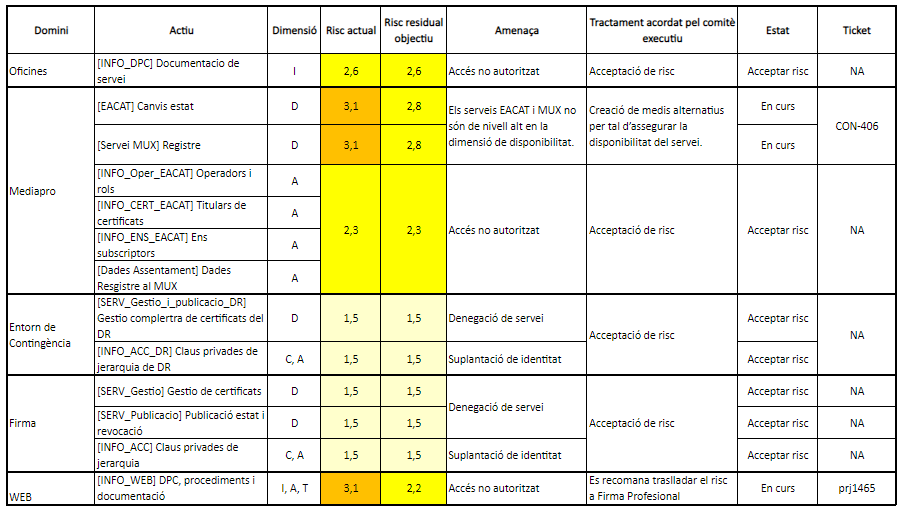

Seguretat : 2022-02-16 Comitè Executiu de Seguretat  

1.  [Seguretat](index.md)
2.  [Pàgina d'inici de la Unitat de Seguretat](15368362.md)
3.  [Actes de reunió](26317880.md)
4.  [Comitè Executiu de Seguretat](81855049.md)

Seguretat : 2022-02-16 Comitè Executiu de Seguretat
===================================================

Created by Ivan Caballero, last modified on 28 abril 2022

Data

16-feb-2022

Assistents
----------

*   [Àstrid Desset](https://confluence.aoc.cat/display/~ADesset)
*   [Miquel Estape](https://confluence.aoc.cat/display/~mestape)
*   [Usuario desconocido (marderiu)](https://confluence.aoc.cat/display/~marderiu)
*   [Ignasi Albors](https://confluence.aoc.cat/display/~ialbors)
*   [Rubén Cortés](https://confluence.aoc.cat/display/~rcortes)
*   [Ivan Caballero](https://confluence.aoc.cat/display/~icaballero)

Ordre del dia
-------------

### **Revisió i aprovació de normatives i procediments**

S'informa al Comitè Executiu, que el Comitè Operatiu de Seguretat ha revisat i aprovat sense canvis els següents documents:

*   Política de seguretat
*   Norma d'Accés a Internet
*   Norma de contrasenyes
*   Norma de Control d'accés
*   Procediment d'incidents de Seguretat i backup
*   Procediment Esborrat d'actius
*   Procediment de còpies de seguretat
*   Procediment de Gestió de WildCard
*   Procediment de gestió de vulnerabilitats

Els documents es poden consultar en el Pla Director de Seguretat de la Intranet: [Pla director de seguretat](https://confluence.aoc.cat/display/EDL/Pla+director+de+seguretat)

El comitè Operatiu ha actualitzat i aprovat el següents documents:

*   Norma de Treball fora d'oficines: [https://llicenciesaoc-my.sharepoint.com/:w:/g/personal/icaballero\_aoc\_cat/EWK3F11rmRdEtMF6hkqzQmUBmSjAILrfNwIqERaHPYaR7g?e=eTSQA9](https://llicenciesaoc-my.sharepoint.com/:w:/g/personal/icaballero_aoc_cat/EWK3F11rmRdEtMF6hkqzQmUBmSjAILrfNwIqERaHPYaR7g?e=eTSQA9)

El comitè Operatiu ha redactat i aprovat el següents documents nous:

*   Procediment de revisió de sistemes de confiença: [https://llicenciesaoc-my.sharepoint.com/:w:/g/personal/icaballero\_aoc\_cat/EenmANUiH51LrKshBviAQN4B8puuQc5pEYOFs-VttfAYwA?e=1ffuTE](https://llicenciesaoc-my.sharepoint.com/:w:/g/personal/icaballero_aoc_cat/EenmANUiH51LrKshBviAQN4B8puuQc5pEYOFs-VttfAYwA?e=1ffuTE)

### **Revisió i aprovació de l'anàlisi de riscos de SCD**

Anàlisi de riscos: [AARR SCD 2022](https://llicenciesaoc-my.sharepoint.com/:f:/g/personal/icaballero_aoc_cat/El7HzHR2e2ZOhQaPzo2X83UBGBxmMIMa3QWUyh4mVr_4rw?e=nBCy6i)

### Revisió i aprovació del Pla de Contingència de negoci de SCD

PCN: [https://llicenciesaoc-my.sharepoint.com/:f:/g/personal/fferre\_aoc\_cat/Ems9ppFtOfFIvoMd22txacwBmrKdAlNd3dOlnbx6JUIsgQ?e=FIExGR](https://llicenciesaoc-my.sharepoint.com/:f:/g/personal/fferre_aoc_cat/Ems9ppFtOfFIvoMd22txacwBmrKdAlNd3dOlnbx6JUIsgQ?e=FIExGR)

Acta
----

A la sessió del passat 16 de febrer de 2022, dins de l'ordre del dia del Consell de Direcció del Consorci AOC, constituït com a  
Comitè Executiu de Seguretat, Ivan Caballero en qualitat de Responsable de Sistemes de Seguretat i Rubén Cortés en qualitat  
de Responsable de Seguretat van exposar els següents punts per a l'aprovació per part del Comitè Executiu de Seguretat.

Punt

Ponent

Títol

Notes

1

[Ivan Caballero](https://confluence.aoc.cat/display/~icaballero)

Aprovació anual de normatives i procediments

S'informa al Comitè Executiu que s'han revisat i aprovat sense canvis els següents documents:

*   Política de seguretat
*   Norma d'Accés a Internet
*   Norma de contrasenyes
*   Norma de Control d'accés
*   Procediment d'incidents de Seguretat i backup
*   Procediment Esborrat d'actius
*   Procediment de còpies de seguretat
*   Procediment de Gestió de WildCard
*   Procediment de gestió de vulnerabilitats

2

[Ivan Caballero](https://confluence.aoc.cat/display/~icaballero)

Aprovació de l'actualització de la normativa "Treball fora de les instal·lacions"

El Comitè Operatiu ha actualitzat i aprovat la normativa "Treball fora de les instal·lacions".  
El Comitè Executiu revisa i aprova la nova versió de la normativa de "Treball fora de les instal·lacions".

El Comitè Executiu quan es faci la comunicació als usuaris, s'indiquin els canvis afegits.

3

[Ivan Caballero](https://confluence.aoc.cat/display/~icaballero)

Aprovació del procediment nou "Revisió de sistemes de confiença

El Comitè Operatiu ha creat i aprovat la normativa "Revisió de sistemes de confiança".

El Comitè Executiu revisa i aprova el procediment.

4

[Ivan Caballero](https://confluence.aoc.cat/display/~icaballero)

Revisió i aprovació de l'anàlisi de riscos del servei SCD

Es fa la exposició de l'**anàlisi de riscos** del servei SCD de l'any 2022.

S'exposa que el risc actual mesurat es de 3,1 (alt).  
El Comitè Executiu aprova el risc residual en 3 i per tant cal prendre accions mitigadores dels riscos iguals o superior a 3,0.

Es presenta el pla de tractament de riscos, amb les propostes d'accions mitigatòries. S'ha calculat el risc aplicant les mesures propusades, i el Risc Residual Objectiu és 2,8.

  

El comitè Executiu de Seguretat aprova el Pla de Tractament de Riscos i el Risc Residual Objectiu és 2,8.

  

  

5

[Ivan Caballero](https://confluence.aoc.cat/display/~icaballero)

Revisió i aprovació del Pla de Continuïtat de Negoci (PCN) del servei SCD

Es fa la exposició de l'actualització del **Pla de Continuïtat de Negoci**, formada pels documents:

*   Anàlisi d'impacte,
*   Estratègies de continuïtat
*   Gestió d'incidents
*   Procediments de recuperació
*   Taula de rols
*   Informe de les proves de contingència de 2022.

Es fa la exposició del resultat de la prova de contingència executada el dia 7 de febrer la qual va finalitzar de forma satisfactòria.

El Comitè Executiu aprova el Pla de Continuïtat de Negoci.

  

Attachments:
------------

 [image2022-2-16\_10-48-56.png](attachments/64979962/64980204.png) (image/png)  

Document generated by Confluence on 07 junio 2025 00:08

[Atlassian](http://www.atlassian.com/)