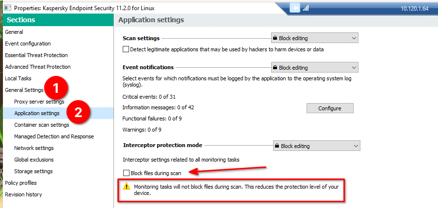

Seguretat : Incidències  

1.  [Seguretat](index.md)
2.  [Pàgina d'inici de la Unitat de Seguretat](15368362.md)
3.  [Projectes Unitat de Seguretat](Projectes-Unitat-de-Seguretat_41517821.md)
4.  [Antivirus en servidors](Antivirus-en-servidors_64980041.md)
5.  [Pilot de Kaspersky en EACAT](Pilot-de-Kaspersky-en-EACAT_64980047.md)

Seguretat : Incidències
=======================

Created by Ivan Caballero, last modified on 31 marzo 2022

Emplenat de disc per generació de dumps
---------------------------------------

Afecta a sistemes Linux.

Quan el client falla genera un dump en /var que pot emplenar el filesystem.

Es recomanar desactivar la generació de dumps:

Documentació oficial:  [https://support.kaspersky.com/KES4Linux/11.2.0/en-US/198080.htm](https://support.kaspersky.com/KES4Linux/11.2.0/en-US/198080.htm)

Per desactivar els dumps:

1\. systemctl stop kesl  
2\. sudo vi /var/opt/kaspersky/kesl/common/kesl.ini para editar el fichero  
3\. Añadir el siguiente parámetro a la línea \[General\] en la siguiente sección:  
CoreDumps=no  
4\. systemctl start kesl

Aquestes instruccions estan incloses en el procediment d'instal·lació.

Denegació del servei per mòdul WTP (Web Threat Protection)
----------------------------------------------------------

Logs de Kaspersky:

[Report on threat detection distributed by component and detection technology (1-27-2022 3-12-38 PM).xls](attachments/64980049/64980051.xls)

En la instal·lació del client s'ha produit una denegació de servei en EACAT.

S'ha desactivat el mòdul WTP (Web Threat Protection) a la directiva.

S'han posat excepcions i no sa'ha tornat a produir.

Bloqueig peticions Ajax a Valisa PL6PRE
---------------------------------------

Sistema Linux

Es detecta incidència a la Valisa (PL6PRE, Linux). Probablement falla des de que es va instal·lar en PRE, però no s'ha detectat fins ara.

Deixa de funcionar l'enviament de mails.

El navegador mostra un error 302 de redirecció.

Sembla que Kaspersky bloqueja la petición Ajax. La crida Ajax fa saltar la válvula del IDP i capa la crida.

[https://contacte.aoc.cat:8443/browse/SEG-271](https://contacte.aoc.cat:8443/browse/SEG-271)

S'han posat excepcions i no sa'ha tornat a produir.

El client s'activat sol quan el desactivem
------------------------------------------

Cal fer un stop de l'agent de xarxa també o desinstal.lar kesl

Bloqueig del heartbeat de PAM
-----------------------------

Hem detectat que el heartbeat de PAM no funciona en les màquines on està Kaspersky.

Les màquines tenen l'agent i el KLS aturat encara així no funciona. No es pot veure el mòdul que talla les connexions fins que no s'aixequi.

No era problema de kaspersky.

  

Càrrega de peticions al SCD des de EACAT
----------------------------------------

[PRJ-8261](https://contacte.aoc.cat/browse/PRJ-8261?src=confmacro) - Los datos no se pueden recuperar debido a un error inesperado.

  

En PRE, les màquines mc-tr-lg01-pre \[W2016\] 10.120.2.72, i mc-tr-lg02-pre \[W2016\] 10.120.2.73 no poden accedir a aquesta URL:

[https://scd.preproduccio.aoc.cat/connectors/connector4?wsdl](https://scd.preproduccio.aoc.cat/connectors/connector4?wsdl\):) 

Hauria de demanar certificat, però surt aquest missatge:

S'han posat excepcions i no sa'ha tornat a produir.

Microtalls a EACAT PL PRO
-------------------------

Hi talls de servei de 2 o 3 minuts al servei [https://pl6.eacat.cat/](https://pl6.eacat.cat/)

  

Los Threaths de Liferay se veian pausados.

  

Son llamadas que liferay se hace a sí mismo por el puerto 8009.

Se tuvo que para la protección. Primero en los liferay. Después se tuvo que parar también en los frontales.

  

### Solució.

Es treu que Kaspersky pugui bloquejar els arxius durant l'escanneig

  

S'exclouen els arxius de Liferay

  

  

Error en sondas del CTTI.
-------------------------

El dia 30 a les 15:00 s'activa la protecció en els frontals de PL6. Abans s'ha apliat la CPU de 2 a 4 cores. Es vigila el servei fins a les 16:30 i no dona problemes.

A les 22:15 es desactiva ja que han trucat del CTTI perque hi ha sondes 

  

  

Ens ha trucat el CTTI a les 20:50h per avisar-nos de diverses alertes:

Primer de tot, com veiem que el factor comú d’aquestes sondes és EACAT, reinciem ambdós nodes de manera ordenada de PL6, però aquests reinicis no han arreglat la problemàtica. A les OP5 vam veure alerta als dos frontals de pl6, també els reiniciem i EACAT continuava sense funcionar, de fet no es podia ni accedir al login.

Al final, hem detectat que avui s’havien instal·lat el Kaspersky als dos frontals de PL6, els quals estaven afectats. Hem accedit a la màquina del Kaspersky a les 22:15h aproximadament i al desactivar els Kaspersky als frontals de PL6, hem tornat a donar servei a EACAT:

També al desactivar els Kaspersky dels frontals, les sondes OMI s’han anat recuperant i ja està tot estable:

  

Attachments:
------------

 [image2022-2-9\_5-40-4.png](attachments/64980049/64980050.png) (image/png)  
 [Report on threat detection distributed by component and detection technology (1-27-2022 3-12-38 PM).xls](attachments/64980049/64980051.xls) (application/vnd.ms-excel)  
 [image2022-3-4\_18-1-21.png](attachments/64980049/64980579.png) (image/png)  
 [image2022-3-16\_17-30-29.png](attachments/64980049/64980733.png) (image/png)  
 [image2022-3-16\_17-50-30.png](attachments/64980049/64980735.png) (image/png)  
 [image2022-3-24\_9-19-10.png](attachments/64980049/64980783.png) (image/png)  
 [image2022-3-24\_9-20-16.png](attachments/64980049/64980784.png) (image/png)  
 [image2022-3-31\_9-22-18.png](attachments/64980049/64980854.png) (image/png)  
 [image2022-3-31\_9-22-50.png](attachments/64980049/64980855.png) (image/png)  
 [image2022-3-31\_9-23-29.png](attachments/64980049/64980856.png) (image/png)  

Document generated by Confluence on 07 junio 2025 00:08

[Atlassian](http://www.atlassian.com/)