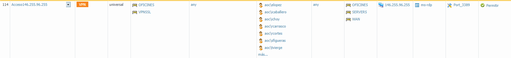

Seguretat : Accés a la plataforma de backup d'office 365  

1.  [Seguretat](index.md)
2.  [Pàgina d'inici de la Unitat de Seguretat](15368362.md)
3.  [Projectes Unitat de Seguretat](Projectes-Unitat-de-Seguretat_41517821.md)
4.  [Backup d'Office 365](64979561.md)
5.  [Manual usuari](Manual-usuari_64979563.md)
6.  [obsolet backup O365](obsolet-backup-O365_64980960.md)

Seguretat : Accés a la plataforma de backup d'office 365
========================================================

Created by Ivan Caballero on 07 abril 2022

Per accedir al sistema de còpies de seguretat, fer servir el launcher del PAM:

[https://pam.aoc.cat/SecretServer/app/#/secret/553/general](https://pam.aoc.cat/SecretServer/app/#/secret/553/general)

  

Les còpies de seguretat es fan des del servidor Windows 146.255.96.255.

L'accés es fa per RDP i la comtrasenya està al PAM.

Només la IP 157.97.65.88 té accés a la IP pública. Aquest és la IP de sortida de la VPN.

L'accés per la VPN està restringit a usuaris de segutetat i manteniment intern

  

  

  

  
  

  

  

Attachments:
------------

 [image2022-4-7\_8-45-28.png](attachments/64980951/64980952.png) (image/png)  

Document generated by Confluence on 07 junio 2025 00:08

[Atlassian](http://www.atlassian.com/)