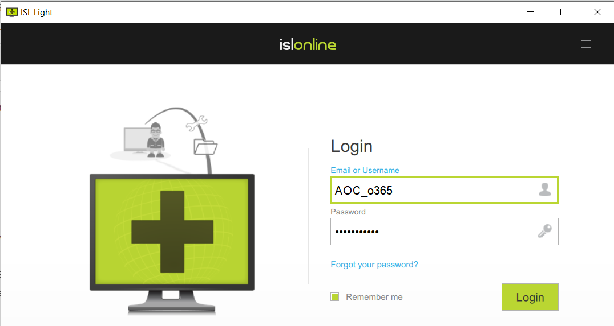
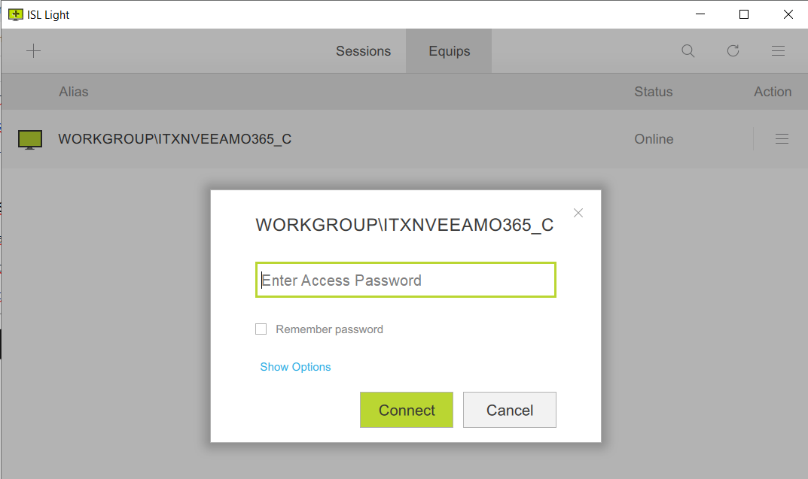
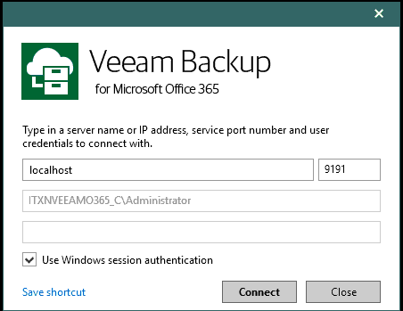

Seguretat : Accés a plataforma de backup Office 365 per ISL  

1.  [Seguretat](index.md)
2.  [Pàgina d'inici de la Unitat de Seguretat](15368362.md)
3.  [Projectes Unitat de Seguretat](Projectes-Unitat-de-Seguretat_41517821.md)
4.  [Backup d'Office 365](64979561.md)
5.  [Manual usuari](Manual-usuari_64979563.md)
6.  [obsolet backup O365](obsolet-backup-O365_64980960.md)

Seguretat : Accés a plataforma de backup Office 365 per ISL
===========================================================

Created by Ivan Caballero on 07 abril 2022

  

Primera connexió al sistema
---------------------------

La connexió al sistema es fa amb el programa ISL Ligth 4 que es pot descarregar d'aquesta URL:

[http://soporte.eidservicios.com/users/main/downloads.html](http://soporte.eidservicios.com/users/main/downloads.html)

Instalar el programari.

Accés al sistema
----------------

Executar ISL Light 4.

Connectar fent servir l'usuari AOC\_o365.

La contrasenya: [https://pam.aoc.cat/SecretServer/app/#/secret/491/general](https://pam.aoc.cat/SecretServer/app/#/secret/491/general)

Accedir l'equip Workgroup\\itxnveeamo365\_C,

[https://pam.aoc.cat/SecretServer/app/#/secret/492/general](https://pam.aoc.cat/SecretServer/app/#/secret/492/general)

  

L'equip és Windows. L'usuari de windows és aoc\_o365

[https://pam.aoc.cat/SecretServer/app/#/secret/493/general](https://pam.aoc.cat/SecretServer/app/#/secret/493/general)

  

Dins de l'escriptori, executar l'icone: Veeam Backup for Microsoft Office 365 connect to...

Obrir veam backup

Attachments:
------------

 [image2022-1-21\_7-11-52.png](attachments/64980954/64980955.png) (image/png)  
 [image2022-1-21\_7-12-38.png](attachments/64980954/64980956.png) (image/png)  
 [image2022-1-26\_23-48-43.png](attachments/64980954/64980957.png) (image/png)  

Document generated by Confluence on 07 junio 2025 00:08

[Atlassian](http://www.atlassian.com/)