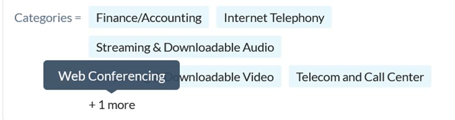

Seguretat : Protecció de dades  

1.  [Seguretat](index.md)
2.  [Pàgina d'inici de la Unitat de Seguretat](15368362.md)
3.  [Projectes Unitat de Seguretat](Projectes-Unitat-de-Seguretat_41517821.md)
4.  [SASE](SASE_81856152.md)
5.  [Catalonia SOC - SASE - Netskope](Catalonia-SOC---SASE---Netskope_64981706.md)

Seguretat : Protecció de dades
==============================

Created by Ivan Caballero, last modified on 22 agosto 2022

Definició del tractament
------------------------

El sistema guarda fins a 6 mesos, les dades de tots els usuaris de CATSOC. El servei guarda l’historial de navegació dels usuaris adherits a la plataforma. Aquestes dades estan encriptades i en servidors europeus sense que hi hagi transferència al estranger, complint amb la protecció de dades com us comento a continuació:

Informació bàsica sobre protecció de dades
------------------------------------------

**Responsable del tractament**

El responsable del tractament és l’Agència de Ciberseguretat de Catalunya. Les vostres dades seran tractades amb la màxima confidencialitat únicament pel personal autoritzat pel Responsable del tractament.

**Finalitats del tractament:**

*   Gestió de la sol·licitud d'alta.
*   Enviament de comunicats relacionats amb el servei sol·licitat.
*   Enviament de comunicacions d'Agència de Ciberseguretat de Catalunya (Catalonia SOC) per informar-te de millores, novetats i consells.

**Termini de conservació de les dades**

Les teves dades es conservaran mentre duri la missió realitzada en interès públic i no n'hagueu sol·licitat la supressió, així com, durant els terminis establerts per la Legislació aplicable i vigent.

**Legitimació**

La legitimació es basa en l'article 6.1 e) del Reglament (UE) 2016/679 de 27 d'abril de 2016 que diu “el tractament és necessari per complir una missió realitzada en interès públic o en l'exercici de poders públics conferits al responsable del tractament”.

**Destinataris:**

Les vostres dades seran comunicades als departaments de la Generalitat i entitats vinculades que en depenen per a la gestió dels diferents serveis públics de la seva competència.

**Drets de les persones interessades:**

Els drets d'accés, rectificació, supressió, limitació del tractament i oposició es faran efectius mitjançant carta adreçada a la Fundació Centre de Seguretat de la Informació de Catalunya, Carrer de Salvador Espriu, 45-51 08908 L'Hospitalet de Llobregat o bé mitjançant de l'adreça de correu electrònic habilitada a aquest efecte [protecciodades@ciberseguretat.cat](mailto:protecciodades@ciberseguretat.cat). En qualsevol cas, l'Usuari haurà d'identificar-se mitjançant DNI i concretar-ne el requeriment.

**Informació addicional:** si voleu ampliar aquesta informació podeu consultar la informació detallada del tractament.

Nivell de detall de dades dins del logs
---------------------------------------

El Catalonia SOC desencripta les comunicacions per poder analitzar-les.

Hi ha una sèrie de categories web que no s'analitzen per considerar-se personals. Són les següents:

El nivell de log que es registra, tant si és una web dins de les excepcions com si no, no inclou dades personals. Només es registra la execució de processos. En cap cas es registren credencials o continguts de la web.

Exemple de log accedint a una web dins de les excepcions: www.caixabanc.es:

2022/08/22 15:05:29.574 stAgentSvc p17e0 t63b8 info bypassAppMgr.cpp:1171 BypassAppMgr bypassing flow to exception host: [www.caixabank.es](http://www.caixabank.es/), process: chrome.exe, Dest IP: 104.18.1.56, Dest Port: 443  
2022/08/22 15:05:34.037 stAgentSvc p17e0 t63b8 info bypassAppMgr.cpp:1171 BypassAppMgr bypassing flow to exception host: [loapp.caixabank.es](http://loapp.caixabank.es/), process: chrome.exe, Dest IP: 217.148.72.237, Dest Port: 443  
2022/08/22 15:05:34.201 stAgentSvc p17e0 t63b8 info bypassAppMgr.cpp:1171 BypassAppMgr bypassing flow to exception host: [js.pp.caixabank.es](http://js.pp.caixabank.es/), process: chrome.exe, Dest IP: 104.18.20.201, Dest Port: 443  
2022/08/22 15:05:34.237 stAgentSvc p17e0 t63b8 info bypassAppMgr.cpp:1171 BypassAppMgr bypassing flow to exception host: [content-autofill.googleapis.com](http://content-autofill.googleapis.com/), process: chrome.exe, Dest IP: 142.250.185.170, Dest Port: 443  
2022/08/22 15:05:34.395 stAgentSvc p17e0 t63b8 info bypassAppMgr.cpp:1171 BypassAppMgr bypassing flow to exception host: [content-autofill.googleapis.com](http://content-autofill.googleapis.com/), process: chrome.exe, Dest IP: 142.250.185.170, Dest Port: 443

Exemple de log accedint a una web que no està dins de les excepcions: www.filmaffinity.es:

2022/08/22 15:16:38.526 stAgentSvc p17e0 t63b8 info tunnel.cpp:811 nsTunnel DTLS \[sessId 11\] Tunneling flow from addr: 192.168.8.109:63979, process: chrome.exe to host: [www.filmaffinity.com](http://www.filmaffinity.com/), addr: 82.98.137.22:443 to nsProxy  
2022/08/22 15:16:38.527 stAgentSvc p17e0 t63b8 info tunnel.cpp:811 nsTunnel DTLS \[sessId 11\] Tunneling flow from addr: 192.168.8.109:63980, process: chrome.exe to host: [www.filmaffinity.com](http://www.filmaffinity.com/), addr: 82.98.137.22:443 to nsProxy  
2022/08/22 15:16:38.546 stAgentSvc p17e0 t63b8 info tunnel.cpp:811 nsTunnel DTLS \[sessId 11\] Tunneling flow from addr: 192.168.8.109:63981, process: chrome.exe to host: [cdn.smartclip-services.com](http://cdn.smartclip-services.com/), addr: 130.61.96.156:443 to nsProxy  
2022/08/22 15:16:38.548 stAgentSvc p17e0 t63b8 info tunnel.cpp:811 nsTunnel DTLS \[sessId 11\] Tunneling flow from addr: 192.168.8.109:63982, process: chrome.exe to host: [s3.eu-central-1.amazonaws.com](http://s3.eu-central-1.amazonaws.com/), addr: 52.219.170.193:443 to nsProxy  
2022/08/22 15:16:41.216 stAgentSvc p17e0 t63b8 info tunnel.cpp:811 nsTunnel DTLS \[sessId 11\] Tunneling flow from addr: 192.168.8.109:63986, process: chrome.exe to host: [cdn.smartclip-services.com](http://cdn.smartclip-services.com/), addr: 130.61.96.156:443 to nsProxy  
2022/08/22 15:16:41.279 stAgentSvc p17e0 t63b8 info tunnel.cpp:811 nsTunnel DTLS \[sessId 11\] Tunneling flow from addr: 192.168.8.109:63987, process: chrome.exe to host: [www.google-analytics.com](http://www.google-analytics.com/), addr: 142.250.181.238:443 to nsProxy  
2022/08/22 15:16:41.300 stAgentSvc p17e0 t63b8 info tunnel.cpp:811 nsTunnel DTLS \[sessId 11\] Tunneling flow from addr: 192.168.8.109:63988, process: chrome.exe to host: [pics.filmaffinity.com](http://pics.filmaffinity.com/), addr: 82.98.162.78:443 to nsProxy  
2022/08/22 15:16:41.303 stAgentSvc p17e0 t63b8 info tunnel.cpp:811 nsTunnel DTLS \[sessId 11\] Tunneling flow from addr: 192.168.8.109:63989, process: chrome.exe to host: [cmp.quantcast.com](http://cmp.quantcast.com/), addr: 143.204.9.23:443 to nsProxy  
2022/08/22 15:16:41.304 stAgentSvc p17e0 t63b8 info tunnel.cpp:811 nsTunnel DTLS \[sessId 11\] Tunneling flow from addr: 192.168.8.109:63990, process: chrome.exe to host: [sb.scorecardresearch.com](http://sb.scorecardresearch.com/), addr: 13.226.175.76:443 to nsProxy  
2022/08/22 15:16:41.652 stAgentSvc p17e0 t63b8 info tunnel.cpp:811 nsTunnel DTLS \[sessId 11\] Tunneling flow from addr: 192.168.8.109:63991, process: chrome.exe to host: [quantcast.mgr.consensu.org](http://quantcast.mgr.consensu.org/), addr: 143.204.9.28:443 to nsProxy  
2022/08/22 15:16:41.677 stAgentSvc p17e0 t63b8 info tunnel.cpp:811 nsTunnel DTLS \[sessId 11\] Tunneling flow from addr: 192.168.8.109:63992, process: chrome.exe to host: [rules.quantcount.com](http://rules.quantcount.com/), addr: 13.226.175.38:443 to nsProxy  
2022/08/22 15:16:41.727 stAgentSvc p17e0 t63b8 info tunnel.cpp:811 nsTunnel DTLS \[sessId 11\] Tunneling flow from addr: 192.168.8.109:63993, process: chrome.exe to host: [stats.g.doubleclick.net](http://stats.g.doubleclick.net/), addr: 74.125.206.156:443 to nsProxy  
2022/08/22 15:16:41.890 stAgentSvc p17e0 t63b8 info tunnel.cpp:811 nsTunnel DTLS \[sessId 11\] Tunneling flow from addr: 192.168.8.109:63994, process: chrome.exe to host: [quantcast.mgr.consensu.org](http://quantcast.mgr.consensu.org/), addr: 143.204.9.23:443 to nsProxy  
2022/08/22 15:16:42.414 stAgentSvc p17e0 t63b8 info tunnel.cpp:811 nsTunnel DTLS \[sessId 11\] Tunneling flow from addr: 192.168.8.109:63995, process: chrome.exe to host: [audit-tcfv2.cmp.quantcast.com](http://audit-tcfv2.cmp.quantcast.com/), addr: 18.196.221.202:443 to nsProxy  
2022/08/22 15:16:42.500 stAgentSvc p17e0 t63b8 info bypassAppMgr.cpp:1171 BypassAppMgr bypassing flow to exception host: [translate.googleapis.com](http://translate.googleapis.com/), process: chrome.exe, Dest IP: 216.58.214.10, Dest Port: 443  
2022/08/22 15:16:44.398 stAgentSvc p17e0 t63b8 info tunnel.cpp:811 nsTunnel DTLS \[sessId 11\] Tunneling flow from addr: 192.168.8.109:63997, process: chrome.exe to host: [securepubads.g.doubleclick.net](http://securepubads.g.doubleclick.net/), addr: 142.250.185.130:443 to nsProxy  
2022/08/22 15:16:44.429 stAgentSvc p17e0 t63b8 info tunnel.cpp:811 nsTunnel DTLS \[sessId 11\] Tunneling flow from addr: 192.168.8.109:63998, process: chrome.exe to host: [pixel.quantserve.com](http://pixel.quantserve.com/), addr: 91.228.74.200:443 to nsProxy  
2022/08/22 15:16:44.435 stAgentSvc p17e0 t63b8 info tunnel.cpp:811 nsTunnel DTLS \[sessId 11\] Tunneling flow from addr: 192.168.8.109:63999, process: chrome.exe to host: [des.smartclip.net](http://des.smartclip.net/), addr: 35.186.194.101:443 to nsProxy  
2022/08/22 15:16:44.914 stAgentSvc p17e0 t63b8 info tunnel.cpp:811 nsTunnel DTLS \[sessId 11\] Tunneling flow from addr: 192.168.8.109:64000, process: chrome.exe to host: [dpm.demdex.net](http://dpm.demdex.net/), addr: 54.154.32.144:443 to nsProxy  
2022/08/22 15:16:44.944 stAgentSvc p17e0 t63b8 info tunnel.cpp:811 nsTunnel DTLS \[sessId 11\] Tunneling flow from addr: 192.168.8.109:64001, process: chrome.exe to host: [dpm.demdex.net](http://dpm.demdex.net/), addr: 54.154.32.144:443 to nsProxy  
2022/08/22 15:16:44.992 stAgentSvc p17e0 t63b8 info tunnel.cpp:811 nsTunnel DTLS \[sessId 11\] Tunneling flow from addr: 192.168.8.109:64002, process: chrome.exe to host: [securepubads.g.doubleclick.net](http://securepubads.g.doubleclick.net/), addr: 142.250.185.130:443 to nsProxy  
2022/08/22 15:16:45.439 stAgentSvc p17e0 t63b8 info tunnel.cpp:811 nsTunnel DTLS \[sessId 11\] Tunneling flow from addr: 192.168.8.109:64005, process: chrome.exe to host: [cdn.mookie1.com](http://cdn.mookie1.com/), addr: 23.216.124.148:443 to nsProxy  
2022/08/22 15:16:45.609 stAgentSvc p17e0 t63b8 info tunnel.cpp:811 nsTunnel DTLS \[sessId 11\] Tunneling flow from addr: 192.168.8.109:64008, process: stagentsvc.exe to host: [achecker-catalonia-soc.eu.goskope.com](http://achecker-catalonia-soc.eu.goskope.com/), addr: 31.186.239.95:443 to nsProxy  
2022/08/22 15:16:46.071 stAgentSvc p17e0 t63b8 info tunnel.cpp:811 nsTunnel DTLS \[sessId 11\] Tunneling flow from addr: 192.168.8.109:64009, process: chrome.exe to host: [smc.demdex.net](http://smc.demdex.net/), addr: 52.19.103.22:443 to nsProxy  
2022/08/22 15:16:46.074 stAgentSvc p17e0 t63b8 info tunnel.cpp:811 nsTunnel DTLS \[sessId 11\] Tunneling flow from addr: 192.168.8.109:64010, process: chrome.exe to host: [smc.demdex.net](http://smc.demdex.net/), addr: 52.19.103.22:443 to nsProxy  
2022/08/22 15:16:46.077 stAgentSvc p17e0 t63b8 info tunnel.cpp:811 nsTunnel DTLS \[sessId 11\] Tunneling flow from addr: 192.168.8.109:64013, process: stagentsvc.exe to host: [achecker-catalonia-soc.eu.goskope.com](http://achecker-catalonia-soc.eu.goskope.com/), addr: 31.186.239.95:443 to nsProxy  
2022/08/22 15:16:46.189 stAgentSvc p17e0 t63b8 info tunnel.cpp:811 nsTunnel DTLS \[sessId 11\] Tunneling flow from addr: 192.168.8.109:64014, process: chrome.exe to host: [www.gstatic.com](http://www.gstatic.com/), addr: 142.250.181.227:443 to nsProxy  
2022/08/22 15:16:46.230 stAgentSvc p17e0 t63b8 info bypassAppMgr.cpp:1171 BypassAppMgr bypassing flow to exception host: [content-autofill.googleapis.com](http://content-autofill.googleapis.com/), process: chrome.exe, Dest IP: 216.58.212.170, Dest Port: 443  
2022/08/22 15:16:46.373 stAgentSvc p17e0 t63b8 info bypassAppMgr.cpp:1171 BypassAppMgr bypassing flow to exception host: [self.events.data.microsoft.com](http://self.events.data.microsoft.com/), process: onedrive.exe, Dest IP: 20.50.73.10, Dest Port: 443  
2022/08/22 15:16:46.458 stAgentSvc p17e0 t63b8 info tunnel.cpp:811 nsTunnel DTLS \[sessId 11\] Tunneling flow from addr: 192.168.8.109:64017, process: chrome.exe to host: [router.infolinks.com](http://router.infolinks.com/), addr: 172.66.41.9:443 to nsProxy  
2022/08/22 15:16:49.322 stAgentSvc p17e0 t63b8 info tunnel.cpp:811 nsTunnel DTLS \[sessId 11\] Tunneling flow from addr: 192.168.8.109:64018, process: chrome.exe to host: [fonts.gstatic.com](http://fonts.gstatic.com/), addr: 216.58.212.163:443 to nsProxy  
2022/08/22 15:16:49.783 stAgentSvc p17e0 t63b8 info tunnel.cpp:811 nsTunnel DTLS \[sessId 11\] Tunneling flow from addr: 192.168.8.109:64019, process: chrome.exe to host: [filmaffinity.com](http://filmaffinity.com/), addr: 82.98.137.22:443 to nsProxy

  

  

  
  

Attachments:
------------

 [image2022-8-22\_15-38-20.png](attachments/77824325/77824326.png) (image/png)  

Document generated by Confluence on 07 junio 2025 00:08

[Atlassian](http://www.atlassian.com/)