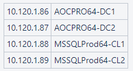

Seguretat : 2022-09-23 Comitè Operatiu de seguretat  

1.  [Seguretat](index.md)
2.  [Pàgina d'inici de la Unitat de Seguretat](15368362.md)
3.  [Actes de reunió](26317880.md)
4.  [Comitè Operatiu de Seguretat](81855047.md)
5.  [2022](2022_100010196.md)

Seguretat : 2022-09-23 Comitè Operatiu de seguretat
===================================================

Created by Ivan Caballero, last modified on 27 septiembre 2022

Data

23-sep-2022 

Assistents
----------

*   [Rubén Cortés](https://confluence.aoc.cat/display/~rcortes) [Irma Choy](https://confluence.aoc.cat/display/~ichoy) [Ivan Caballero](https://confluence.aoc.cat/display/~icaballero)
    

Ordre del dia
-------------

**Pla de treball per resolució de vulnerabilitats.**

*   Acceptació de vulnerabilitats Windows Server 2008: cal acceptar la data de resolució per la migració de tots el Windows Server 2008 que encara hi ha al Consorci AOC. Les vulnerabilitats que hi ha en aquests servidors són:
    *   eTram: prevista migració al nou eTram el dia 31 de desembre
    *   Domain Controllers i MSSQLProd64 d'EACAT: sense data de migració. Li he demanat a Sistemes. Proposo acceptar fins al 31 de desembre.

 

*   Servidors d'oficines: Exchange, AD, servidor de fitxers. Finals de desembre.

*   Acceptació de vulnerabilitats de Palo Alto d'oficines: hi ha vulnerabilitats que afecten a GlobalProtect i també al firewall
    *   Firewall: hi ha vulnerabilitats de nivell alt: [INT-2177](https://contacte.aoc.cat/browse/INT-2177). Cal contractar a una empresa que faci l'actualització ja que és una acció perillosa.
    *   GlobalProtect: hi ha una vulnerabilitat de nivell alt: [INT-2475](https://contacte.aoc.cat/browse/INT-2475). No tenim disponible el distribuïdor  de programari "Intunes" per distribuir la nova versió.
*   Acceptació en màquines EACAT:
    *   splunk fa servir SSL 3.0 i no es pot limitar fins a la versió 6.5. Nosaltres estem a la 6.0.2. Tiquets:  
        
        *   [https://contacte.aoc.cat:8443/browse/SEG-332](https://contacte.aoc.cat:8443/browse/SEG-332)

**Permisos de sharepoint**

Jo crec que aquí darrere hi ha d’haver una prèvia classificació i gestió de carpetes

Que cada propietari de carpeta defineixi els permisos tenint en compte que cada usuari ha de tenir accés a allò que necessites per l’exercici De les teves funcions.

Les carpetes de contractació no obertes.

**Aprovació de normatives i procediments**

Acta
----

**Pla de treball per resolució de vulnerabilitats.**

S'aproven les dates de resolució de les vulnerabilitats:

*   Windows Server 2008 en Servei e-Tram: 31 de desembre
*   Windows Server 2008 en EACAT: 31 de desembre
*   Windows Server 2008 en Oficines: 31 de desembre
*   PaloAlto d'oficines: no tenim data prevista del responsable. El Cap de Seguretat accepta la vulnerabilitat fins a 31 de desembre. S'informarà al responsable.
*   Splunk en EACAT i resta de plataformes: no tenim data prevista del responsable. Cal fer la migració del servidor de SPLUNK. S'aprova la vulnerabilitat fins a finals de 2023 i s'informarà al responsable.

**Permisos de sharepoint**

S'explica la problemàtica de que actualment a Endreca, per defecte el grup "AOC" (tot el personal del consorci), té accés de lectura a les carpetes. Només les carpetes molt evidents, per exemple RRHB té l'accés restringit.

[Irma Choy](https://confluence.aoc.cat/display/~ichoy)indica que caldria fer un projecte de classificació de la informació i donar directrius als propietaris de carpetes per determinar on està la informació sensible i mantenir els permisos.

Per la migració a sharepoint

*   es traurà el accesos del grup AOC.
*   El comitè operatiu revisarà els permisos de les carpetes i farà una proposta als responsables. Pendent convocar reunió.

**Encàrrec de Tractament amb el CTTI per la migració d'oficines**

[Irma Choy](https://confluence.aoc.cat/display/~ichoy)està fet l'encàrrec de tractament i consulta si a nivell de seguretat cal posar algún requeriment.

S'informa que probablement no es posaran dades ni cap dispositiu del Consorci en les oficines del CTTI, i només farem servir la seva infraestructura de comunicacions per sortir a Internet.

El dia 28 està previst validar aquesta solució, i aquest cas no caldrà cap requeriment de seguretat.

Igualment es consultarà a CESICAT i ells van fer algún anàlisi de riscos.

Sí caldrà refrescar als usuaris les normatives de no dexar informa a taules, a impressors, etc.

  

Attachments:
------------

 [Privades\_EACAT\_PRO\_\_SIS-4894\_\_3w6yf7.html](attachments/77824377/77824378.md) (text/html)  
 [image2022-9-22\_16-13-34.png](attachments/77824377/77824500.png) (image/png)  

Document generated by Confluence on 07 junio 2025 00:08

[Atlassian](http://www.atlassian.com/)