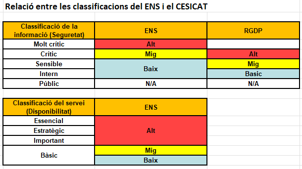

Seguretat : Guia valoració de la informació i categorització dels serveis  

1.  [Seguretat](index.md)
2.  [Pàgina d'inici de la Unitat de Seguretat](15368362.md)
3.  [Procediments Unitat de Seguretat](Procediments-Unitat-de-Seguretat_81856210.md)

Seguretat : Guia valoració de la informació i categorització dels serveis
=========================================================================

Created by Ivan Caballero, last modified on 29 enero 2024

La categorització de serveis de l'AOC es farà seguint la metodologia de l'Agència de Ciberseguretat i de l'Esquema Nacional de Seguretat i la de l'Agència de Ciberseguretat de Catalunya. Per les dades de caràcter personal es farà servir l'eina de l'Agència de Ciberseguretat.

Per ajudar en la valoració, es compararan les dades i el servei amb els exemples proporcionat.

*   Metodologia de l'ACC: [GUIT049-C Guia de classificació dels tractaments d'informació v1.1.doc](attachments/81855870/81855871.doc)
*   Metodologia de l'ENS: [803\_ENS-valoracion.pdf](attachments/81855870/81855872.pdf)
*   Eina per Dades Personals: [Fitxa de Tractament\_GEN v.7.0.xlsm](attachments/81855870/81855873.xlsm)
*   Exemples de dades i serveis: [Taula exemples de valoració de serveis.xlsx](attachments/81855870/81855875.xlsx)
*   Plantilla informe de valoració: [Plantila Informe de valoració serveis AOC 20240126.docx](attachments/81855870/100008980.docx)

Procediment:
------------

La responsabilitat de la valoració de la informació i dels serveis és exclusivament del responsable de la informació i dels serveis, en el cas de l'AOC, el Comitè Executiu de Seguretat. La valoració es proposta pel Responsable de Seguretat i pel Cap del Servei i el Comitè Executiu aprovarà la valoració.

  

*   La documentació s'haurà d'ubicar en el directori [https://llicenciesaoc.sharepoint.com/:f:/s/CiberseguretatAOC/Ej04dmjQSmxamtP-kbrVzi4BckW0tRwxw3\_NjRtff78iiQ?e=saOPBC](https://llicenciesaoc.sharepoint.com/:f:/s/CiberseguretatAOC/Ej04dmjQSmxamtP-kbrVzi4BckW0tRwxw3_NjRtff78iiQ?e=saOPBC) dins de la carpeta del servei corresponent. Es recomana crear una carpeta amb el nom "Categorització 2.0" per indicar que s'ha seguit aquesta metodologia. 
*   Fer entrevista amb el cap del servei per recollir la informació rellevant del servei. Fer informe per justificar la valoració seguint la següent plantilla: [Plantila Informe de valoració serveis AOC 20240126.docx](attachments/81855870/100008980.docx)
*   Es recomana fer la valoració agafant els exemples de "Taula exemples de valoració de serveis". Trobar exemples per la metodologia de l'ACC i de l'ENS i aplicar la mateixa valoració. En la darrera pestanya està la relació entre les 2 metodologies que han de coincidir. Per valoracions més acurades o que no es trobin exemples clars, es pot anar les metodologies originals de l'ACC "GUIT049-C" i la de l'ENS "803\_ENS".

*   Fer valoració del risc en dades personals amb eina del CESICAT: [Fitxa de Tractament\_GEN v.7.0.xlsm](attachments/81855870/81855873.xlsm). Aquest excel l'ha d'emplenar el cap de servei amb el suport de la Unitat de Seguretat.
*   Posar el resultat en l'excel "Quadre resum CESICAT - ENS\_v8.0": [https://llicenciesaoc.sharepoint.com/:f:/s/CiberseguretatAOC/Ej04dmjQSmxamtP-kbrVzi4BckW0tRwxw3\_NjRtff78iiQ?e=KOFveO](https://llicenciesaoc.sharepoint.com/:f:/s/CiberseguretatAOC/Ej04dmjQSmxamtP-kbrVzi4BckW0tRwxw3_NjRtff78iiQ?e=KOFveO)
*   La valoració final es portarà a Comitè Executiu de Seguretat per ser aprovat.
*   Publicar els resultats a la intranet

Attachments:
------------

 [GUIT049-C Guia de classificació dels tractaments d'informació v1.1.doc](attachments/81855870/81855871.doc) (application/msword)  
 [803\_ENS-valoracion.pdf](attachments/81855870/81855872.pdf) (application/pdf)  
 [Fitxa de Tractament\_GEN v.7.0.xlsm](attachments/81855870/81855873.xlsm) (application/vnd.ms-excel.sheet.macroEnabled.12)  
 [Plantila Informe de valoració serveis AOC.docx](attachments/81855870/81855874.docx) (application/vnd.openxmlformats-officedocument.wordprocessingml.document)  
 [Taula exemples de valoració de serveis.xlsx](attachments/81855870/100008976.xlsx) (application/vnd.openxmlformats-officedocument.spreadsheetml.sheet)  
 [Taula exemples de valoració de serveis.xlsx](attachments/81855870/81855875.xlsx) (application/vnd.openxmlformats-officedocument.spreadsheetml.sheet)  
 [image2024-1-26\_13-17-26.png](attachments/81855870/100008978.png) (image/png)  
 [Plantila Informe de valoració serveis AOC 20240126.docx](attachments/81855870/100008980.docx) (application/vnd.openxmlformats-officedocument.wordprocessingml.document)  

Document generated by Confluence on 07 junio 2025 00:08

[Atlassian](http://www.atlassian.com/)