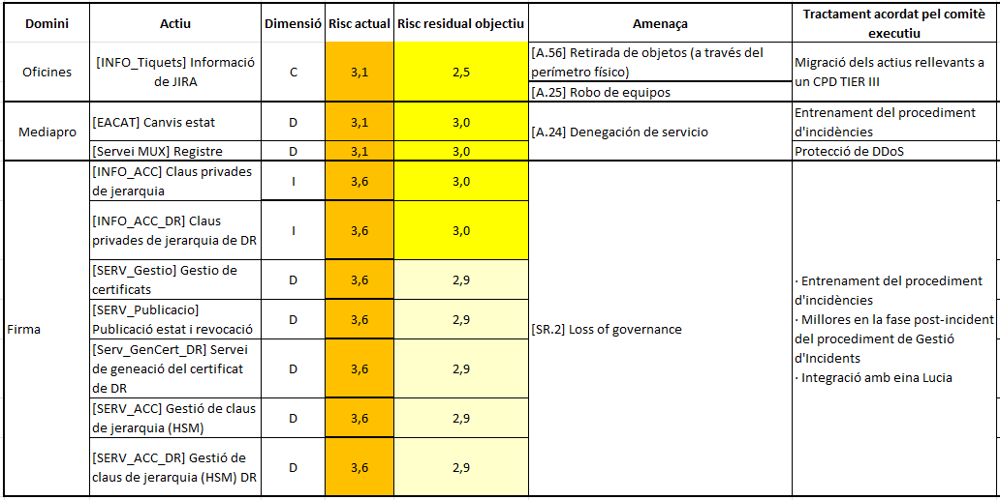

Seguretat : 2023-03-30 Comitè Executiu de Seguretat  

1.  [Seguretat](index.md)
2.  [Pàgina d'inici de la Unitat de Seguretat](15368362.md)
3.  [Actes de reunió](26317880.md)
4.  [Comitè Executiu de Seguretat](81855049.md)

Seguretat : 2023-03-30 Comitè Executiu de Seguretat
===================================================

Created by Ivan Caballero, last modified on 30 marzo 2023

Data

30-mar-2023

Assistents
----------

*   [Usuario desconocido (sgallardo)](https://confluence.aoc.cat/display/~SGallardo) [Rubén Cortés](https://confluence.aoc.cat/display/~rcortes) [Usuario desconocido (marderiu)](https://confluence.aoc.cat/display/~marderiu) [Miquel Estape](https://confluence.aoc.cat/display/~mestape) [Ignasi Albors](https://confluence.aoc.cat/display/~ialbors) [Ivan Caballero](https://confluence.aoc.cat/display/~icaballero)

Ordre del dia
-------------

*   Aprovació de la versió 4 de Procediment d'Incidents i Violacions de Seguretat:
*   Aprovació d'anàlisi de riscos de SCD

*   Aprovació del risc residual.
*   Aprovació del pla de tractament de riscos
*   Aprovació del risc residual objectiu

*   Aprovació de PCN de SCD

*   Aprovació de la prova de contingència
*   Aprovació de la taula de rols

*   Aprovació sense canvis de normatives i procediments:

*   NOR01 Accés a Internet
*   NOR02 Creació de contrasenyes
*   NOR03 Treball fora de les instal·lacions
*   NOR04 Control d'accés
*   PROC02 Esborrat segur d'actius
*   PROC03 Còpies i restauracions de seguretat

Documents:  [Comitè executiu](https://llicenciesaoc-my.sharepoint.com/:f:/g/personal/icaballero_aoc_cat/ElvP-BwGsBpCtKR5AXz5bAoBFMzYykPN1RmJy5wloKZbNA?e=jGbS3E)

  

Acta
----

Punt

Ponent

Títol

Notes

1

Ivan Caballero

Revisió del Procediment d'Incidents i Violacions de Seguretat 

*   S'exposen els canvis afegits, proposats pel Comitè Executiu en la convocatòria de febrer.
*   El Comitè Executiu aprova la versió 4 del document.

2

Ivan Caballero

Revisió d'Anàlisi de Riscos i PTR de SCD

*   S'exposa l'anàlisi de riscos del servei SCD, on el risc actual s'ha valorat en 3,6.
*   El Comitè Executiu aprova el risc residual en 3.
*   El comitè Executiu aprova el Pla de Tractament de Riscos proposat.

*   El Comitè Executiu aprova el risc residual objectiu en 3.

3

Ivan Caballero

Revisió d'Anàlisi d'Impacte (BIA) i Pla de Contingència de Negoci (PCN)

*   S'exposa l'actualització de BIA, del PCN i de la prova de contingència feta el dia 7 de març
*   La prova ha estat auditada per l'ACC i el seu resutat és satisfactori.
*   S'exposa l'actualització de la taula de rols i canvis afegit.
*   El Comitè Executiu aprova el BIA, el PCN i la taula de rols.

4

Ivan Caballero

Revisió de la normativa i procediments sense canvi

*   El Comitè Executiu aprova les normatives i procediments sense canvis llistat a l'ordre del dia.

Attachments:
------------

 [image2023-3-30\_10-11-58.png](attachments/81856021/81856024.png) (image/png)  

Document generated by Confluence on 07 junio 2025 00:08

[Atlassian](http://www.atlassian.com/)