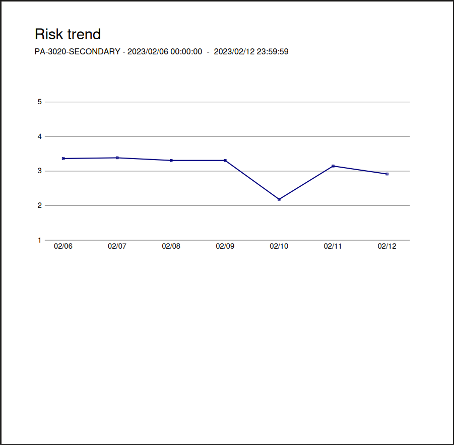

Seguretat : Anàlisi d'events als Firewalls/IDS  

1.  [Seguretat](index.md)
2.  [Pàgina d'inici de la Unitat de Seguretat](15368362.md)
3.  [Procediments Unitat de Seguretat](Procediments-Unitat-de-Seguretat_81856210.md)

Seguretat : Anàlisi d'events als Firewalls/IDS
==============================================

Created by Rafael Carrasco, last modified by Ivan Caballero on 26 junio 2024

/\*<!\[CDATA\[\*/ div.rbtoc1749247710838 {padding: 0px;} div.rbtoc1749247710838 ul {list-style: circle;margin-left: 0px;} div.rbtoc1749247710838 li {margin-left: 0px;padding-left: 0px;} /\*\]\]>\*/

*   [Informació contextual](#Anàlisid'eventsalsFirewalls/IDS-Informaciócontextual)
*   [Periodicitat](#Anàlisid'eventsalsFirewalls/IDS-Periodicitat)
*   [Tasques inicials de normalització dels informes](#Anàlisid'eventsalsFirewalls/IDS-Tasquesinicialsdenormalitzaciódelsinformes)
*   [Configuració dels reports](#Anàlisid'eventsalsFirewalls/IDS-Configuraciódelsreports)
*   [Repositori dels informes](#Anàlisid'eventsalsFirewalls/IDS-Repositoridelsinformes)
*   [Exemple dels informes:](#Anàlisid'eventsalsFirewalls/IDS-Exempledelsinformes:)
*   [Continguts dels informes](#Anàlisid'eventsalsFirewalls/IDS-Contingutsdelsinformes)
*   [Els informes més rellevants](#Anàlisid'eventsalsFirewalls/IDS-Elsinformesmésrellevants)
*   [Exemple de gestió dels events:](#Anàlisid'eventsalsFirewalls/IDS-Exempledegestiódelsevents:)

Informació contextual
---------------------

*   L'eina: La funció principal dels anàlisi d'events als Firewalls/IDS perimetrals és donar visibilitat i identificar els events de seguretat detectats en base al tràfic de xarxa dels nostres serveis, per tal de poder donar resposta en funció dels tipus d'events i la seva categorització i criticitat.  
    Estem fent servir actualment uns reports confeccionats "_ad hoc_" a ón estem fent servir mitjançant plugins específics mètriques i indicadors per tal d'intentar donar visibilitat a tot una sèrie d'events, més endavant expliquem com són aquests informes.

*   Producte: Basat en sol·lució de mercat fabricant Palo Alto Networks, producte Palo Alto PA-3020 amb PanOS v9.1.14 en HA en el cas de Mediacloud, i Palo Alto PA-850 amb PanOS v10.2.3-h4 en Standalone.

*   Àmbit: Ens arriben reports dels PaloAlto de plataforna Datacenter MediaCloud i del PaloAlto d'Oficines. A Nexica, a data d'avui (25-06-2024) no tenim firewall de capa 7.  
    Els reports arriben a la bústia de seguretat, i en el cas de plataforma Datacenter MediaCloud també a Sistemes, i en el cas d'Oficines a Manteniment Intern.

*   Accés: El tenim ubicat al PAM dintre de Seguretat [https://pam.aoc.cat/SecretServer/app/#/secrets/view/folder/264](https://pam.aoc.cat/SecretServer/app/#/secrets/view/folder/264)

Periodicitat
------------

*   La periodicitat de la revisió dels IDS serà trimestral. Quan es disposi de IPS s'estudiarà ampliar la periodicitat.

Tasques inicials de normalització dels informes
-----------------------------------------------

[Normalització reporting seguretat perimetral - Palo Alto - MediaCloud](https://contacte.aoc.cat/browse/SEG-355)

[Normalització seguretat perimetral - Palo Alto - Oficines](https://contacte.aoc.cat/browse/SEG-343)

Configuració dels reports
-------------------------

*   Programador de correo electrónico - amb una periodicitat de cada dilluns

  

*   El grup d'informes "Informe AOC" és aquest que inclou el resum en PDF "Resum per Informe setmanal" i el Custom Report "Infome setmanal per Informe de seguretat":

  

*   Resum PDF "Resum per Informe Setmanal":

  

*   I el de "Amenaces setmanal per Informe de seguretat" és aquest informe personalitzat:

  

*   I per últim, el planificador dels enviaments es troba a Device → Gestión o Management, a la part de "Configuració de logs e informes, i està programat per les 2:00 de la matinada:

  

  

Repositori dels informes
------------------------

El tenim a una carpeta de Seguiment per Firewall-IDS al Drive de Ciberseguretat AOC, aquest és l'enllaç → [Firewall-IDS](https://llicenciesaoc.sharepoint.com/:f:/s/CiberseguretatAOC/EoQpn-2xxfxBnL0Dm3f-snwBVk3XLR_-4A4qdIpTkF2rTQ?e=1BXSgP)

  

Exemple dels informes:
----------------------

Així és com arriben, en el cas de MediaCloud arriben 2 informes, 1 per cada node al estar en HA:

  

Continguts dels informes
------------------------

  

Els informes més rellevants
---------------------------

Bandwith Trend, Risk Trend, Threat Trend, Top attacker sources, Resum per informe setmanal, Amenaces setmanal per Informe Seguretat, 

  

  

  

Exemple de gestió dels events:
------------------------------

[Revisió periòdica informes PA MC - 2022w51](https://contacte.aoc.cat/browse/SEG-361)

[Revisió periòdica informes PA MC - 2022w52](https://contacte.aoc.cat/browse/SEG-372)

  

Attachments:
------------

 [image2023-5-31\_23-0-6.png](attachments/81856229/93356206.png) (image/png)  
 [image2023-5-31\_23-4-47.png](attachments/81856229/93356207.png) (image/png)  
 [image2023-6-1\_0-42-25.png](attachments/81856229/93356208.png) (image/png)  
 [image2023-6-1\_0-42-59.png](attachments/81856229/93356209.png) (image/png)  
 [image2023-6-1\_0-43-38.png](attachments/81856229/93356210.png) (image/png)  
 [image2023-6-1\_0-44-2.png](attachments/81856229/93356211.png) (image/png)  
 [image2023-6-1\_0-44-27.png](attachments/81856229/93356212.png) (image/png)  
 [image2023-6-1\_0-45-46.png](attachments/81856229/93356213.png) (image/png)  
 [image2023-6-1\_0-46-22.png](attachments/81856229/93356214.png) (image/png)  
 [image2023-6-1\_0-48-18.png](attachments/81856229/93356215.png) (image/png)  
 [image2023-6-1\_0-54-16.png](attachments/81856229/93356218.png) (image/png)  
 [image2023-6-1\_0-57-54.png](attachments/81856229/93356219.png) (image/png)  
 [image2023-6-1\_0-58-52.png](attachments/81856229/93356220.png) (image/png)  
 [image2023-6-1\_0-59-43.png](attachments/81856229/93356221.png) (image/png)  
 [image2023-6-1\_1-0-54.png](attachments/81856229/93356222.png) (image/png)  
 [image2023-6-1\_1-1-49.png](attachments/81856229/93356223.png) (image/png)  
 [image2023-6-1\_1-4-35.png](attachments/81856229/93356224.png) (image/png)  
 [image2023-6-1\_1-6-1.png](attachments/81856229/93356225.png) (image/png)  

Document generated by Confluence on 07 junio 2025 00:08

[Atlassian](http://www.atlassian.com/)