Seguretat : Procediment d'anàlisi de vulnerabilitats  

1.  [Seguretat](index.md)
2.  [Pàgina d'inici de la Unitat de Seguretat](15368362.md)
3.  [Procediments Unitat de Seguretat](Procediments-Unitat-de-Seguretat_81856210.md)

Seguretat : Procediment d'anàlisi de vulnerabilitats
====================================================

Created by Rafael Carrasco, last modified by Ivan Caballero on 28 abril 2025

/\*<!\[CDATA\[\*/ div.rbtoc1749247720576 {padding: 0px;} div.rbtoc1749247720576 ul {list-style: disc;margin-left: 0px;} div.rbtoc1749247720576 li {margin-left: 0px;padding-left: 0px;} /\*\]\]>\*/

*   [Informació contextual](#Procedimentd'anàlisidevulnerabilitats-Informaciócontextual)
    *   [Excepcions en els IPS](#Procedimentd'anàlisidevulnerabilitats-ExcepcionsenelsIPS)
*   [Matriu de Scans actuals](#Procedimentd'anàlisidevulnerabilitats-MatriudeScansactuals)
*   [Configuració comuna dels anàlisi planificats:](#Procedimentd'anàlisidevulnerabilitats-Configuraciócomunadelsanàlisiplanificats:)
*   [Captures de pantalla](#Procedimentd'anàlisidevulnerabilitats-Capturesdepantalla)
*   [Exemples d'inici de tasques de millora arrel dels indicadors als Scans](#Procedimentd'anàlisidevulnerabilitats-Exemplesd'inicidetasquesdemilloraarreldelsindicadorsalsScans)
*   [Exemple de tasca específica per analitzar vulnerabilitats arrel de publicació de vulnerabilitat pública coneguda](#Procedimentd'anàlisidevulnerabilitats-Exempledetascaespecíficaperanalitzarvulnerabilitatsarreldepublicaciódevulnerabilitatpúblicaconeguda)
*   [Revisió periòdica trimestral (afegida la revisió de dispositius mitjançant Windows Defender a partir de la SEG-470)](#Procedimentd'anàlisidevulnerabilitats-Revisióperiòdicatrimestral\(afegidalarevisiódedispositiusmitjançantWindowsDefenderapartirdelaSEG-470\))
*   [Planificada tasca periòdica per la revisió trimestral - primer dilluns cada 3 mesos](#Procedimentd'anàlisidevulnerabilitats-Planificadatascaperiòdicaperlarevisiótrimestral-primerdillunscada3mesos)
*   [Scans a l'entorn d'AWS](#Procedimentd'anàlisidevulnerabilitats-Scansal'entornd'AWS)
    *   [Vulnerabilitats de DESA'L:](#Procedimentd'anàlisidevulnerabilitats-VulnerabilitatsdeDESA'L:)
        *   [Accés als reports](#Procedimentd'anàlisidevulnerabilitats-Accésalsreports)
        *   [Tractament de les vulnerabilitats](#Procedimentd'anàlisidevulnerabilitats-Tractamentdelesvulnerabilitats)
    *   [Vulnerabilitats de VALID:](#Procedimentd'anàlisidevulnerabilitats-VulnerabilitatsdeVALID:)
        *   [Accés als reports:](#Procedimentd'anàlisidevulnerabilitats-Accésalsreports:)
        *   [Tractament de vulnerabilitats](#Procedimentd'anàlisidevulnerabilitats-Tractamentdevulnerabilitats)
*   [Scans a l'entorn de Azure (PENDENT DE REVISIO)](#Procedimentd'anàlisidevulnerabilitats-Scansal'entorndeAzure\(PENDENTDEREVISIO\))
*   [Scans de l'Agència de Ciberseguretat de Catalunya](#Procedimentd'anàlisidevulnerabilitats-Scansdel'AgènciadeCiberseguretatdeCatalunya)
    *   [Accés als informes:](#Procedimentd'anàlisidevulnerabilitats-Accésalsinformes:)
    *   [Tractament:](#Procedimentd'anàlisidevulnerabilitats-Tractament:)
*   [Scans en estacions de treball](#Procedimentd'anàlisidevulnerabilitats-Scansenestacionsdetreball)
    *   [Exportació de l'informe.](#Procedimentd'anàlisidevulnerabilitats-Exportaciódel'informe.)
    *   [Tractament.](#Procedimentd'anàlisidevulnerabilitats-Tractament.)
    *   [Exportació de l'informe.](#Procedimentd'anàlisidevulnerabilitats-Exportaciódel'informe..1)
    *   [Tractament.](#Procedimentd'anàlisidevulnerabilitats-Tractament..1)
*   [Registre de vulnerabilitats](#Procedimentd'anàlisidevulnerabilitats-Registredevulnerabilitats)

  

Informació contextual
---------------------

*   L'eina: La funció principal dels anàlisi de vulnerabilitats perimetral és donar visibilitat i identificar els problemes de seguretat en base a la resposta de xarxa a la qual responen els nostres serveis, per tal de poder millorar-la, reportant a la consola centralitzada tots els indicadors.

*   Producte: Basada en sol·lució de mercat fabricant Tenable, producte Nessus.

*   Àmbit: Desplegat a un servidor VM dedicat per aquest servei ubicat al vcenter del centre de dades d'Oficines.

*   Accés: El tenim ubicat al PAM dintre de Seguretat [https://pam.aoc.cat/SecretServer/app/#/secrets/view/folder/267](https://pam.aoc.cat/SecretServer/app/#/secrets/view/folder/267)

  

El servei de Nessus als seus inicis, el owner era la Unitat de Sistemes, i al 2022 va passar a ser de la Unitat de Seguretat pel caràcter nativament de seguretat de la solució.

La configuració actual del servei neix d'una proposta interna feta al 2022 ([Proposta inicial SEG-284](https://contacte.aoc.cat/browse/SEG-284?focusedCommentId=258225&page=com.atlassian.jira.plugin.system.issuetabpanels:comment-tabpanel#comment-258225)) ja que ens vam trobar configurats multitud de Scans, en diversos trams horaris i contra varis serveis, plataformes e IPs tant públiques com privades del Consorci AOC.

Posteriorment vam treballar la proposta definitiva i actual ja desde Seguretat ([SEG-287 - Nessus - proposta sobre ús de l'eina i metodologia](81856233.md)) deshabilitant quasi bé tota la configuració fins llavors i afegint Pools de Scan de IP per Datacenters.

  

 L'objectiu que perseguim amb aquesta estratègia, a banda principalment de l'anàlisi de vulnerabilitats, és el descobriment que puguin fer sobre nous serveis que es vagin desplegant a la infraestructura, sigui la xarxa i el DataCenter que sigui.

 Que es facin trimestralment i que en el cas dels Scan per adreçament siguin el primer del any en curs al Abril, és per tindre tot el primer trimestre i la resta consecutivament tancat en un mateix informe de resultats.

### Excepcions en els IPS

Els escanejos de Nessus es detecten com atacs per part dels IPS. La política adoptada per l'AOC és que els escanejos s'han de reflectir en els firewalls però no s'ha de bloquejar la connexió.

S'han posat excepcions en els firewalls per a que la IP de Nessus (57.133.98.126 (IP de sortida a Internet)) es detecti però no es boqueixi.

*   Excepció en el firewall perimetral Fortigate

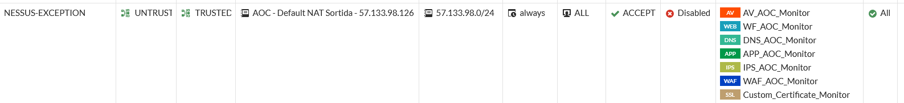

  

Matriu de Scans actuals
-----------------------

Així doncs, els Scan de Xarxes per DataCenter, periodicitat i durada, i la configuració de IPs o grup de IPs, són els següents:

Name

Schedule / Durada

Targets

Adreçament Públic Azure

 Every 3 months on day 1 at 3:00 PM / ****  23 minuts

20.67.121.31, 51.138.34.253,13.69.98.234, 20.82.29.207, 104.45.78.237,20.67.120.71, 20.76.194.40, 20.76.194.40, 20.76.194.40, 20.103.40.219, 13.94.207.228, 20.71.12.208

Adreçament Públic Kyndryl

 Every 3 months on day 1 at 5:00 PM /  6 hores

57.133.96.128/26  
57.133.96.192/29  
57.133.98.0/27  
57.133.98.32/28  
57.133.98.64/28  
57.133.98.80/28  
57.133.98.96/27  
57.133.98.192/27  
57.133.98.224/28  
57.133.98.240/28

Adreçament Públic AWS

 Every 3 months on day 1 at 2:00 PM /  21 minuts

S'ha demanat a Claranet automatitzar un informe d'enpoints per enviar el 31-3, el 30-6, el 30-9 y el 31-12 un report a destinacions [aartetxe@ayesa.com](mailto:aartetxe@ayesa.com), [jvegap@ayesa.com](mailto:jvegap@ayesa.com), [seguretat@aoc.cat](mailto:seguretat@aoc.cat) 

Xarxes privades conegudes Kyndryl

 Every 3 months on day 2 at 2:00 PM /  6 hores

10.120.0.0/24, 10.120.1.0/24, 10.120.2.0/24, 10.120.3.0/24, 10.120.4.0/24, 10.124.16.0/24, 10.120.22.0/24, 10.120.55.0/24

Xarxes privades conegudes Oficines AOC

 Every 3 months on day 3 at 2:00 PM /  48 minuts

192.168.166.0/24, 192.168.0.0/24, 10.1.1.0/24

Adreçament privat 10.120.1.X

 On Demand /  1h51min

10.120.1.0/24

Adreçament privat 10.120.2.X

 On Demand /  4 hores

10.120.2.0/24

Adreçament Públic

 On Demand /  2h21min

S'ha demanat a Claranet automatitzar un informe d'enpoints per enviar el 31-3, el 30-6, el 30-9 y el 31-12 un report a destinacions [aartetxe@ayesa.com](mailto:aartetxe@ayesa.com), [jvegap@ayesa.com](mailto:jvegap@ayesa.com), [seguretat@aoc.cat](mailto:seguretat@aoc.cat) 

Xarxa privada /16 Kyndryl per descobriment

 On Demand /  sense referència de temps de durada, la darrera vegada es va cancel·lar al portar moltes hores.

10.120.0.0/16

  

Configuració comuna dels anàlisi planificats:
---------------------------------------------

*   Configuració general

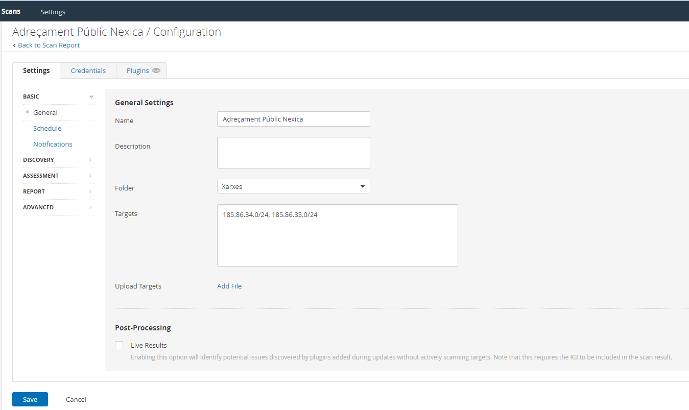

*   Planificació

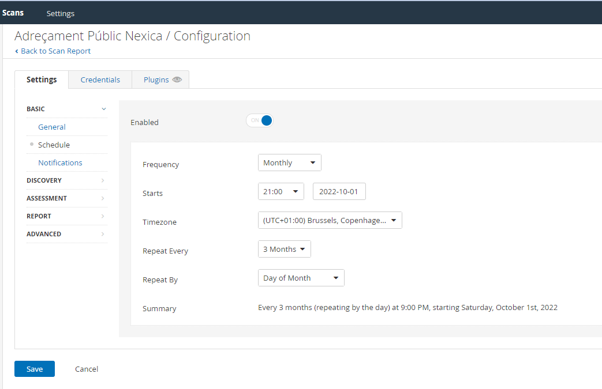

*   Notificacions

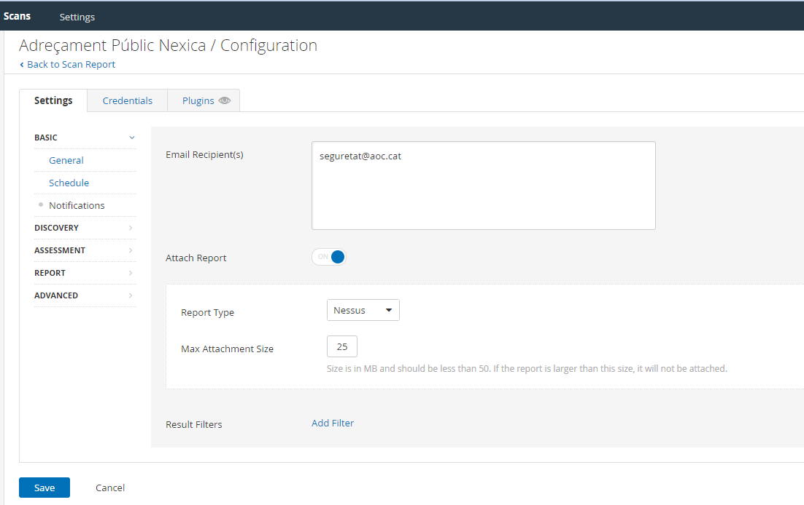

Captures de pantalla
--------------------

Login

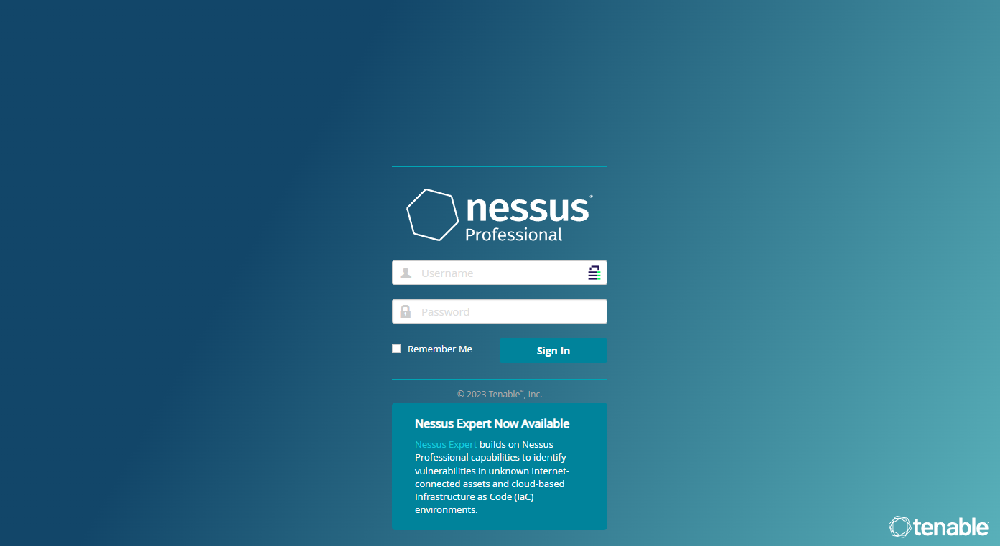

  

Dashboard principal (My Scans)

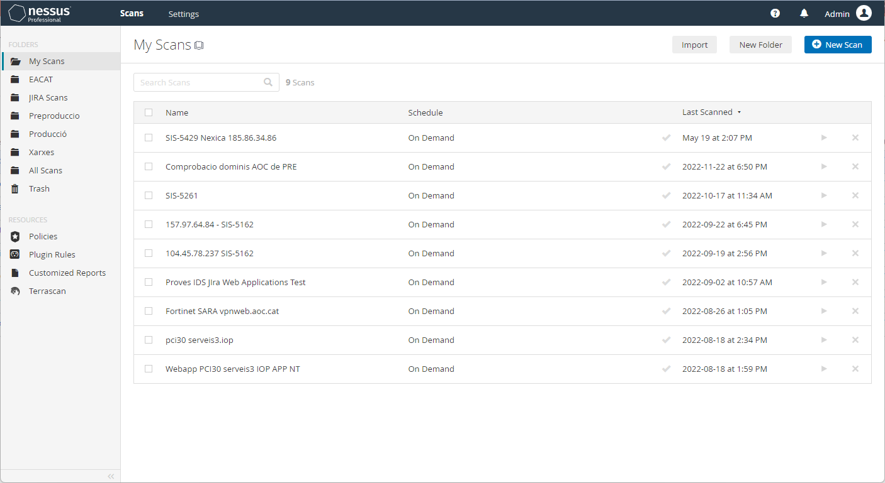

  

Scan de Xarxes planificats (Xarxes)

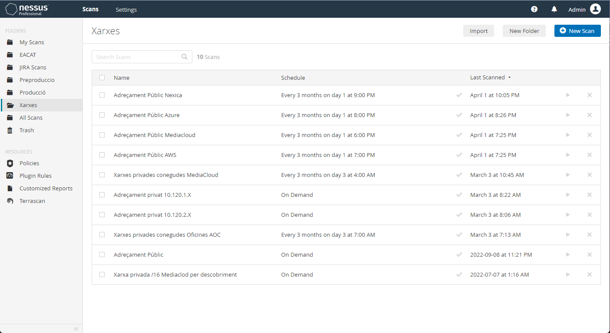

  

Exemple de revisió d'informe:

*   Adreçament Públic Nexica - Scan Summary

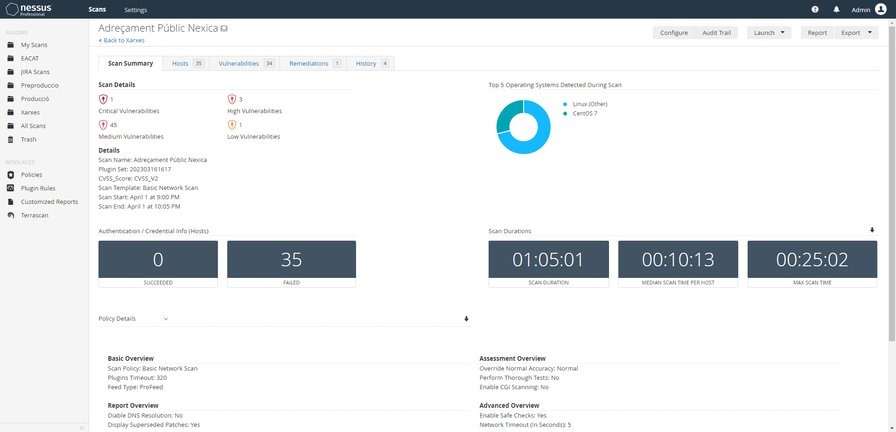

*   Adreçament Públic Nexica - Hosts

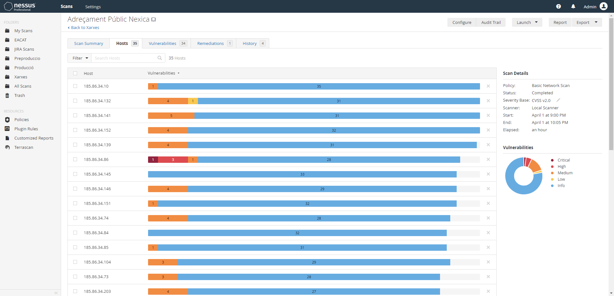

*   Adreçament Públic Nexica - Vulnerabilities

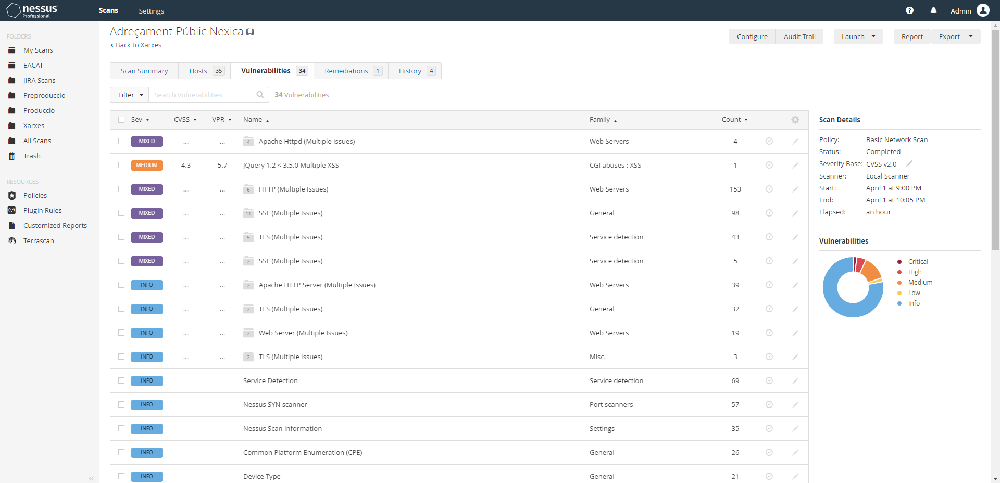

*   Adreçament Públic Nexica - Remediations

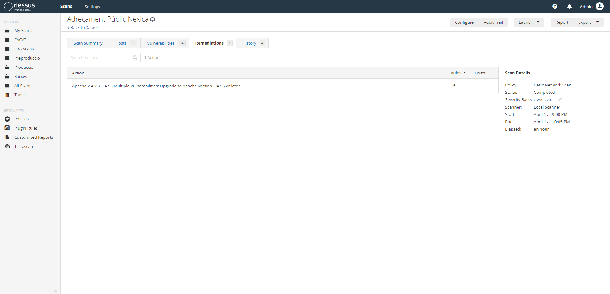

*   Adreçament Públic Nexica - History

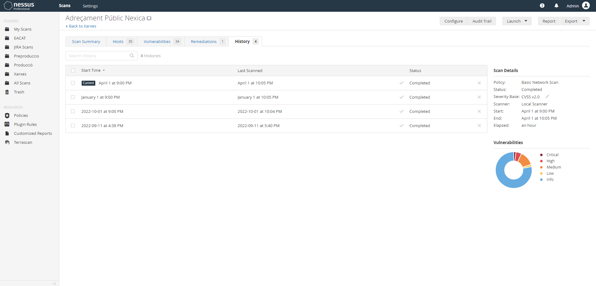

  

 Actualment estrem treballant en reduïr les vulnerabilitats en aquest ordre:

*   Critical vulnerabilities - tenim una molt baixa identificació en aquesta categoria
*   High vulnerabilities - probablement és on tenim ara que posar el focus per reduïr aquestes ja que fins ara hem treballat en l'anterior més crítiques.
*   Medium vulnerabilities - seràn les properes a tractar en aquest ordre després de les High
*   Low vulnerabilities - seràn sempre les darreres en revisar i/o potser en només tindre-les identificades.

  

Exemples d'inici de tasques de millora arrel dels indicadors als Scans
----------------------------------------------------------------------

[SIS-5161 - Vulnerabilitats escaneig adreçament públic Mediacloud 11/09/2022](https://contacte.aoc.cat/browse/SIS-5161)

[SIS-5162 - SMTP amb el relay obert a Azure](https://contacte.aoc.cat/browse/SIS-5162)

[SIS-5163 - SSL Versión a 185.86.34.132 (Nexica)](https://contacte.aoc.cat/browse/SIS-5163)

  

Exemple de tasca específica per analitzar vulnerabilitats arrel de publicació de vulnerabilitat pública coneguda
----------------------------------------------------------------------------------------------------------------

[SIS-4709 - SEC - Fer escanneig de rangs de IP públiques per detectar log4j](https://contacte.aoc.cat/browse/SIS-4709)

  

Revisió periòdica trimestral (afegida la revisió de dispositius mitjançant Windows Defender a partir de la SEG-470)
-------------------------------------------------------------------------------------------------------------------

[SEG-428 - 1T2023 - Revisió periòdica trimestral de vulnerabilitats perimetrals (Nessus)](https://contacte.aoc.cat/browse/SEG-428)

[SEG-440 - 2T2023 - Revisió periòdica trimestral de vulnerabilitats Xarxes privades conegudes Oficines AOC (Nessus)](https://contacte.aoc.cat/browse/SEG-440)

[SEG-441 - 2T2023 - Revisió periòdica trimestral de vulnerabilitats Xarxes privades conegudes MediaCloud (Nessus)](https://contacte.aoc.cat/browse/SEG-441)

[SEG-470 -](https://contacte.aoc.cat/browse/SEG-470) [3T2023 - Revisió periòdica trimestral de vulnerabilitats perimetrals (Nessus + Dispositius)](https://contacte.aoc.cat/browse/SEG-470)

  

  

Planificada tasca periòdica per la revisió trimestral - primer dilluns cada 3 mesos
-----------------------------------------------------------------------------------

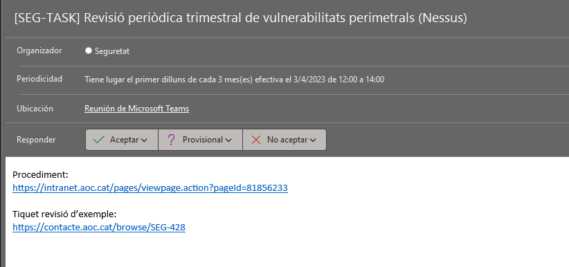

  

Scans a l'entorn d'AWS
----------------------

L'eina de descubriment de vulnerabilitats a AWS és inspector.

Actualment només està configurat per les comptes de DESA'L PRO i VALID, però està previst que es configuri per totes les comptes.

### Vulnerabilitats de DESA'L:

Pel servei DESA'L el procediment és temporal, i quan estigui a la Landing Zone es farà servir el procediment estàndard.

L'eina inspector deixa un report en un bucket de S3 i es conserva durant 1 any.

#### Accés als reports

*   Accedir a AWS [https://caoc.awsapps.com/start/#/](https://caoc.awsapps.com/start/#/)
*   Accedir a la compta de "Desa'l PRO #514160381454 | [desalpro@aoc.cat](mailto:desalpro@aoc.cat)"
*   Accedir al servei S3, i al bucket "desal-pro-inspector-reports" o fer servir l'enllaç directe: [desal-pro-inspector-reports: Bucket de S3 | S3 | Global (amazon.com)](https://s3.console.aws.amazon.com/s3/buckets/desal-pro-inspector-reports?region=eu-west-1&tab=objects)
*   Descarregar el darrer informe.

#### Tractament de les vulnerabilitats

*   Descarregar el darrer informe de Inspector i deixar-lo a la carpeta corresponent ([AWS](https://llicenciesaoc.sharepoint.com/:f:/s/CiberseguretatAOC/Em91uJrYirFAm2lCdey8u3sB71L3sLXl_qhemc-82Kt7Yg?e=zct2WB))
*   Canviar el nom de l'arxiu per un estandard que indiqui adreçament, plataforma i data, per exemple "AdreçamentPublicAWS202304".
*   Obrir l'informe i reportar les vulnerabilitats a la unitat responsables. Fer servir les eines de tiqueting, JIRA per responsables de l'AOC, i [https://online.claranet.es/](https://online.claranet.es/) per responsables de Claranet. Les vulnerabilitats que ja es van reportar en tractaments anterior, reclamar-les en el tiquet corresponent.
*   Afegir a l'informe de l'inspector, la informació que sigui rrellevant:
    *   el tiquet de tractament per poder fer seguiment. 
    *   la descripció de l'actiu
    *   etc

### Vulnerabilitats de VALID:

La gestió de vulnerabilitats es fa des de l'Inspector del compte Networking. L'inspector és transversal i registrarà les vulnerabilitats de tots els serveis dins de la Landing Zone.

#### Accés als reports:

Anar a AWS i accedir al compte de VALID-SHARED: [AWS access portal (awsapps.com)](https://caoc.awsapps.com/start/#/?tab=accounts):

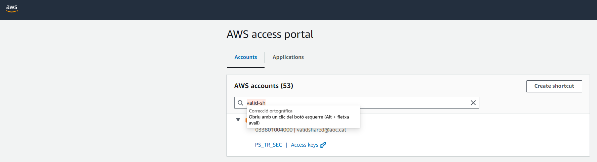

  

Dins de Inspector es poden trobar els findings:

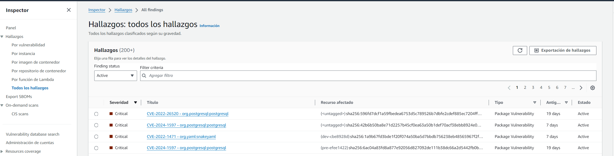

  

#### Tractament de vulnerabilitats

De forma periòdica, s'envia un tiquet a Claranet amb còpia a Seguretat per tractar les vulnerabilitats:

La periodicitat és la següent:

*   mensual per critical
*   Trimestral per high
*   Trimestral per Medium i low. Aquestes no es tractaran si no es veu alguna cosa important.

En el tiquet estan indicades les vulnerabilitats trobades.

Tractament:

*   Comprovar si la vulnerabilitat ja està sent tractada. En aquest cas hauria d'estar registrada en el registre de vulnerabilitats: [Registre de vulnerabilitats.xlsx](https://llicenciesaoc.sharepoint.com/:x:/r/sites/CiberseguretatAOC/Documents%20compartits/General/CONFIDENCIAL/Vulnerabilitats/Registre%20de%20vulnerabilitats.xlsx?d=wc24ee3fca79b53b2aa7f14553fc5aadd&csf=1&web=1&e=e0QOtN)
*   Si la vulnerabilitat no està sent tractada, obrir tiquet a la unitat corresponent pel tractament de la vulnerabilitat.
*   Registrar les vulnerabilitats trobades en l'excel: [Registre de vulnerabilitats.xlsx](https://llicenciesaoc.sharepoint.com/:x:/r/sites/CiberseguretatAOC/Documents%20compartits/General/CONFIDENCIAL/Vulnerabilitats/Registre%20de%20vulnerabilitats.xlsx?d=wc24ee3fca79b53b2aa7f14553fc5aadd&csf=1&web=1&e=e0QOtN)

  

Scans a l'entorn de Azure (PENDENT DE REVISIO)
----------------------------------------------

  PENDENT    →  Afegir vulnerabilitats de AZURE en el circuit de gestió de vulnerabilitats - Enfoc eines cloud privat Azure [https://contacte.aoc.cat/browse/SEG-437](https://contacte.aoc.cat/browse/SEG-437)

  

  

  

Scans de l'Agència de Ciberseguretat de Catalunya
-------------------------------------------------

L'ACC fa un escanneig trimestral dels rangs de IPs públiques.

Es fa des de la IP 83.247.146.155.

Abans de fer l'scan sempre envien un mail de conformació amb les IP que tenen al pool. Mail de contacte: Catalonia SOC <soc@ciberseguretat.cat>

### Accés als informes:

Els informes es deixen en aquesta URL:

[https://portalaall.ciberseguretat.cat/catalonia-soc/vulnerabilitats/infraestructura-1/infraestructura/](https://portalaall.ciberseguretat.cat/catalonia-soc/vulnerabilitats/infraestructura-1/infraestructura/)

### Tractament:

Descarreguem l'informe complert en format XML

El deixem a la carpeta [Vulnerabilitats](https://llicenciesaoc.sharepoint.com/:f:/s/CiberseguretatAOC/EjKYt54cwJ9EmogGsmmnLRoBwS9SmGwdq8Qw1L2Xl9Myeg?e=EUF6SQ)

Es fa el tractament com en la resta d'escaneixos.

Scans en estacions de treball
-----------------------------

En l'aplicació InTune es revisa la conformitat dels equips de treball i smartphones.

### Exportació de l'informe.

*   Accedir al reports de conformitat de dispositius d' InTune: [https://intune.microsoft.com/#view/Microsoft\_Intune\_Enrollment/DeviceComplianceOrgReportBlade](https://intune.microsoft.com/#view/Microsoft_Intune_Enrollment/DeviceComplianceOrgReportBlade)
*   Exportar un informe complert.

### Tractament.

*   Deixa l'informe en la carpeta [Estacions de treball](https://llicenciesaoc.sharepoint.com/:f:/r/sites/CiberseguretatAOC/Documents%20compartits/General/CONFIDENCIAL/Vulnerabilitats/2024/Estacions%20de%20treball?csf=1&web=1&e=XZvNW7). Tractar les dades si és necessari per destacar les estacions de treball en estat "no conforme"
*   Obrir tiquet a Manteniment Intern per a que revisin les no conforme

Des del Windows Defender es revisen les vulnerabilitats en equips.

### Exportació de l'informe.

*   Accedir al report Administración de vulnerabilidades - Puntos debiles, de Windows defender: [https://security.microsoft.com/vulnerabilities/cves?tid=37a8a0b9-1874-4e5d-b1f5-11040c1c07fc](https://security.microsoft.com/vulnerabilities/cves?tid=37a8a0b9-1874-4e5d-b1f5-11040c1c07fc)
*   Exportar un informe complert.

### Tractament.

*   Deixa l'informe en la carpeta [Estacions de treball](https://llicenciesaoc.sharepoint.com/:f:/r/sites/CiberseguretatAOC/Documents%20compartits/General/CONFIDENCIAL/Vulnerabilitats/2024/Estacions%20de%20treball?csf=1&web=1&e=XZvNW7).
*   Obrir tiquet a Manteniment Intern.

Registre de vulnerabilitats
---------------------------

L'objectiu del registre de vulnerabilitats, és tenir un registre a on es documentin i quedin reflectits els següents requeriments::

*   Les vulnerabilitats que tenim pendents, per fer-ne seguiment.
*   Les vulnerabilitats que tenim resoltes per si tornen a aparèixer.
*   Un registre de les vulnerabilitats acceptades.

Els registres són:

*   un registre general: "Registre de vulnerabilitats", per vulnerabilitats provinents de PENTESTs, i notificacions.
*   registres de cada scanneig per cada entorn, on el registre actiu és l'últim i la resta es guarda com històric.
*   un resum anomenat "Seguiment de vulnerabilitats", amb la evolució del número de vulnerabilitats que es fa servir com KPI key performance indicator (indicador clave de rendimiento) del procés de tractament de vulnerabilitats.

El registre de les vulnerabilitats es troba en aquesta carpeta:

[https://llicenciesaoc.sharepoint.com/:f:/s/CiberseguretatAOC/EjKYt54cwJ9EmogGsmmnLRoBwS9SmGwdq8Qw1L2Xl9Myeg?e=lpTsbX](https://llicenciesaoc.sharepoint.com/:f:/s/CiberseguretatAOC/EjKYt54cwJ9EmogGsmmnLRoBwS9SmGwdq8Qw1L2Xl9Myeg?e=lpTsbX)

  

  

Attachments:
------------

 [image2023-5-30\_21-22-31.png](attachments/81856233/93356161.png) (image/png)  
 [image2023-5-30\_21-23-26.png](attachments/81856233/93356162.png) (image/png)  
 [image2023-5-30\_21-24-5.png](attachments/81856233/93356163.png) (image/png)  
 [image2023-5-30\_21-26-14.png](attachments/81856233/93356164.png) (image/png)  
 [image2023-5-30\_21-26-53.png](attachments/81856233/93356165.png) (image/png)  
 [image2023-5-30\_21-28-26.png](attachments/81856233/93356166.png) (image/png)  
 [image2023-5-30\_21-29-16.png](attachments/81856233/93356167.png) (image/png)  
 [image2023-5-30\_21-29-59.png](attachments/81856233/93356168.png) (image/png)  
 [image2023-5-30\_21-32-3.png](attachments/81856233/93356169.png) (image/png)  
 [image2023-5-30\_21-32-30.png](attachments/81856233/93356170.png) (image/png)  
 [image2023-5-30\_21-32-57.png](attachments/81856233/93356171.png) (image/png)  
 [image2023-5-31\_13-20-43.png](attachments/81856233/93356187.png) (image/png)  
 [image2024-6-4\_9-44-48.png](attachments/81856233/100010601.png) (image/png)  
 [image2024-6-4\_10-37-43.png](attachments/81856233/100010603.png) (image/png)  
 [image2024-6-4\_10-39-26.png](attachments/81856233/100010604.png) (image/png)  
 [information.svg](attachments/81856233/113311753.svg) (image/svg+xml)  
 [image2025-4-16\_9-35-17.png](attachments/81856233/128647455.png) (image/png)  

Document generated by Confluence on 07 junio 2025 00:08

[Atlassian](http://www.atlassian.com/)