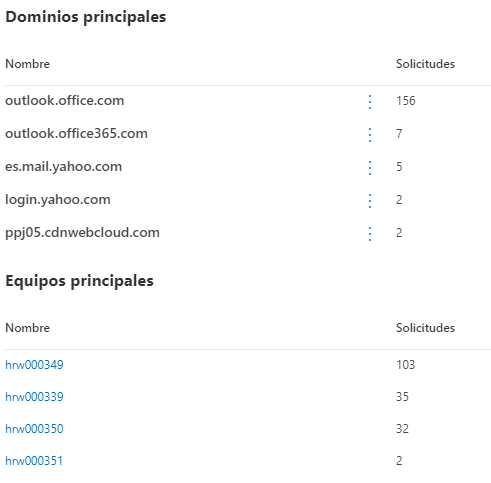

Seguretat : Protecció de dades personals  

1.  [Seguretat](index.md)
2.  [Pàgina d'inici de la Unitat de Seguretat](15368362.md)
3.  [Projectes Unitat de Seguretat](Projectes-Unitat-de-Seguretat_41517821.md)
4.  [SASE](SASE_81856152.md)
5.  [SASE amb Windows Defender](SASE-amb-Windows-Defender_81856154.md)

Seguretat : Protecció de dades personals
========================================

Created by Ivan Caballero, last modified on 10 mayo 2023

Informació registrada
---------------------

La informació que es registre està orientada a saber a quines URLs s'accedeix des de l'organització.

La informació està anonimitzada i agregada. No indica usuaris ni horari d'accés.

  

  

Queda registrat els llocs web on han accedit les estacions de treball, però la informació està agregada per grups de màquines que han accedit a una categoria. No es pot saber quantes vegades ha accedit cada estació de treball ni en quin moment.

  

Temps de Retenció
-----------------

La retenció de dades es de 6 mesos.

Ubicació de les dades
---------------------

Les dades són dins dels nostre Tenant de Microsoft 365 i per tant són a Europa.

  

Attachments:
------------

 [image2023-4-28\_16-53-42.png](attachments/81856253/81856254.png) (image/png)  
 [image2023-4-28\_16-58-47.png](attachments/81856253/81856255.png) (image/png)  
 [image2023-4-28\_16-55-29.png](attachments/81856253/81856256.png) (image/png)  

Document generated by Confluence on 07 junio 2025 00:08

[Atlassian](http://www.atlassian.com/)