Seguretat : FortiEDR-MDR (Endpoint Detection & Response)-(Managed)  

1.  [Seguretat](index.md)
2.  [Pàgina d'inici de la Unitat de Seguretat](15368362.md)
3.  [Procediments Unitat de Seguretat](Procediments-Unitat-de-Seguretat_81856210.md)

Seguretat : FortiEDR-MDR (Endpoint Detection & Response)-(Managed)
==================================================================

Created by Rafael Carrasco, last modified by Ivan Caballero on 23 mayo 2024

/\*<!\[CDATA\[\*/ div.rbtoc1749247711516 {padding: 0px;} div.rbtoc1749247711516 ul {list-style: circle;margin-left: 0px;} div.rbtoc1749247711516 li {margin-left: 0px;padding-left: 0px;} /\*\]\]>\*/

*   [Documentació oficial](#FortiEDRMDR\(EndpointDetection&Response\)\(Managed\)-Documentacióoficial)
*   [Informació contextual](#FortiEDRMDR\(EndpointDetection&Response\)\(Managed\)-Informaciócontextual)
*   [Dashboard principal](#FortiEDRMDR\(EndpointDetection&Response\)\(Managed\)-Dashboardprincipal)
*   [Events, detalls de classificació i fluxe Advanced Data](#FortiEDRMDR\(EndpointDetection&Response\)\(Managed\)-Events,detallsdeclassificacióifluxeAdvancedData)
*   [Forensics: Parent View i comprovació de Hashes](#FortiEDRMDR\(EndpointDetection&Response\)\(Managed\)-Forensics:ParentViewicomprovaciódeHashes)
*   [Forensics: Event Path, revisar el Flow Anayzer VS Stack View](#FortiEDRMDR\(EndpointDetection&Response\)\(Managed\)-Forensics:EventPath,revisarelFlowAnayzerVSStackView)
*   [Forensics: Revisió de les execucions a command line](#FortiEDRMDR\(EndpointDetection&Response\)\(Managed\)-Forensics:Revisiódelesexecucionsacommandline)
*   [Gestionar excepcions](#FortiEDRMDR\(EndpointDetection&Response\)\(Managed\)-Gestionarexcepcions)
*   [Threat Hunting](#FortiEDRMDR\(EndpointDetection&Response\)\(Managed\)-ThreatHunting)
*   [Per revisar dispostius USB: Events → Device Control](#FortiEDRMDR\(EndpointDetection&Response\)\(Managed\)-PerrevisardispostiusUSB:Events→DeviceControl)
*   [Comunication Control - Aplicacions amb informació de versionats i CVE identificats](#FortiEDRMDR\(EndpointDetection&Response\)\(Managed\)-ComunicationControl-AplicacionsambinformaciódeversionatsiCVEidentificats)
*   [Comunication Control - Policies](#FortiEDRMDR\(EndpointDetection&Response\)\(Managed\)-ComunicationControl-Policies)
*   [Security Policies](#FortiEDRMDR\(EndpointDetection&Response\)\(Managed\)-SecurityPolicies)
*   [Security Settings - Playbooks](#FortiEDRMDR\(EndpointDetection&Response\)\(Managed\)-SecuritySettings-Playbooks)
*   [Inventory - Collectors](#FortiEDRMDR\(EndpointDetection&Response\)\(Managed\)-Inventory-Collectors)
*   [Crear nou instal·lador per agent FortiEDR](#FortiEDRMDR\(EndpointDetection&Response\)\(Managed\)-Crearnouinstal·ladorperagentFortiEDR)
*   [Generació d'Informes](#FortiEDRMDR\(EndpointDetection&Response\)\(Managed\)-Generaciód'Informes)
*   [Informes d'exemple](#FortiEDRMDR\(EndpointDetection&Response\)\(Managed\)-Informesd'exemple)

Documentació oficial
--------------------

Exclusiones de servicios y drivers del colector recomendadas para añadir en la solución de antivirus de terceros:

1.  [Technical Tip: Paths to exclude Antivirus exceptio... - Fortinet Community](https://community.fortinet.com/t5/FortiEDR/Technical-Tip-Paths-to-exclude-Antivirus-exceptions-in-3rd-Party/ta-p/199331)

Guía de administración y requisitos del colector:

1.  Documentació oficial del producte: [Introducing FortiEDR | FortiEDR 6.0.0 | Fortinet Document Library](https://docs.fortinet.com/document/fortiedr/6.0.0/administration-guide/354083) 
2.  Requeriments de hardware i SO del col·lector: [Introduction | FortiEDR 6.0.0 | Fortinet Document Library](https://docs.fortinet.com/document/fortiedr/6.0.0/collector-system-requirements/346917/introduction)

Activar descubrimiento de máquinas a través del IoT device Discovery:

1.  [IoT device discovery | FortiEDR 6.0.0 | Fortinet Document Library](https://docs.fortinet.com/document/fortiedr/6.0.0/administration-guide/559754/iot-device-discovery)

Respecto al problema de no recibir las notificaciones por correo del portal de soporte de Fortinet, os recomiendo revisar los siguientes artículos:

1.  [https://community.fortinet.com/t5/Customer-Service/Technical-Tip-Adding-a-new-registered-email-for-creating-a/ta-p/199814](https://community.fortinet.com/t5/Customer-Service/Technical-Tip-Adding-a-new-registered-email-for-creating-a/ta-p/199814)
2.  [https://community.fortinet.com/t5/Customer-Service/Customer-Service-Note-How-can-I-let-other-people-access-my/ta-p/190264](https://community.fortinet.com/t5/Customer-Service/Customer-Service-Note-How-can-I-let-other-people-access-my/ta-p/190264)
3.  [https://community.fortinet.com/t5/Customer-Service/Customer-Service-Note-Email-interaction-when-working-tickets/ta-p/198407](https://community.fortinet.com/t5/Customer-Service/Customer-Service-Note-Email-interaction-when-working-tickets/ta-p/198407)
4.  También se recomienda revisar la herramienta de antispam para ver si hay algún bloqueo sobre el dominio de Fortinet.

Informació contextual
---------------------

*   L'eina: La funció principal del EDR/MDR (Endpoint Detection & Response / Managed) és oferir una seguretat al endpoint (més enllà de les funcions d'un antivirus clàsic EPP Endpoint Protection Platform) basada en el comportament dels processos i aplicacions, sotmesos a avaluació a temps real i amb capacitats de resposta i accions de mitigació i rollback, i reportant a la consola centralitzada tots els events. Les opcions de Managed és el nivell de suport que tindrem de la solució per part del fabricant.
*   Producte: Basada en sol·lució de mercat fabricant Fortinet, producte FortiEDR

*   Àmbit: Desplegada a tots els equips d'usuari i tots els equips de plataforma tant on-premise com al cloud híbrid, uns 500 dispositius.

*   Accés: El tenim ubicat al PAM dintre de Seguretat [https://pam.aoc.cat/SecretServer/app/#/secrets/view/folder/273](https://pam.aoc.cat/SecretServer/app/#/secrets/view/folder/273)

Dashboard principal
-------------------

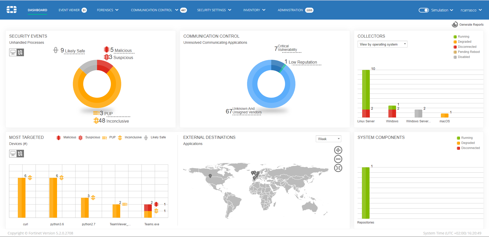

  

Events, detalls de classificació i fluxe Advanced Data
------------------------------------------------------

(Important revisar les Triggered Rules)

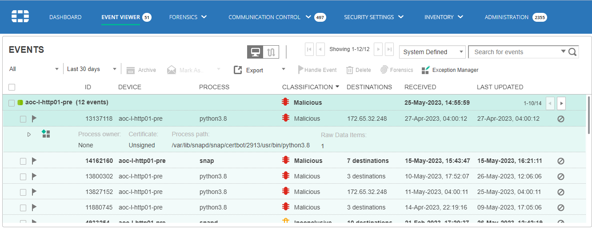 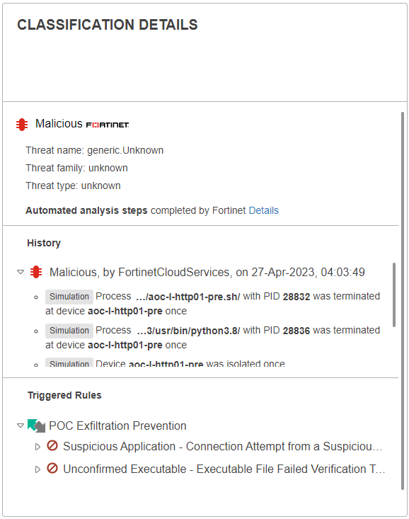

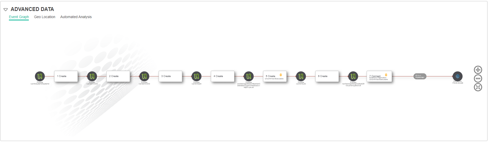

Forensics: Parent View i comprovació de Hashes
----------------------------------------------

Forensics → Parent View

Fixar-se al → Command Line

A la dreta del tot (tres quadrats) → Revisar per exemple en Virustotal

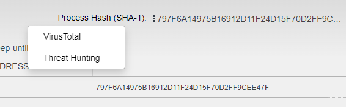

Forensics: Event Path, revisar el Flow Anayzer VS Stack View
------------------------------------------------------------

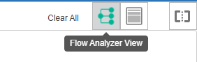

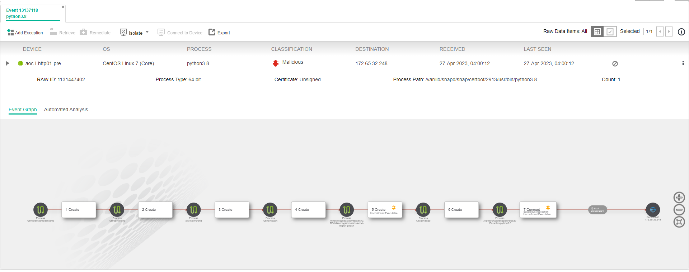

Forensics: Revisió de les execucions a command line
---------------------------------------------------

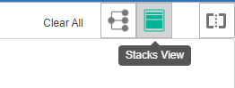

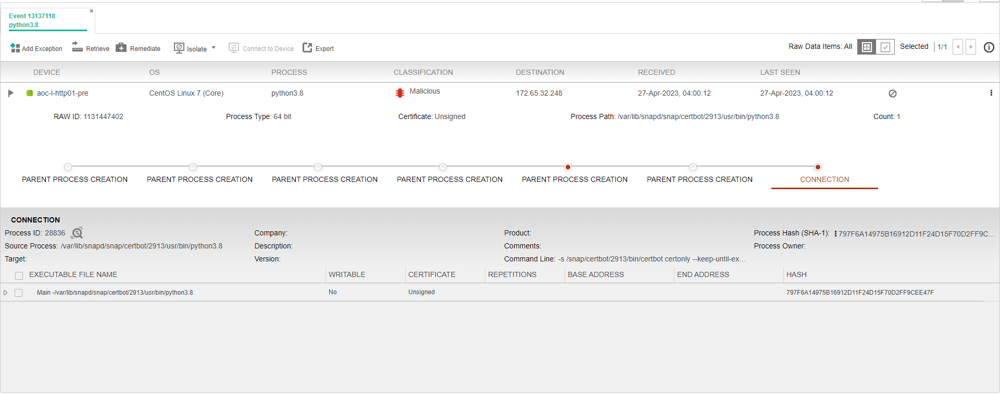

  

Gestionar excepcions
--------------------

Tenim l'icona quatre quadres Exceptions

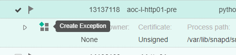

o dintre de Forenscics:

  

Threat Hunting
--------------

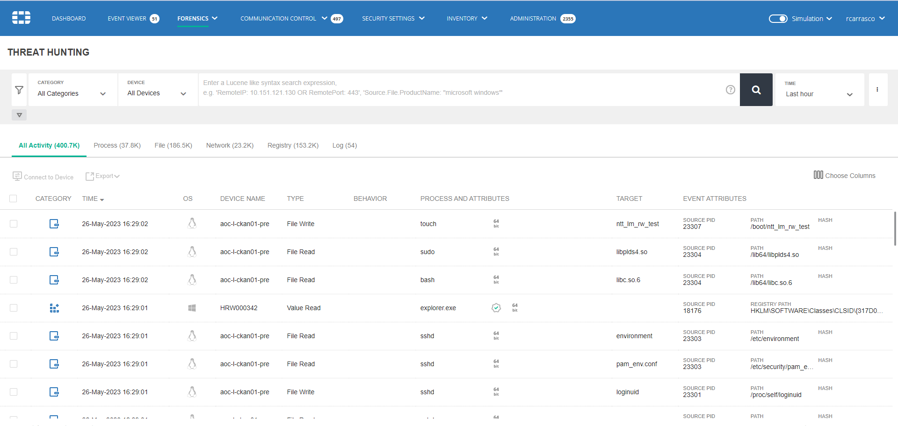

  

Per revisar dispostius USB: Events → Device Control
---------------------------------------------------

PUP → Potential Unwanted Program

  

Comunication Control - Aplicacions amb informació de versionats i CVE identificats
----------------------------------------------------------------------------------

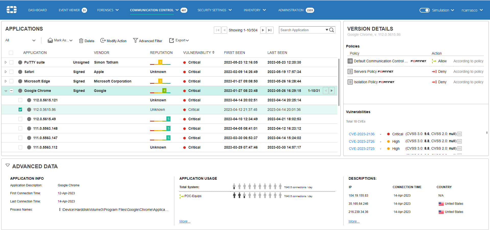

  

Comunication Control - Policies
-------------------------------

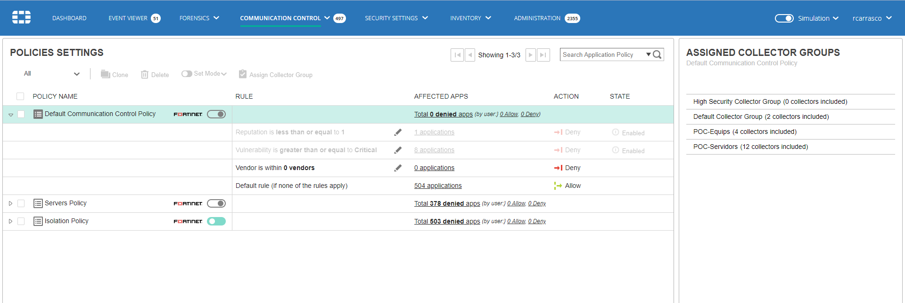

  

Security Policies
-----------------

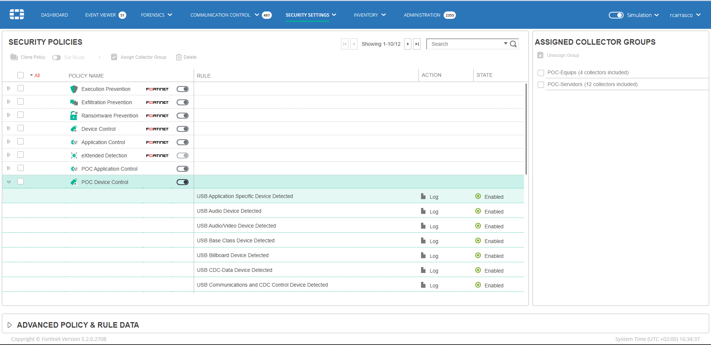

  

Security Settings - Playbooks
-----------------------------

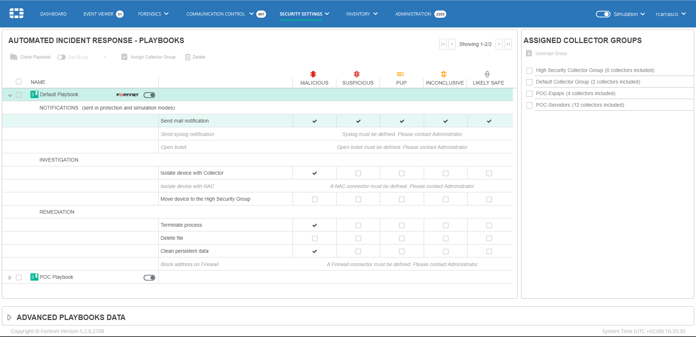

  

Inventory - Collectors
----------------------

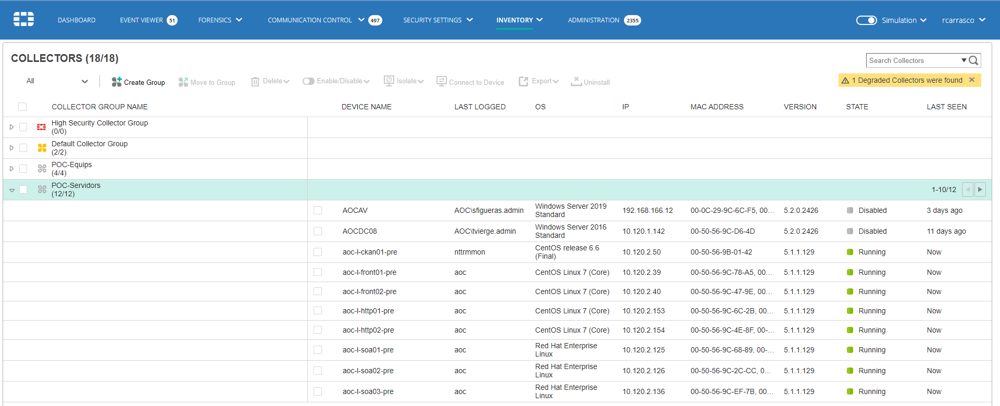

  

Crear nou instal·lador per agent FortiEDR
-----------------------------------------

A Administration → Licensing, tenim l'opció "Request collector installer":

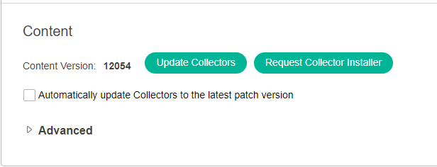

  

  

  

  

  

  

Ara haurem d'acabar d'escollir per quin Sistema Operatiu va destinat, l'adreça del concentrador del nostre tenant, el grup de dispositius i a on s'envia, i podrem fer el "Send Request":

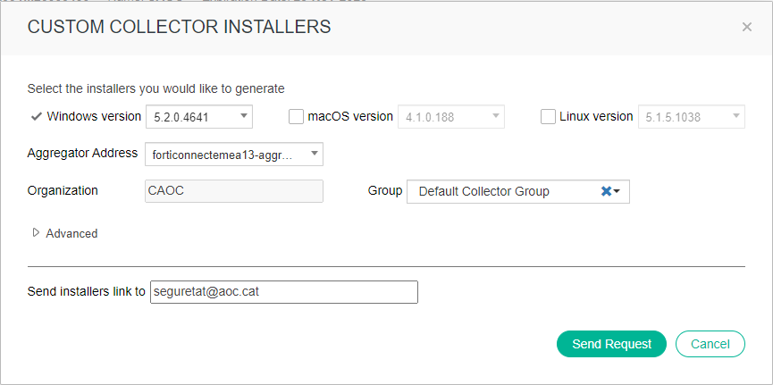

  

  

  

  

  

  

  

  

  

Ens arribarà un correu electrònic com el seguent i podrem fer la descàrrega del fitxer:

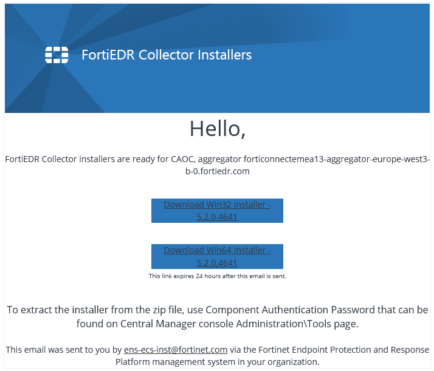

  

  

  

  

  

  

  

  

  

Per fer el Unzip, la credencial la tenim a la consola a Administration → Tools → Component Authentication → Display:

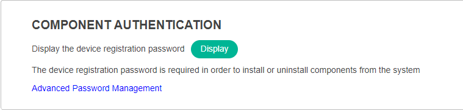

  
  
  
  
  
  
Generació d'Informes
--------------------------------------

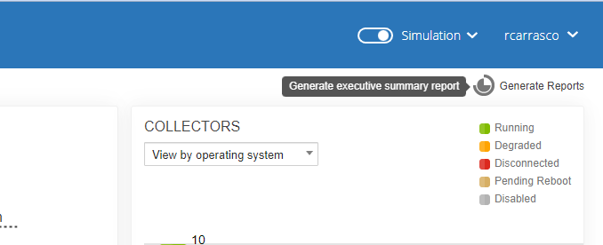

  

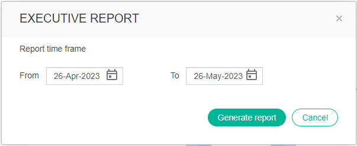

  

Informes d'exemple
------------------

Repositori a carpeta del Sharepoint [AOC\_Reports](https://llicenciesaoc.sharepoint.com/:f:/s/CiberseguretatAOC/Ep5S4pZ9dr9Lo4GVorFbu4IBneGw8w7v5wNEm8c6sFoMig?e=9ZuLJA)

  

  

  

  

  

Attachments:
------------

 [image2023-5-26\_16-21-17.png](attachments/81856306/93356078.png) (image/png)  
 [image2023-5-26\_16-21-52.png](attachments/81856306/93356079.png) (image/png)  
 [image2023-5-26\_16-22-27.png](attachments/81856306/93356080.png) (image/png)  
 [image2023-5-26\_16-24-0.png](attachments/81856306/93356081.png) (image/png)  
 [image2023-5-26\_16-24-48.png](attachments/81856306/93356082.png) (image/png)  
 [image2023-5-26\_16-26-16.png](attachments/81856306/93356083.png) (image/png)  
 [image2023-5-26\_16-26-49.png](attachments/81856306/93356084.png) (image/png)  
 [image2023-5-26\_16-27-14.png](attachments/81856306/93356085.png) (image/png)  
 [image2023-5-26\_16-27-34.png](attachments/81856306/93356086.png) (image/png)  
 [image2023-5-26\_16-28-34.png](attachments/81856306/93356087.png) (image/png)  
 [image2023-5-26\_16-29-19.png](attachments/81856306/93356088.png) (image/png)  
 [image2023-5-26\_16-30-28.png](attachments/81856306/93356089.png) (image/png)  
 [image2023-5-26\_16-31-27.png](attachments/81856306/93356090.png) (image/png)  
 [image2023-5-26\_16-32-45.png](attachments/81856306/93356091.png) (image/png)  
 [image2023-5-26\_16-33-33.png](attachments/81856306/93356092.png) (image/png)  
 [image2023-5-26\_16-34-11.png](attachments/81856306/93356093.png) (image/png)  
 [image2023-5-26\_16-35-0.png](attachments/81856306/93356094.png) (image/png)  
 [image2023-5-26\_16-35-55.png](attachments/81856306/93356095.png) (image/png)  
 [image2023-5-26\_16-36-31.png](attachments/81856306/93356096.png) (image/png)  
 [image2023-5-26\_16-37-15.png](attachments/81856306/93356097.png) (image/png)  
 [image2023-5-26\_16-37-43.png](attachments/81856306/93356098.png) (image/png)  
 [image2024-1-22\_16-35-24.png](attachments/81856306/100008943.png) (image/png)  
 [image2024-1-22\_16-37-4.png](attachments/81856306/100008944.png) (image/png)  
 [image2024-1-22\_16-39-30.png](attachments/81856306/100008945.png) (image/png)  
 [image2024-1-22\_16-40-38.png](attachments/81856306/100008946.png) (image/png)  

Document generated by Confluence on 07 junio 2025 00:08

[Atlassian](http://www.atlassian.com/)