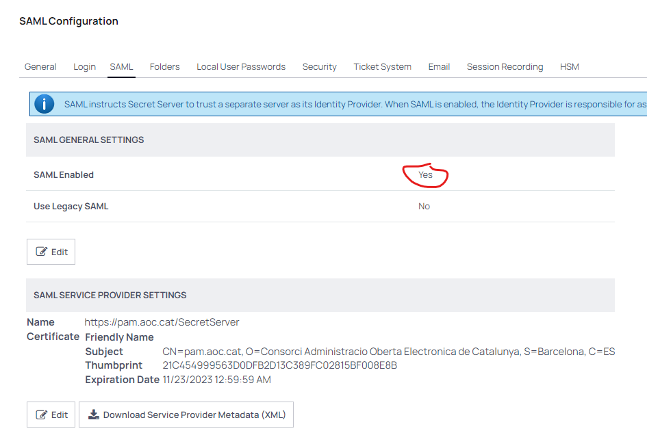
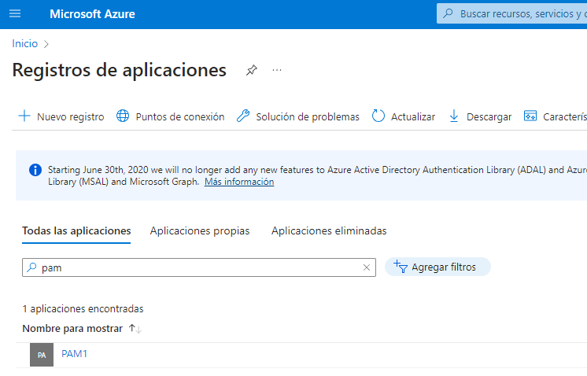
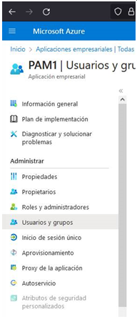

Seguretat : Autenticació SAML amb Azure AD  

1.  [Seguretat](index.md)
2.  [Pàgina d'inici de la Unitat de Seguretat](15368362.md)
3.  [Procediments Unitat de Seguretat](Procediments-Unitat-de-Seguretat_81856210.md)
4.  [PAM - Manuals i Procediments](PAM---Manuals-i-Procediments_93356107.md)
5.  [Manual de l'administrador](64979218.md)

Seguretat : Autenticació SAML amb Azure AD
==========================================

Created by Ivan Caballero, last modified on 13 septiembre 2023

L'autenticació està delegada a l'Azure AD.

Configuració
------------

La configuració en el PAM es fa en aquesta URL: [https://pam.aoc.cat/SecretServer/saml-configuration](https://pam.aoc.cat/SecretServer/saml-configuration)

La configuració en l'Azure AD es fa Registro de Aplicaciones - PAM1 - Autenticación

  

Cal donar permisos en l'aplicació als usuaris.

  

Breaking Glass
--------------

Hi ha una URL per evitar l'autenticació amb AZURE AD: <la URL està en el GuardedBox>

L'usuari Administrador local i contrasenya són al GuardedBox.

Doble factor
------------

Els usuaris tindran el doble factor de M365 i el doble factor del PAM. No es pot desactivar el PAM ja que llavors els accessos local no tindrien MFA. S'ha elevat la caducitat del MFA del PAM a 365 dies.

Attachments:
------------

 [image2023-9-12\_17-2-43.png](attachments/93357170/93357171.png) (image/png)  
 [image2023-9-12\_17-32-10.png](attachments/93357170/93357175.png) (image/png)  
 [image2023-9-13\_11-5-5.png](attachments/93357170/93357192.png) (image/png)  

Document generated by Confluence on 07 junio 2025 00:08

[Atlassian](http://www.atlassian.com/)