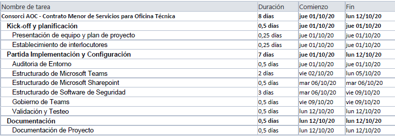

Seguretat : Abast del projecte  

1.  [Seguretat](index.md)
2.  [Pàgina d'inici de la Unitat de Seguretat](15368362.md)
3.  [Projectes Unitat de Seguretat](Projectes-Unitat-de-Seguretat_41517821.md)
4.  [Seguretat en Office 365](Seguretat-en-Office-365_64979340.md)
5.  [Projecte de securització d'office 365](64979342.md)

Seguretat : Abast del projecte
==============================

Created by Ivan Caballero, last modified on 09 diciembre 2021

L’adjudicatari haurà d’implantar els protocols d’ús de les les eines d’Office 365 i la estructura de seguretat necessària per assegurar que l’ús que es fa de les eines d’Office 365 és segur i eficient.

Concretament haurà de de donar els següents serveis:

Definir l’ús correcte de les diferents eines.

L’adjudicatari haurà de proposar les bones pràctiques en l’ús de totes les eines de la subscripció E3 d’office 365, per a que els usuaris facin un ús segur i eficient de les mateixes, identificant els riscos de les diferents opcions, amb l’objectiu de que el Consorci defineixi les metodologies de treball que millor s’adaptin a la nostre empresa.

Implantar la estructura de seguretat

L’adjudicatari haurà d’implantar un sistema de Govern de les dades d’Office 365, estructurar les diferents eines segons els grups de seguretat que el Consorci ja té creats, implantar una monitorització adecuada que permeti detectar amenaces al sistema, etc.

Suport en l’Administració.

L’adjudicatari haurà de donar suport als administradors globals del Tenant d’Office 365 en l’administració global de l’eina, concretament haurà de supervisar la definició dels procediments d’explotació i donar suport en l’atenció a incidències.

Oferta.
=======

Definición de sistema de trabajo integrado con herramientas de Microsoft 365
----------------------------------------------------------------------------

Dentro de las herramientas que se encuentran involucradas dentro de este alcance, identificamos:

*   Microsoft Teams
*   Microsoft Sharepoint On-line
*   Microsoft Exchange On-line
*   Microsoft OneDrive On-line

Dentro de este ámbito, se incluirá los siguientes aspectos

*   Auditoria de uso de las herramientas de Microsoft 365, para identificar las implementadas dentro de la organización y conocer el uso actual.
*   Definición de estructura de funcionamiento departamental dentro de Microsoft Teams, realizando un documento que especifique la metodología a seguir para la creación y distribución de contenidos dentro de los departamentos afectados.
*   Definición de permisos dentro de Microsoft Sharepoint, para los repositorios documentales de los Equipos de trabajo de Microsoft Teams, realizando un documento con los permisos por departamento.
*   Identificación de herramientas de terceros para su activación en Microsoft Teams, se realizará una revisión del posible software de terceros que pueda ser necesario para facilitar la conexión con el entorno de Microsoft Teams.

Diseño de estructura de Seguridad del entorno con herramientas de Microsoft 365
-------------------------------------------------------------------------------

En este apartado realizamos la configuración de todos los aspectos esenciales comunes a los servicios de la solución de Microsoft 365 sobre la base de cobertura del ENS Real Decreto BOE-A-2010-1330 y su aplicación en Sharepoint Online CCN-STIC-885B y Microsoft Teams CCN-STIC-885D, Servicios en la Nube CCN-STIC-823 y la Configuración segura de servicios de Microsoft Azure CCN-STIC-884A.  
Atendiendo a estas directrices de seguridad, se realizarán las siguientes acciones dentro de este ámbito.

*   Detección de Amenazas y su remediación, serán configuradas e implementadas las herramientas de Office Advanced Threat Protection para la monitorización de amenazas y su remediación ante ataques de software de código malicioso, campañas de Pishing y la protección de malware dentro de la organización, Azure Active Directory Identity Protection para la protección de la gestión de identidades.
*   Control de uso de Aplicaciones, será configurado el servicio y la herramienta Cloud App Security desde el Centro de Seguridad de M365 para proteger el uso de las diferentes aplicaciones de los usuarios de la organización y además auditar los repositorios de información de Microsoft Sharepoint y Microsoft OneDrive.
*   Aplicación de Directivas de uso de Microsoft Teams, a través del centro de Administración de Microsoft Teams se realizará la configuración de Directivas de Seguridad según el ENS para controlar el uso de la herramienta dentro de la organización.
*   Aplicación de restricciones para Grupos Microsoft 365, a través del centro de Administración de O365 y de Azure Active Directory, se generará la estructura de seguridad para la creación de Grupos de O365 y la pertenencia de estos, realizando un gobierno de la información de manera estructurada.

Soporte a usuarios Administradores del entorno.
-----------------------------------------------

Dentro de este ámbito se encuentra el soporte que se prestará específicamente a Usuarios Administradores del entorno de Consorci AOC para poder atender las posibles peticiones y/o incidencias del servicio que puedan aparecer durante la ejecución del proyecto.  
Dentro de las coberturas de este servicio, identificamos las siguientes

*   El servicio de Soporte será realizado únicamente en horario laboral con la modalidad 8x5NBD.
*   Las consultas que están incluidas dentro de este servicio son las referentes a:
    *   o Incidencias de funcionamiento, que provoquen una pérdida total o parcial del uso de las herramientas.
    *   o Incidencias de acceso/permisos, que afecten a las herramientas de Microsoft Teams, Sharepoint, OneDrive, Azure Active Directory.
    *   o Incidencias producidas por amenazas, que afecten a la normalidad del servicio del usuario final y requieran de acciones de remediación que no hallan podido ser resueltas en primera instancia por los Usuarios Administradores del entorno de Consorci AOC
*   Se establecerá un único punto de entrada para atender y recibir todas las solicitudes de soporte que formule el responsable correspondiente en el Consorci AOC que será el Centro de Soporte de NexTReT.
*   El jefe de proyecto de NexTReT será el principal punto de contacto que tendrá la persona del Consorci AOC, a la que podrá dirigirse y debatir sus solicitudes, así como revisar y validar la documentación asociada al servicio.

  

Calendario
----------

  

  

Para la partida de la oferta destinada al soporte de usuarios, se contempla un total de 4 jornadas, que serán utilizadas durante todo el ciclo de vida del proyecto, con un vencimiento del 31 de Diciembre de 2020.

  

Attachments:
------------

 [image2021-2-22\_16-3-29.png](attachments/41521721/41521734.png) (image/png)  

Document generated by Confluence on 07 junio 2025 00:08

[Atlassian](http://www.atlassian.com/)