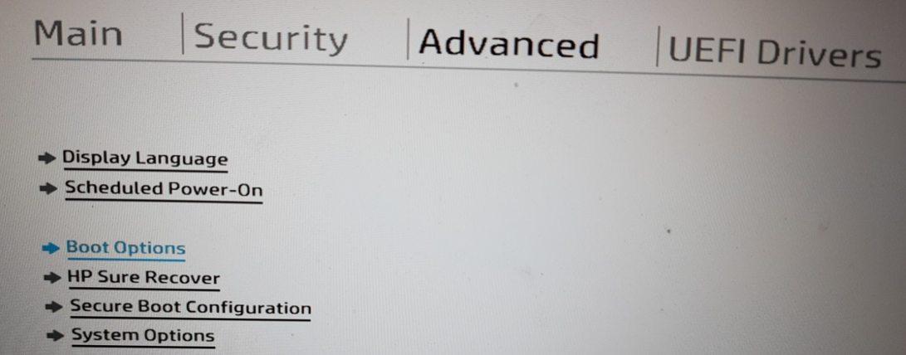
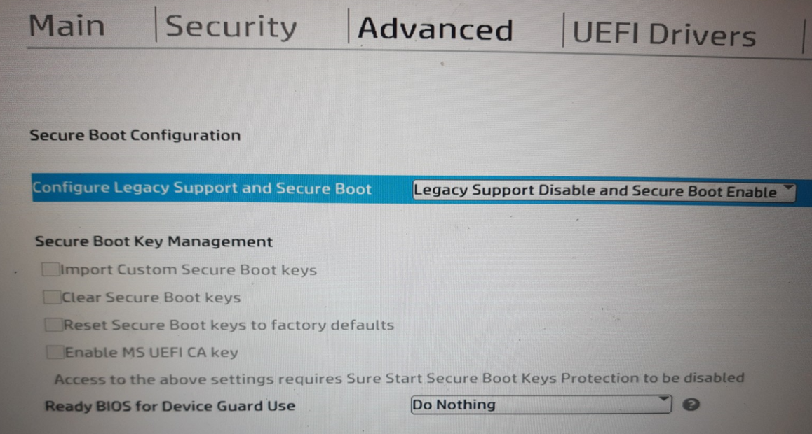
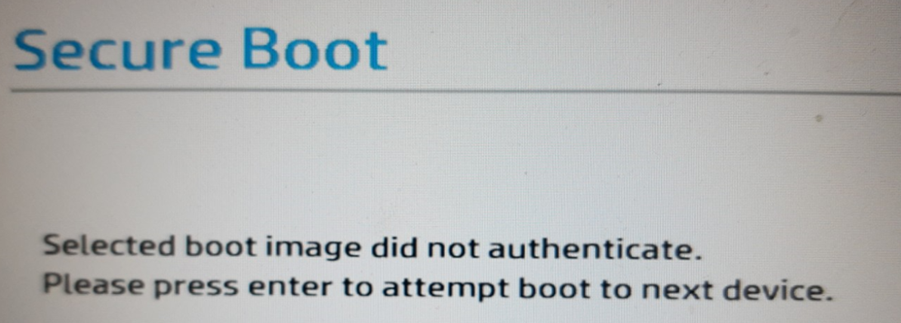
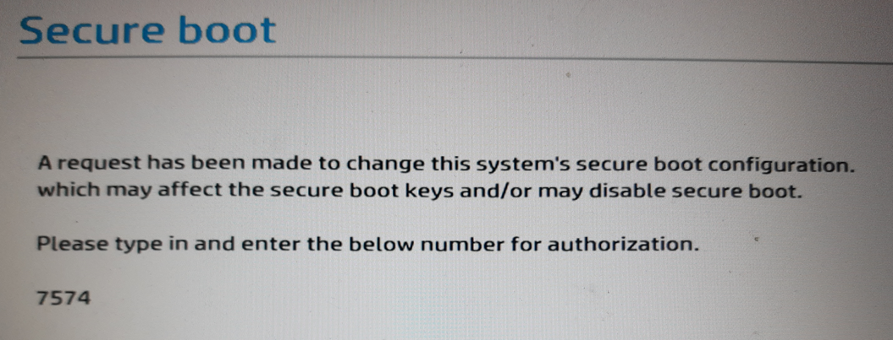
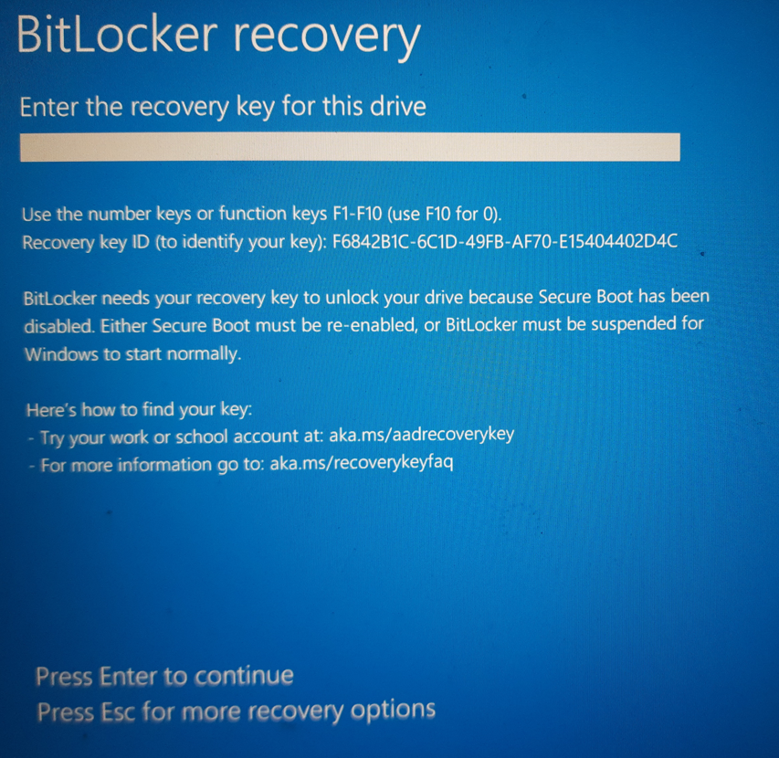

Seguretat : Activar Secure Boot per poder xifrar el disc  

1.  [Seguretat](index.md)
2.  [Pàgina d'inici de la Unitat de Seguretat](15368362.md)
3.  [Projectes Unitat de Seguretat](Projectes-Unitat-de-Seguretat_41517821.md)
4.  [Seguretat en Office 365](Seguretat-en-Office-365_64979340.md)
5.  [Desplegament d' Intune](64979693.md)
6.  [Xifrat de discos](Xifrat-de-discos_64979701.md)

Seguretat : Activar Secure Boot per poder xifrar el disc
========================================================

Created by Ivan Caballero on 13 febrero 2022

Per poder xifrar el disc d'arranc cal activar el secure boot.

El secure boot activa el TPM de la BIOS on està el certificat de xifrat. Sense secure boot, un PC amb el disc xifrat no podrà iniciar.

El secure boot farà que no es pugui iniciar des de una imatge bootable en un USB:

“_El Secure Boot o arranque seguro, es un modo para UEFI que trae Windows desde Windows 8, y que **impide la ejecución de cualquier software no firmado o certificado** en el arranque del sistema. Con ello se intenta evitar la carga de malware o aplicaciones que no sean de fiar cuando inicias el ordenador, **pero también afecta a sistemas operativos como las distribuciones GNU/Linux**._”

  

Per activar el secure boot:
---------------------------

*   Accedir a la BIOS.
*   Trobar l'opció de configuració de  Secure Boot. Configurar com "Legacy Support Disabled and Secure Boot Enabled":

  

*   Guardar la configuració.

Amb el Secure Boot activat, si s'intenta iniciar amb un USB que no estigui certificat, dona aquest error:

  

Per descativar el Secure Boot
-----------------------------

*   Accedir a la BIOS.
*   Canviar la configuració de Secure Boot a disabled.
*   Salvar la configuració. Demanarà confirmació:

  

Si s'intenta iniciar el PC xifrat amb secure boot desactivat dona aquest error. Cal deixar-ho activat.

  

Attachments:
------------

 [image2022-2-13\_7-45-17.png](attachments/64980137/64980138.png) (image/png)  
 [image2022-2-13\_7-49-45.png](attachments/64980137/64980139.png) (image/png)  
 [image2022-2-13\_7-53-42.png](attachments/64980137/64980140.png) (image/png)  
 [image2022-2-13\_7-55-10.png](attachments/64980137/64980141.png) (image/png)  
 [image2022-2-13\_7-56-46.png](attachments/64980137/64980142.png) (image/png)  
 [image2022-2-13\_7-57-10.png](attachments/64980137/64980143.png) (image/png)  

Document generated by Confluence on 07 junio 2025 00:08

[Atlassian](http://www.atlassian.com/)