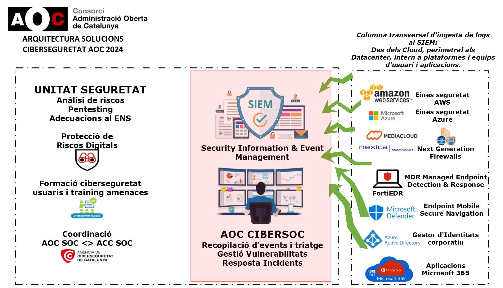

Seguretat : Arquitectura solucions ciberseguretat AOC 2024  

1.  [Seguretat](index.md)
2.  [Pàgina d'inici de la Unitat de Seguretat](15368362.md)
3.  [Arquitectura de Seguretat](Arquitectura-de-Seguretat_24216213.md)
4.  [Esquema de línies de defensa](24216216.md)

Seguretat : Arquitectura solucions ciberseguretat AOC 2024
==========================================================

Created by Rafael Carrasco, last modified on 30 agosto 2024

Carpeta de treball al One Drive → [Arquitectura Solucions Ciberseguretat](https://llicenciesaoc.sharepoint.com/:f:/s/CiberseguretatAOC/EmlTrWE9nY9JmCArpkgsgVIBCijgipN8sldUFHEjlPIVSA?e=Z8pe5N)

  

  

*   [Rols de les eines de seguretat a dispositius d'usuari](113311890.md)

Attachments:
------------

 [Arquitectura solucions ciberseguretat AOC 2024.jpeg](attachments/100009495/100009496.jpeg) (image/jpeg)  

Document generated by Confluence on 07 junio 2025 00:08

[Atlassian](http://www.atlassian.com/)