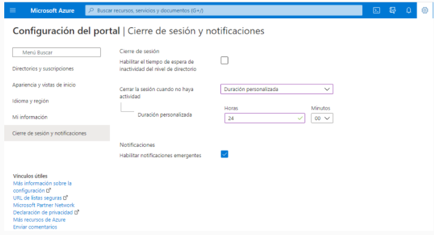

Seguretat : Caducitat de sessions  

1.  [Seguretat](index.md)
2.  [Pàgina d'inici de la Unitat de Seguretat](15368362.md)
3.  [Projectes Unitat de Seguretat](Projectes-Unitat-de-Seguretat_41517821.md)
4.  [Seguretat en Office 365](Seguretat-en-Office-365_64979340.md)
5.  [Manteniment continu seguretat Office 365](Manteniment-continu-seguretat-Office-365_64979344.md)

Seguretat : Caducitat de sessions
=================================

Created by Ivan Caballero on 20 diciembre 2021

  

Tractat en el tiquet de Nextret: [https://aoc.freshservice.nextret.net/support/tickets/138086](https://aoc.freshservice.nextret.net/support/tickets/138086)

JCG: Buenos días Iván hemos validado a través de Azure AD, el cierre de sesión tal como nos comentas, de momento sólo es posible a través de directivas como la aplicada y esta que te esta adicional que te proponemos para desconexión por horas de inactividad. Por ejemplo si el usuario no esta conectado durante 48 horas o 2 días le cierre la cesión.

Attachments:
------------

 [image2021-12-20\_11-52-11.png](attachments/64979378/64979379.png) (image/png)  

Document generated by Confluence on 07 junio 2025 00:08

[Atlassian](http://www.atlassian.com/)