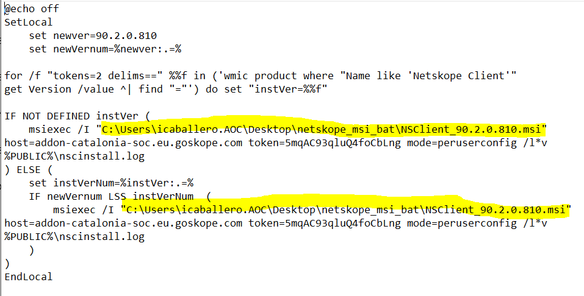
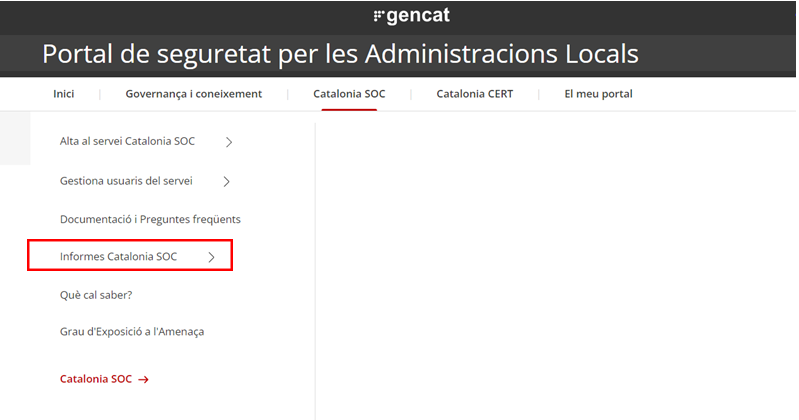
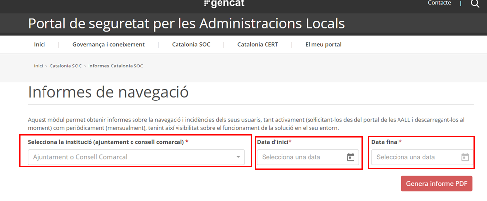
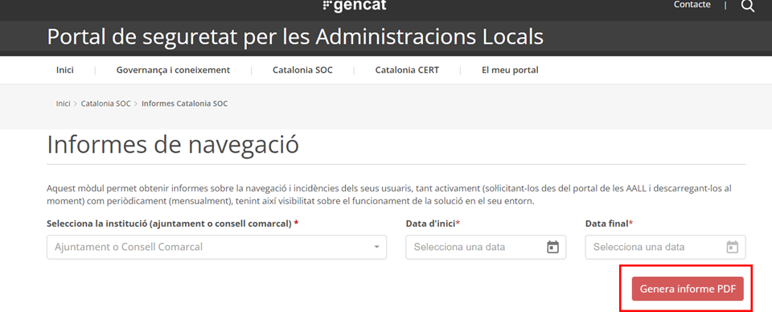
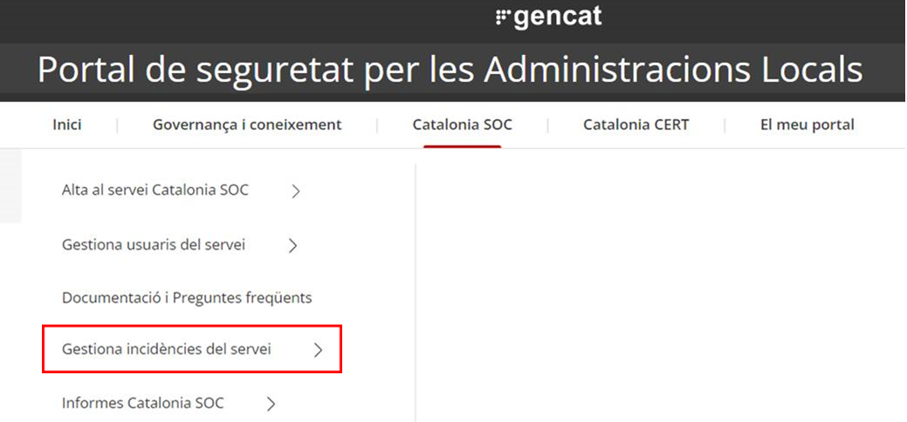
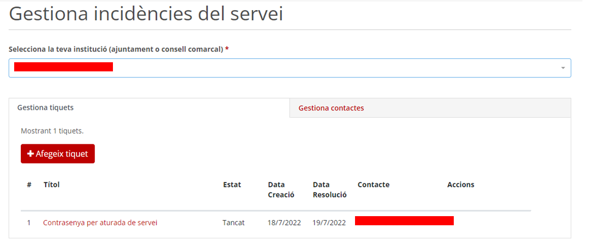
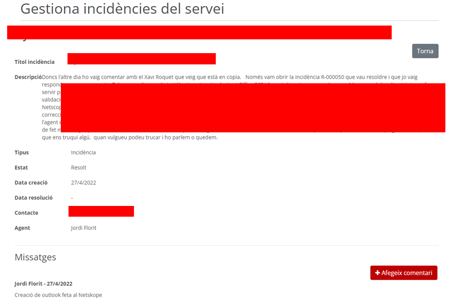
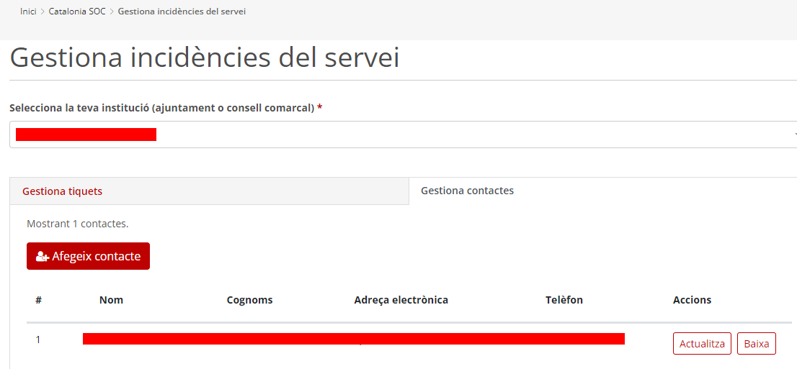

Seguretat : Catalonia SOC - SASE - Netskope  

1.  [Seguretat](index.md)
2.  [Pàgina d'inici de la Unitat de Seguretat](15368362.md)
3.  [Projectes Unitat de Seguretat](Projectes-Unitat-de-Seguretat_41517821.md)
4.  [SASE](SASE_81856152.md)

Seguretat : Catalonia SOC - SASE - Netskope
===========================================

Created by Ivan Caballero, last modified on 12 abril 2023

/\*<!\[CDATA\[\*/ div.rbtoc1749247730720 {padding: 0px;} div.rbtoc1749247730720 ul {list-style: disc;margin-left: 0px;} div.rbtoc1749247730720 li {margin-left: 0px;padding-left: 0px;} /\*\]\]>\*/

*   [Contacte](#CataloniaSOCSASENetskope-Contacte)
*   [Introducció](#CataloniaSOCSASENetskope-Introducció)
*   [Instal·lació del client](#CataloniaSOCSASENetskope-Instal·laciódelclient)
*   [Aturar el client](#CataloniaSOCSASENetskope-Aturarelclient)
*   [Generació informes](#CataloniaSOCSASENetskope-Generacióinformes)
*   [Gestió d'incidències](#CataloniaSOCSASENetskope-Gestiód'incidències)

Contacte
========

Mail de contacte: [suport.cataloniasoc@ciberseguretat.cat](mailto:suport.cataloniasoc@ciberseguretat.cat), Jordi Florit Aguilera <jflorit@[sirt.com](http://sirt.com)\>

Tiquet de desplegament: [https://contacte.aoc.cat:8443/browse/SEG-281](https://contacte.aoc.cat:8443/browse/SEG-281)

Consola d'administració: [https://portalaall.ciberseguretat.cat/](https://portalaall.ciberseguretat.cat/)

Incidències: [suport.cataloniasoc@ciberseguretat.cat](mailto:suport.cataloniasoc@ciberseguretat.cat)

Mes informació: [https://llicenciesaoc.sharepoint.com/:f:/s/CiberseguretatAOC/ElBaKOS1a89WsNbco1z4qk4BrvpKFpm7HFRzKqe4EHSJgQ?e=zSCAwj](https://llicenciesaoc.sharepoint.com/:f:/s/CiberseguretatAOC/ElBaKOS1a89WsNbco1z4qk4BrvpKFpm7HFRzKqe4EHSJgQ?e=zSCAwj)

Introducció
===========

El Catalonia SOC és una eina SASE del fabricant Netskope. Redirigeix el tràfic a un proxy on es desencripta la comunicació i s'analitza en busca d'amenaces.

Bloqueja webs (només) malicioses.

My Public IPv4 is: 163.116.169.0/24

  

El Catalonia SOC nomès cobreix a data d'avui els ports 80 i 443. La resta de port no s'envien al Catalonia SOC.

Hi ha dos tipus d'excepcions:

*   les que fan SSL\_BYPASS que vol dir que passa pel proxy del CataloniaSOC i el deixa passar sense analitzar, Això mantindria la IP que proporcionem nosaltres.
*   Tenim un altra excepció que consisteix a fer que directament els URLs o programes que afegíssim a aquesta llista no passarien ni pel proxy, llavors aquestes URLs mantindrien les IPs originals vostres (està pensat per a URLs que necessiten la IP original com a requisit).

  

Instal·lació del client
=======================

El paquet d'instal·lació està a la carpeta del projecte: [https://llicenciesaoc.sharepoint.com/:f:/s/CiberseguretatAOC/ElBaKOS1a89WsNbco1z4qk4BrvpKFpm7HFRzKqe4EHSJgQ?e=zSCAwj](https://llicenciesaoc.sharepoint.com/:f:/s/CiberseguretatAOC/ElBaKOS1a89WsNbco1z4qk4BrvpKFpm7HFRzKqe4EHSJgQ?e=zSCAwj)

Cal modificar el fitxer .bat per indicar la ubicació dels arxius. S'ha de posar la ruta del paquet msi:

Al final de la inatl·lació sortirà una icona del programa en execució Netskope Client

Aturar el client
================

Si el client està donant problemes, es pot aturar temporalment:

Execució com administrador: "C:\\Program Files (x86)\\Netskope\\STAgent\\stAgentSvc.exe" -stop

Per tornar a activar el client:

Execució com administrador: "C:\\Program Files (x86)\\Netskope\\STAgent\\stAgentSvc.exe" -start

Generació informes
==================

[https://portalaall.ciberseguretat.cat/](https://portalaall.ciberseguretat.cat/)

  

Gestió d'incidències
====================

[https://portalaall.ciberseguretat.cat/](https://portalaall.ciberseguretat.cat/)

*   Seleccionar la vostra institució, i en aquest apartat veureu dues pestanyes:
    *   En aquesta pestanya podreu afegir un nou tiquet , afegir comentari i modificar el seu estat ( apareixerà l’opció en la columna Accions)

*   Gestiona tiquets:

*   Si seleccioneu el propi tiquet ( click en la descripció), s’obrirà una nova finestra amb la descripció d’aquest i on podreu anar afegint comentaris. També podreu veure els comentaris que afegeixi l’equip de suport.

*   Gestiona els teus contactes: En aquesta pestanya, podreu gestionar els vostres contactes per a que puguin obrir incidències, i n’estiguin informats. Sempre podreu modificar l’estat d’aquests usuaris realitzant les accions que es troben en la columna accions.

  

  

  

Attachments:
------------

 [image2022-8-15\_22-6-1.png](attachments/64981706/77824253.png) (image/png)  
 [image2022-8-15\_22-7-10.png](attachments/64981706/77824254.png) (image/png)  
 [image2022-8-15\_22-7-49.png](attachments/64981706/77824255.png) (image/png)  
 [image2022-8-15\_22-12-59.png](attachments/64981706/77824258.png) (image/png)  
 [image2022-8-15\_22-14-37.png](attachments/64981706/77824259.png) (image/png)  
 [image2022-8-15\_22-15-24.png](attachments/64981706/77824260.png) (image/png)  
 [image2022-8-15\_22-16-11.png](attachments/64981706/77824261.png) (image/png)  
 [image2022-8-15\_22-35-39.png](attachments/64981706/77824265.png) (image/png)  

Document generated by Confluence on 07 junio 2025 00:08

[Atlassian](http://www.atlassian.com/)