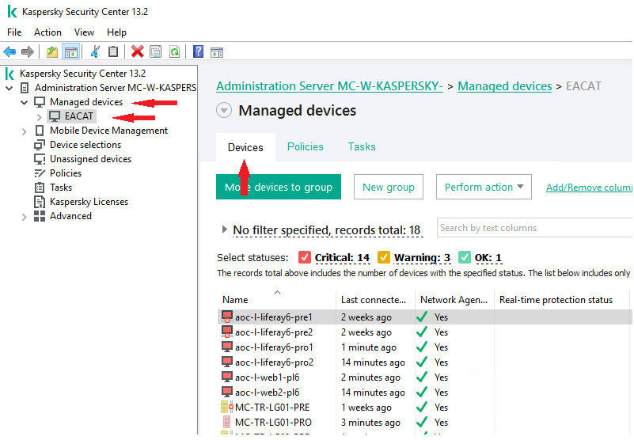

Seguretat : Com aturar correctament el client Kaspersky en els servidors  

1.  [Seguretat](index.md)
2.  [Pàgina d'inici de la Unitat de Seguretat](15368362.md)
3.  [Projectes Unitat de Seguretat](Projectes-Unitat-de-Seguretat_41517821.md)
4.  [Antivirus en servidors](Antivirus-en-servidors_64980041.md)
5.  [Pilot de Kaspersky en EACAT](Pilot-de-Kaspersky-en-EACAT_64980047.md)

Seguretat : Com aturar correctament el client Kaspersky en els servidors
========================================================================

Created by Ivan Caballero on 24 febrero 2022

Si es sospita que el client Kaspersky està generant una incidència, es pot aturar temporalment per diagnosticar-la.

Per fer-ho correctament:

*   Accedir al servidor de Kaspersky: [https://pam.aoc.cat/SecretServer/app/#/secret/310/general](https://pam.aoc.cat/SecretServer/app/#/secret/310/general)
*   Obrir la consola "Kaspersky Security Center 13.2"

  

  

  

*   Anar a Managed devices - EACAT - Devices

*   Accedir al servidor on es vol aturar i anar a la secció Applications.

El servidor sempre tindra 2 aplicacions: El Network Agent, i el Kaspersky Security for windows Server o for Linux.

L'aplicació que s'ha de desactavivar és el **Kaspersky Security for Windows/Linux Server**. Aquest és el client que dona el servei de protecció.

  

*   Seleccionar la aplicació Kespersky Securitu for Windows/Linux Server i premer el botó d'aturar, o amb al bot´p dret del ratolí - Stop

L'aplicació ha de quedar en estat "Inactive":

  

*   Avisar a la unitat de Seguretat de que s'ha desactivat la protecció indicant el servidor.

  

  

  

  

  

  

  

Attachments:
------------

 [image2022-2-24\_9-46-21.png](attachments/64980372/64980373.png) (image/png)  
 [image2022-2-24\_9-47-28.png](attachments/64980372/64980374.png) (image/png)  
 [image2022-2-24\_9-49-51.png](attachments/64980372/64980375.png) (image/png)  
 [image2022-2-24\_9-51-58.png](attachments/64980372/64980376.png) (image/png)  
 [image2022-2-24\_9-54-56.png](attachments/64980372/64980377.png) (image/png)  
 [image2022-2-24\_10-11-54.png](attachments/64980372/64980378.png) (image/png)  
 [image2022-2-24\_10-13-35.png](attachments/64980372/64980379.png) (image/png)  
 [image2022-2-24\_10-14-25.png](attachments/64980372/64980380.png) (image/png)  

Document generated by Confluence on 07 junio 2025 00:08

[Atlassian](http://www.atlassian.com/)