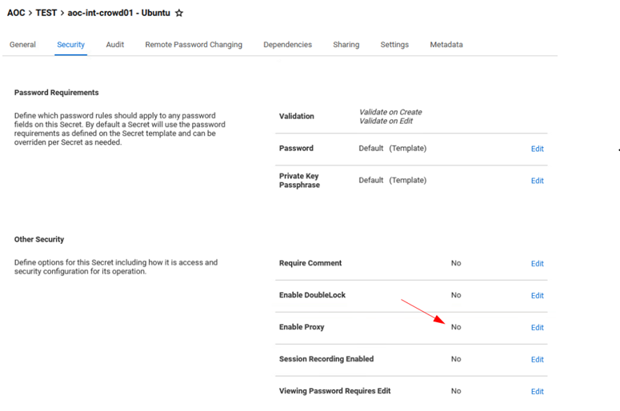

Seguretat : Com gestionar contrasenyes passant per un NAT  

1.  [Seguretat](index.md)
2.  [Pàgina d'inici de la Unitat de Seguretat](15368362.md)
3.  [Procediments Unitat de Seguretat](Procediments-Unitat-de-Seguretat_81856210.md)
4.  [PAM - Manuals i Procediments](PAM---Manuals-i-Procediments_93356107.md)
5.  [Manual de l'administrador](64979218.md)

Seguretat : Com gestionar contrasenyes passant per un NAT
=========================================================

Created by Ivan Caballero, last modified on 13 diciembre 2021

Problema
--------

La IP des del PAM és diferent que la que veu l'usuari perque hi ha un NAT pel mig,

L'usuari pot connectar amb el Launcher, però el PAM no farà el hearbeat i no podrà rotar la contrasenya.

Exemple: els servidors d'oficines.

Solució
-------

S'ha de proxificar la connexió.

*   Posar en el secret la IP que veu el PAM
*   Activar el proxy en el secret

  

La connexió del Launcher es farà des del PAM.

Attachments:
------------

 [image2021-12-13\_6-36-36.png](attachments/64979357/64979358.png) (image/png)  
 [image2021-12-13\_6-40-0.png](attachments/64979357/64979360.png) (image/png)  

Document generated by Confluence on 07 junio 2025 00:08

[Atlassian](http://www.atlassian.com/)