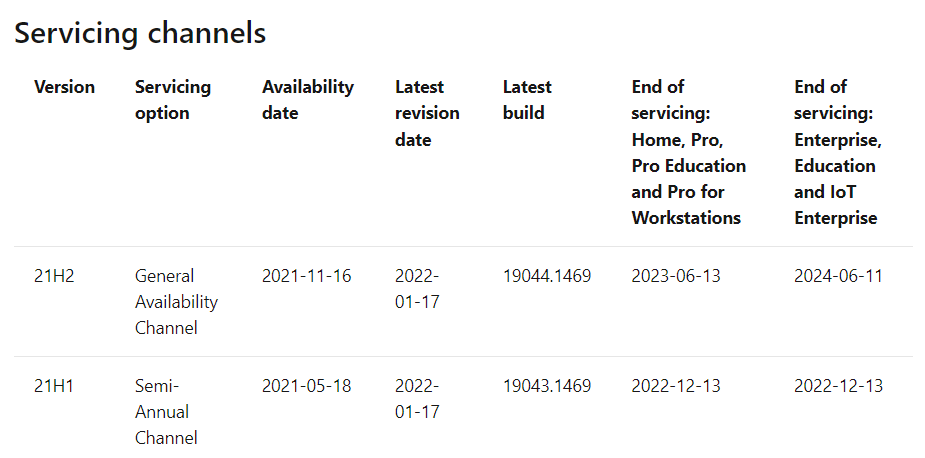

Seguretat : Control de versions de OS de les estacions de treball  

1.  [Seguretat](index.md)
2.  [Pàgina d'inici de la Unitat de Seguretat](15368362.md)
3.  [Projectes Unitat de Seguretat](Projectes-Unitat-de-Seguretat_41517821.md)
4.  [Seguretat en Office 365](Seguretat-en-Office-365_64979340.md)
5.  [Desplegament d' Intune](64979693.md)

Seguretat : Control de versions de OS de les estacions de treball
=================================================================

Created by Ivan Caballero on 25 enero 2022

  

Relació OS Version.
-------------------

A la següent URL són les versions de OS soportades per Microsoft:

[https://docs.microsoft.com/en-us/windows/release-health/release-information](https://docs.microsoft.com/en-us/windows/release-health/release-information)

  

Exemple:

Acords
------

La versió de les estacions de treball han de cumplir:

*   La versió de Windows de totes les estacions ha d'estar soportada, per tant no pot sobrepasar la data de "End of servicing:"
*   S'ha de revisar que les estacions van adoptant la "Lasted Build" i cap estació es queda desfasada.

Versions dels PCs
-----------------

[Windows - Microsoft Endpoint Manager admin center](https://endpoint.microsoft.com/#blade/Microsoft_Intune_DeviceSettings/DevicesWindowsMenu/windowsDevices)

  

  

  

Attachments:
------------

 [image2022-1-25\_7-55-40.png](attachments/64979696/64979697.png) (image/png)  
 [image2022-1-25\_7-56-43.png](attachments/64979696/64979698.png) (image/png)  

Document generated by Confluence on 07 junio 2025 00:08

[Atlassian](http://www.atlassian.com/)