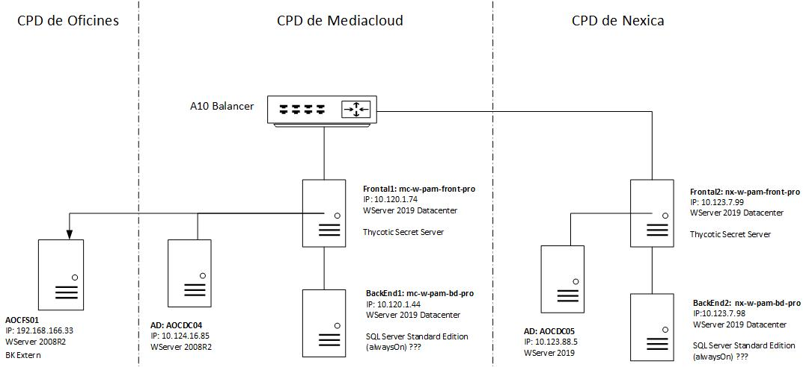

Seguretat : Desplegament de Thycotic  

1.  [Seguretat](index.md)
2.  [Pàgina d'inici de la Unitat de Seguretat](15368362.md)
3.  [Projectes Unitat de Seguretat](Projectes-Unitat-de-Seguretat_41517821.md)
4.  [Desplegament de PAM](Desplegament-de-PAM_41517823.md)

Seguretat : Desplegament de Thycotic
====================================

Created by Ivan Caballero, last modified on 15 octubre 2021

#### [High Availability & Disaster Recovery](41521811.md)

#### [Launcher de SQL Server Management Studio (SSMS) no funciona](41524078.md)

#### [Rols](Rols_41523150.md)

#### [Temes pendents](Temes-pendents_41521859.md)

Caps de Projecte
----------------

David Porto <david.porto@[davincigroup.es](http://davincigroup.es)\>

Oscar Llama <ollama@[ingecom.net](http://ingecom.net)\>

  

Objectius:
----------

Gestió cicle de vida de contrasenyes

Traçabilitat dels accessos

Gestió d'usuaris

  

URL
---

Entorn primari: 

[https://pam.aoc.cat](https://pam.aoc.cat)

[https://mc-w-pam-front-pro/SecretServer/](https://mc-w-pam-front-pro/SecretServer/)

[https://10.120.1.74/SecretServer](https://10.120.1.74/SecretServer)

Entorn secundari: [https://10.123.7.99/SecretServer](https://10.123.7.99/SecretServer)

  

Info addicional
---------------

\\\\endreca\\SEGURETAT\\PROJECTES\\092020 Desplegament de Thycotic

  

  

Infraestructura
---------------

  

  

_Font: \\\\endreca\\SEGURETAT\\PROJECTES\\092020 Desplegament de Thycotic_

  

Usuari de domini: [thycotic@aoc.local](mailto:thycotic@aoc.local)

Grup de domini: thycoticUsers

Relays de correo:

[https://confluence.ntt.eu/pages/viewpage.action?pageId=644291883](https://confluence.ntt.eu/pages/viewpage.action?pageId=644291883)

[https://confluence.ntt.eu/display/AOC/Diagrama+de+sortida+de+correu+per+entorns](https://confluence.ntt.eu/display/AOC/Diagrama+de+sortida+de+correu+per+entorns)

  

*   [Ivan Caballero](https://confluence.aoc.cat/display/~icaballero), configuración de Cluster (HA) es necesario disponer de esta conectividad entre frontal y base de datos. Confirmar a [david.porto@davincigroup.es](mailto:david.porto@davincigroup.es)
    
      
    

Attachments:
------------

 [Thycotic infraestructura 2.0.jpg](attachments/41520443/61931893.jpg) (image/jpeg)  

Document generated by Confluence on 07 junio 2025 00:08

[Atlassian](http://www.atlassian.com/)