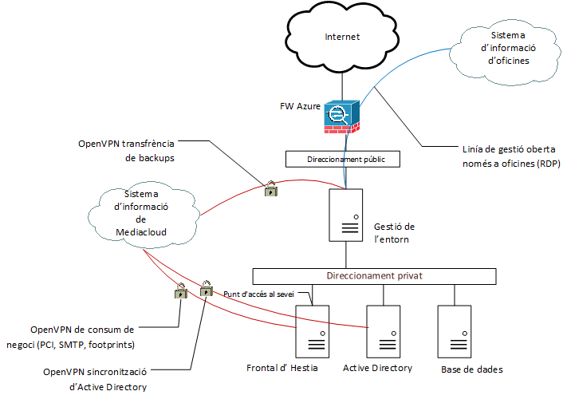

Seguretat : Entorn Azure  

1.  [Seguretat](index.md)
2.  [Pàgina d'inici de la Unitat de Seguretat](15368362.md)
3.  [Arquitectura de Seguretat](Arquitectura-de-Seguretat_24216213.md)
4.  [Esquema de línies de defensa](24216216.md)

Seguretat : Entorn Azure
========================

Created by Ivan Caballero, last modified on 27 abril 2021

_  
_

_Font de la imatge: \\\\endreca\\seguretat\\PLA DIRECTOR DE SEGURETAT\\ENS\\\[OP.PL.2\] ARQUITECTURA DE SEGURIDAD\\Diagrama arquitectura seguretat.vsdx_

  

Perímetre de seguretat
----------------------

  

  

Control de xarxa  
  

DDoS

DDoS Protection basic

  

WAF

Azure AppGW

Azure AppGW és el balancejador de trànsit que permet administrar el trànsit a les aplicacions web. Aquest balancejador permet treballar a la capa 4 i 7, oferint una capa addicional de seguretat treballant com Web Application Firewall (WAF).

IDS

Azure Firewall

  

  

  

  

Monitorització

Auditories de comptes

  

  

Centralització de logs

Azure Monitor

Azure Sentinel (SIEM)

Monitorització de mètriques de les aplicacions, la infraestructura i la xarxa. Es poden analitzar les dades i crear alertes.

  

Azure Sentinel no està activat

Governança de seguretat

Security Center

  

Protecció de la informació

Antivirus

Microsoft IaaS Antimalware

Microsoft antimalware per Azure és una funcionalitat de protecció en temps real que ajuda a identificar i eliminar virus, spyware i altre programari maliciós, amb alertes que es poden configurar per a quan el programari maliciós o no desitjat conegut s'intenti instal·lar o executar en els sistemes de Azure.

Còpies de seguretat

  

  

  

  

Attachments:
------------

 [image2019-7-23\_11-19-48.png](attachments/41521841/41521842.png) (image/png)  

Document generated by Confluence on 07 junio 2025 00:08

[Atlassian](http://www.atlassian.com/)