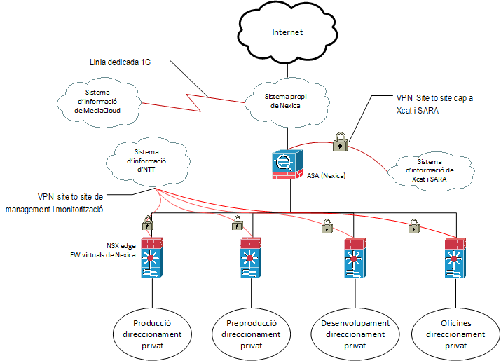

Seguretat : Entorn de Nexica  

1.  [Seguretat](index.md)
2.  [Pàgina d'inici de la Unitat de Seguretat](15368362.md)
3.  [Arquitectura de Seguretat](Arquitectura-de-Seguretat_24216213.md)
4.  [Esquema de línies de defensa](24216216.md)

Seguretat : Entorn de Nexica
============================

Created by Ivan Caballero, last modified on 30 enero 2022

__

_Font de la imatge: \\\\endreca\\seguretat\\PLA DIRECTOR DE SEGURETAT\\ENS\\\[OP.PL.2\] ARQUITECTURA DE SEGURIDAD\\Diagrama arquitectura seguretat.vsdx_

  

_Per mis informació sobre la plataforma:_

_[https://msd.confluence.nttltd.global.ntt/display/AOC/AOC+-+Cloud+Nexica](https://msd.confluence.nttltd.global.ntt/display/AOC/AOC+-+Cloud+Nexica)_

  

Attachments:
------------

 [image2019-7-23\_11-14-4.png](attachments/41521838/41521839.png) (image/png)  

Document generated by Confluence on 07 junio 2025 00:08

[Atlassian](http://www.atlassian.com/)