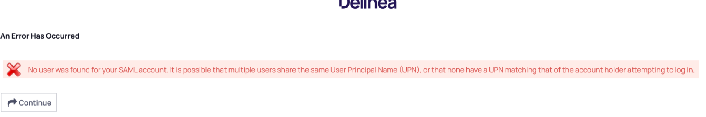
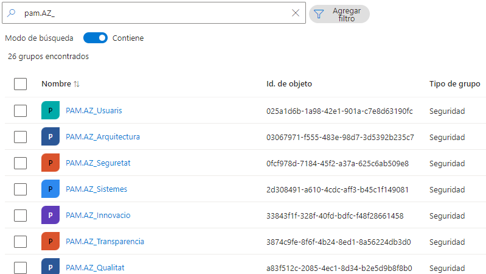
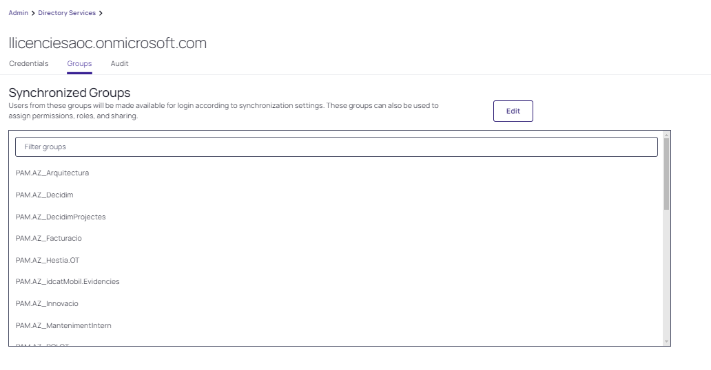

Seguretat : Error No user was found for SAML account.  

1.  [Seguretat](index.md)
2.  [Pàgina d'inici de la Unitat de Seguretat](15368362.md)
3.  [Procediments Unitat de Seguretat](Procediments-Unitat-de-Seguretat_81856210.md)
4.  [PAM - Manuals i Procediments](PAM---Manuals-i-Procediments_93356107.md)
5.  [Manual de l'administrador](64979218.md)

Seguretat : Error No user was found for SAML account.
=====================================================

Created by Ivan Caballero on 09 mayo 2024

Missatge d'error:

  

Los usuarios de PAM no se dan de alta directamente en el PAM. Los usuarios se sincronizan desde los grupos de Azure AD "PAM.AZ\_\*". Los usuarios externos deben tener un usuario interno obligatoriamente.

Este error se produce cuando un usuario que proviene del dominio local intenta entrar en el PAM. La fuente de los usuarios de PAM debe ser el Azure AD. Nunca el dominio local.

Para que un usuario esté dado de alta en el PAM se tienen que dar los siguientes prerequisitos:

*   El usuario debe pertenecer a uno de los grup PAM.AZ\_\*

*   El grupo dónde está el usuario, debe ser uno de los grupos que el PAM sincroniza:

*   Una vez sincronizado, el usuario aparecerá en la lista de usuarios "no activos". Se deberá activar el usuario.

Attachments:
------------

 [image2024-5-9\_10-49-1.png](attachments/100010417/100010418.png) (image/png)  
 [image2024-5-9\_11-5-3.png](attachments/100010417/100010420.png) (image/png)  
 [image2024-5-9\_11-12-53.png](attachments/100010417/100010421.png) (image/png)  

Document generated by Confluence on 07 junio 2025 00:08

[Atlassian](http://www.atlassian.com/)