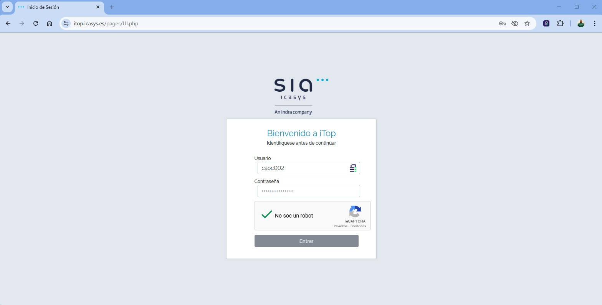
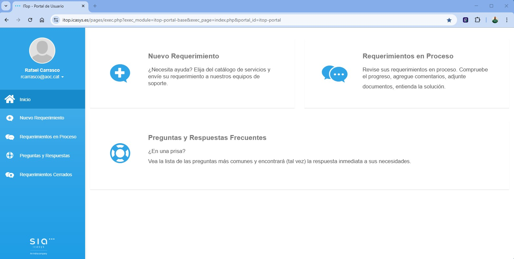
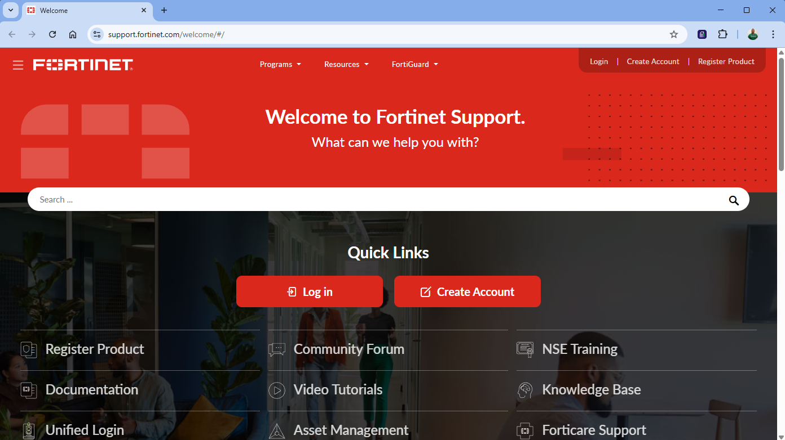
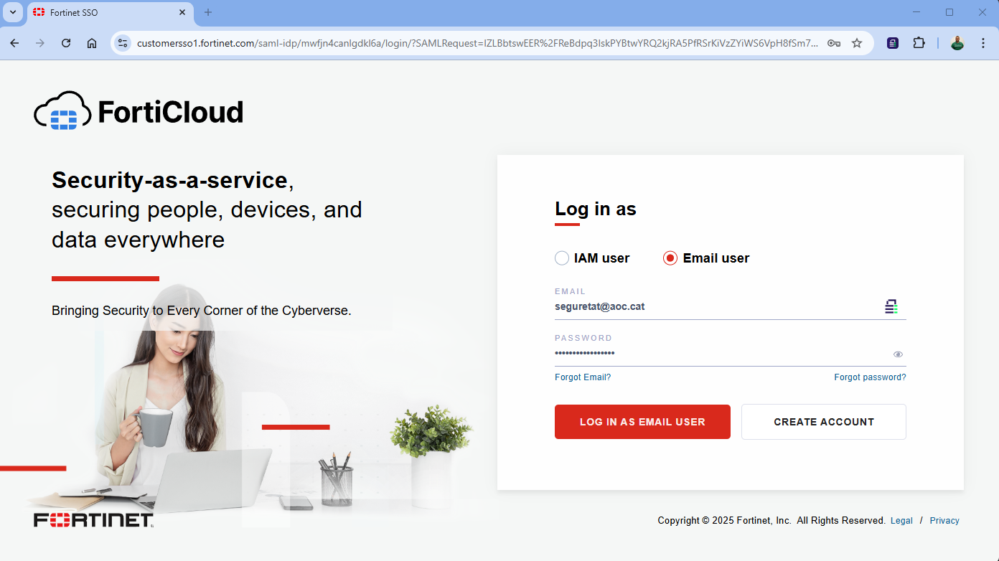
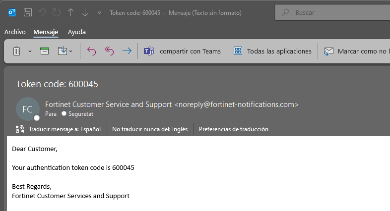

Seguretat : Escalats a la Unitat de Seguretat AOC  

1.  [Seguretat](index.md)
2.  [Pàgina d'inici de la Unitat de Seguretat](15368362.md)
3.  [Procediments Unitat de Seguretat](Procediments-Unitat-de-Seguretat_81856210.md)
4.  [24x7 Procediments](24x7-Procediments_124911681.md)

Seguretat : Escalats a la Unitat de Seguretat AOC
=================================================

Created by Rafael Carrasco, last modified on 21 mayo 2025

Explicarem breument els casos d'escalats i les matrius de contactes i mitjans

  

Escalats interns 8x5
====================

En format 8x5 i de cara a les Unitats de AOC i les seves Oficines Tècniques i/o proveïdors amb aquesta facultat, aquests serien els escalats disponibles:

### Casuístiques habituals

*   servei amb possible impacte a negoci arrel de monitorització funcional i/o d'arquitectura
*   processos que funcionaven es veuen afectats per processament i/o comunicació
*   missatge a consola d'un event de seguretat
*   comportament possiblement maliciós

### Matriu d'escalats i mitjans

  

  

  

  

  

  

  

  

  

  

  

  

  

  

  

  

### Eina habitual d'escalat

Mitjançant tiquet JIRA al projecte de Seguretat "SEG"

  

Escalats al SOC AOC 24x7
========================

En format 24x7 en cas necessari de reportar algun possible incident de seguretat, també hi ha la possibilitat d'escalar lo que sigui necesari de revisió, aquests serien els escalats disponibles:

### Casuístiques habituals

*   servei amb possible impacte a negoci arrel de monitorització funcional i/o d'arquitectura
*   processos que funcionaven es veuen afectats per processament i/o comunicació
*   missatge a consola d'un event de seguretat
*   comportament possiblement maliciós

### Matriu d'escalats i mitjans

  

  

  

  

  

  

  

  

  

  

  

  

  

  

  

  

### Eina habitual d'escalat

Accés al servei de tiqueting iTop [https://itop.icasys.es/](https://itop.icasys.es/)

Com a nou requeriment els casos habituals són de "Monitorización de ciberseguridad", seguiment les diferències, i un cop seleccionada la tipologia caldria

*   explicar el cas.
*   seleccionar els contactes.
*   i Enviar per crear el cas.

**Monitorització de ciberseguretat**  
Programari que té com a objectiu infiltrar-se o danyar un ordinador, servidor o un altre dispositiu de xarxa, sense el coneixement del seu responsable o usuari i amb finalitats molt diverses.

*   Codi Nociu
*   Compromís de la informació
*   Incidents relacionats amb l'accés i fugida (Confidencialitat), modificació o esborrat (Integritat) d'informació no pública
*   Contingut Abusiu Atacs dirigits a fer malbé la imatge de l'organització o utilitzar els seus mitjans electrònics per a altres usos il·lícits (com ara la publicitat, la extorsió o, en general la ciberdelinqüència)
*   Disponibilitat Atacs dirigits a posar fora de servei els sistemes, a fi de causar danys a la productivitat i/o la imatge de les institucions atacades.
*   Frau Incidents relacionats amb accions fraudulentes derivades de suplantació d'identitat, a totes les seves variants
*   Intrusió Atacs dirigits a l'explotació de vulnerabilitats de disseny, de operació o de configuració de diferents tecnologies, a fi de introduir-se de forma fraudulenta a sistemes d'una organització.
*   Obtenció d'informació Atacs dirigits a demanar informació fonamental que permeti avançar en atacs més sofisticats, a través d'enginyeria social o de identificació de vulnerabilitats.
*   Altres Altres incidents no inclosos als apartats anteriors
*   Petició de Ciberseguretat Aquesta és la subcategoria per a peticions de ciberseguretat.
*   Política de seguretat Incidents relacionats per violacions d'usuaris de les polítiques de seguretat aprovades per la organització.

Escalats al MDR AOC 24x7
========================

En format 24x7 també es pot escalar al servei MDR (Managed Detection&Response) sobre algun possible incident de seguretat per revisar el cas de processament per comportament de l'eina EDR, aquests serien els escalats disponibles:

### Casuístiques habituals

*   servei amb possible impacte a negoci arrel de monitorització funcional i/o d'arquitectura
*   processos que funcionaven es veuen afectats per processament i/o comunicació
*   missatge a consola d'un event de seguretat
*   comportament possiblement maliciós

### Matriu d'escalats i mitjans

  

  

  

  

  

  

  

  

  

  

  

  

  

  

  

  

### Eina habitual d'escalat

Acces FortiCare & Support [https://support.fortinet.com/](https://support.fortinet.com/)

Indicar username (correu electrònic donat d'alta) i contrasenya

Amb el OTP arribarà un Token a la bústia de correu

Per obrir casos s'ha d'indicar el identificador del contracte de l'eina: FortiEDR Serial Number FEDR00TM23000463

  

Attachments:
------------

 [image2025-5-21\_8-12-14.png](attachments/128647715/128647720.png) (image/png)  
 [image2025-5-21\_8-13-47.png](attachments/128647715/128647721.png) (image/png)  
 [image2025-5-21\_8-15-26.png](attachments/128647715/128647722.png) (image/png)  
 [escalats iTop 001.jpg](attachments/128647715/128647733.jpg) (image/jpeg)  
 [escalats iTop 002.jpg](attachments/128647715/128647734.jpg) (image/jpeg)  

Document generated by Confluence on 07 junio 2025 00:08

[Atlassian](http://www.atlassian.com/)