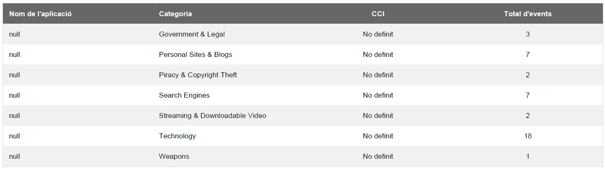
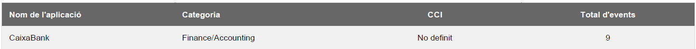
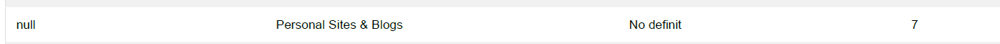
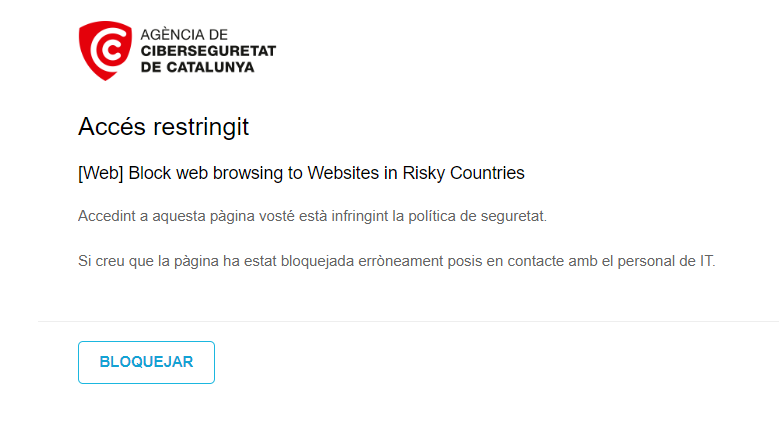
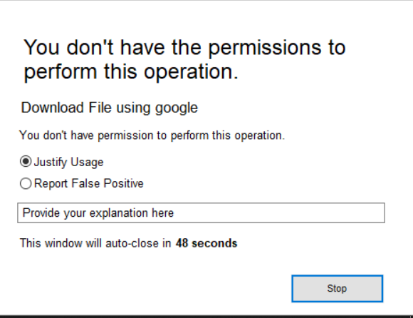
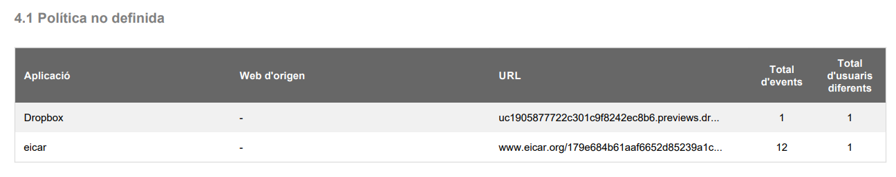
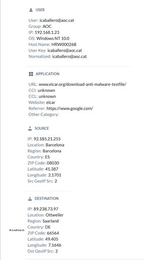
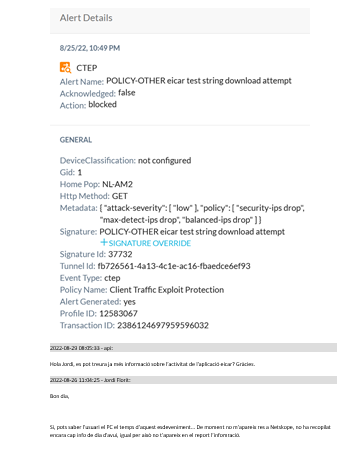

Seguretat : Proves  

1.  [Seguretat](index.md)
2.  [Pàgina d'inici de la Unitat de Seguretat](15368362.md)
3.  [Projectes Unitat de Seguretat](Projectes-Unitat-de-Seguretat_41517821.md)
4.  [SASE](SASE_81856152.md)
5.  [Catalonia SOC - SASE - Netskope](Catalonia-SOC---SASE---Netskope_64981706.md)

Seguretat : Proves
==================

Created by Ivan Caballero, last modified on 12 septiembre 2022

/\*<!\[CDATA\[\*/ div.rbtoc1749247731323 {padding: 0px;} div.rbtoc1749247731323 ul {list-style: disc;margin-left: 0px;} div.rbtoc1749247731323 li {margin-left: 0px;padding-left: 0px;} /\*\]\]>\*/

*   [Dia 18-ago-2022](#Proves-Dia)
*   [Dia 22-ago-2022](#Proves-Dia.1)
    *   [DLP](#Proves-DLP)
*   [Detecció de virus](#Proves-Detecciódevirus)

Dia 18-ago-2022 
----------------

Es fan proves de navegació a diferents tipologies de pàgines web que segons la normativa tenim bloquejades:

Abuse drogs: [www.bombshock.com](http://www.bombshock.com)  
Copyrigth Infrigiment: [www.moviexk.net](http://www.moviexk.net)  
Dating: [www.match.com](http://www.match.com)  
Dynamic DNS: [no-ip.com](http://no-ip.com)  
Extremist: [www.kkk.com](http://www.kkk.com)  
Gambling: [www.fulltiltpoker.com](http://www.fulltiltpoker.com)  
Games: [www.gamespot.com](http://www.gamespot.com)  
Hacking: [www.hackspc.com](http://www.hackspc.com) --> **accés restringit**  
Nudity: [www.nudistbeaches.nl](http://www.nudistbeaches.nl)   
Adult Content: [www.playboy.com](http://www.playboy.com)  
shareware: [www.download.com](http://www.download.com)  
weapons: [www.israeli-weapons.com](http://www.israeli-weapons.com)

Totes les pàgines estàven permeses excepte la de "hacking".

En l'informe apareixen dins de la catregoria de "Sota recerca" i no tenen indicador de compromís "CCI":

A més, una plana bancaria, on vaig ingressar l'usuari i contraseya surt analitzada.

U servei de correu personal també:

Les pàgines blocades donen aquest missatge:

Informe: [9821920002\_AOC\_20220822.pdf](attachments/77824315/77824319.pdf)

Dia 22-ago-2022 
----------------

Es comprova el detall que hi ha als logs.

En cas que et loggis en alguna pàgina les credencials no queden exposades enlloc, l'agent guarda un log que exposa només l'URL a la que has accedit i el comportament que ha tingut en fer la sol·licitud, tu mateix ho pots mirar guardant els logs fent clic dret a l'agent i a l'opció que posa save logs, seguidament es descarrega un .zip i allí tens tota la informació, la que utilitzem des de suport s'anomena nsdebuglog.

Accés a Caixabanc:

2022/08/22 15:05:29.574 stAgentSvc p17e0 t63b8 info bypassAppMgr.cpp:1171 BypassAppMgr bypassing flow to exception host: [www.caixabank.es](http://www.caixabank.es), process: chrome.exe, Dest IP: 104.18.1.56, Dest Port: 443  
2022/08/22 15:05:34.037 stAgentSvc p17e0 t63b8 info bypassAppMgr.cpp:1171 BypassAppMgr bypassing flow to exception host: [loapp.caixabank.es](http://loapp.caixabank.es), process: chrome.exe, Dest IP: 217.148.72.237, Dest Port: 443  
2022/08/22 15:05:34.201 stAgentSvc p17e0 t63b8 info bypassAppMgr.cpp:1171 BypassAppMgr bypassing flow to exception host: [js.pp.caixabank.es](http://js.pp.caixabank.es), process: chrome.exe, Dest IP: 104.18.20.201, Dest Port: 443  
2022/08/22 15:05:34.237 stAgentSvc p17e0 t63b8 info bypassAppMgr.cpp:1171 BypassAppMgr bypassing flow to exception host: [content-autofill.googleapis.com](http://content-autofill.googleapis.com), process: chrome.exe, Dest IP: 142.250.185.170, Dest Port: 443  
2022/08/22 15:05:34.395 stAgentSvc p17e0 t63b8 info bypassAppMgr.cpp:1171 BypassAppMgr bypassing flow to exception host: [content-autofill.googleapis.com](http://content-autofill.googleapis.com), process: chrome.exe, Dest IP: 142.250.185.170, Dest Port: 443

  

Es comprova el detall de log en una pàgina amb autenticació i que no està a les excepcions:

2022/08/22 15:16:38.526 stAgentSvc p17e0 t63b8 info tunnel.cpp:811 nsTunnel DTLS \[sessId 11\] Tunneling flow from addr: 192.168.8.109:63979, process: chrome.exe to host: [www.filmaffinity.com](http://www.filmaffinity.com), addr: 82.98.137.22:443 to nsProxy  
2022/08/22 15:16:38.527 stAgentSvc p17e0 t63b8 info tunnel.cpp:811 nsTunnel DTLS \[sessId 11\] Tunneling flow from addr: 192.168.8.109:63980, process: chrome.exe to host: [www.filmaffinity.com](http://www.filmaffinity.com), addr: 82.98.137.22:443 to nsProxy  
2022/08/22 15:16:38.546 stAgentSvc p17e0 t63b8 info tunnel.cpp:811 nsTunnel DTLS \[sessId 11\] Tunneling flow from addr: 192.168.8.109:63981, process: chrome.exe to host: [cdn.smartclip-services.com](http://cdn.smartclip-services.com), addr: 130.61.96.156:443 to nsProxy  
2022/08/22 15:16:38.548 stAgentSvc p17e0 t63b8 info tunnel.cpp:811 nsTunnel DTLS \[sessId 11\] Tunneling flow from addr: 192.168.8.109:63982, process: chrome.exe to host: [s3.eu-central-1.amazonaws.com](http://s3.eu-central-1.amazonaws.com), addr: 52.219.170.193:443 to nsProxy  
2022/08/22 15:16:41.216 stAgentSvc p17e0 t63b8 info tunnel.cpp:811 nsTunnel DTLS \[sessId 11\] Tunneling flow from addr: 192.168.8.109:63986, process: chrome.exe to host: [cdn.smartclip-services.com](http://cdn.smartclip-services.com), addr: 130.61.96.156:443 to nsProxy  
2022/08/22 15:16:41.279 stAgentSvc p17e0 t63b8 info tunnel.cpp:811 nsTunnel DTLS \[sessId 11\] Tunneling flow from addr: 192.168.8.109:63987, process: chrome.exe to host: [www.google-analytics.com](http://www.google-analytics.com), addr: 142.250.181.238:443 to nsProxy  
2022/08/22 15:16:41.300 stAgentSvc p17e0 t63b8 info tunnel.cpp:811 nsTunnel DTLS \[sessId 11\] Tunneling flow from addr: 192.168.8.109:63988, process: chrome.exe to host: [pics.filmaffinity.com](http://pics.filmaffinity.com), addr: 82.98.162.78:443 to nsProxy  
2022/08/22 15:16:41.303 stAgentSvc p17e0 t63b8 info tunnel.cpp:811 nsTunnel DTLS \[sessId 11\] Tunneling flow from addr: 192.168.8.109:63989, process: chrome.exe to host: [cmp.quantcast.com](http://cmp.quantcast.com), addr: 143.204.9.23:443 to nsProxy  
2022/08/22 15:16:41.304 stAgentSvc p17e0 t63b8 info tunnel.cpp:811 nsTunnel DTLS \[sessId 11\] Tunneling flow from addr: 192.168.8.109:63990, process: chrome.exe to host: [sb.scorecardresearch.com](http://sb.scorecardresearch.com), addr: 13.226.175.76:443 to nsProxy  
2022/08/22 15:16:41.652 stAgentSvc p17e0 t63b8 info tunnel.cpp:811 nsTunnel DTLS \[sessId 11\] Tunneling flow from addr: 192.168.8.109:63991, process: chrome.exe to host: [quantcast.mgr.consensu.org](http://quantcast.mgr.consensu.org), addr: 143.204.9.28:443 to nsProxy  
2022/08/22 15:16:41.677 stAgentSvc p17e0 t63b8 info tunnel.cpp:811 nsTunnel DTLS \[sessId 11\] Tunneling flow from addr: 192.168.8.109:63992, process: chrome.exe to host: [rules.quantcount.com](http://rules.quantcount.com), addr: 13.226.175.38:443 to nsProxy  
2022/08/22 15:16:41.727 stAgentSvc p17e0 t63b8 info tunnel.cpp:811 nsTunnel DTLS \[sessId 11\] Tunneling flow from addr: 192.168.8.109:63993, process: chrome.exe to host: [stats.g.doubleclick.net](http://stats.g.doubleclick.net), addr: 74.125.206.156:443 to nsProxy  
2022/08/22 15:16:41.890 stAgentSvc p17e0 t63b8 info tunnel.cpp:811 nsTunnel DTLS \[sessId 11\] Tunneling flow from addr: 192.168.8.109:63994, process: chrome.exe to host: [quantcast.mgr.consensu.org](http://quantcast.mgr.consensu.org), addr: 143.204.9.23:443 to nsProxy  
2022/08/22 15:16:42.414 stAgentSvc p17e0 t63b8 info tunnel.cpp:811 nsTunnel DTLS \[sessId 11\] Tunneling flow from addr: 192.168.8.109:63995, process: chrome.exe to host: [audit-tcfv2.cmp.quantcast.com](http://audit-tcfv2.cmp.quantcast.com), addr: 18.196.221.202:443 to nsProxy  
2022/08/22 15:16:42.500 stAgentSvc p17e0 t63b8 info bypassAppMgr.cpp:1171 BypassAppMgr bypassing flow to exception host: [translate.googleapis.com](http://translate.googleapis.com), process: chrome.exe, Dest IP: 216.58.214.10, Dest Port: 443  
2022/08/22 15:16:44.398 stAgentSvc p17e0 t63b8 info tunnel.cpp:811 nsTunnel DTLS \[sessId 11\] Tunneling flow from addr: 192.168.8.109:63997, process: chrome.exe to host: [securepubads.g.doubleclick.net](http://securepubads.g.doubleclick.net), addr: 142.250.185.130:443 to nsProxy  
2022/08/22 15:16:44.429 stAgentSvc p17e0 t63b8 info tunnel.cpp:811 nsTunnel DTLS \[sessId 11\] Tunneling flow from addr: 192.168.8.109:63998, process: chrome.exe to host: [pixel.quantserve.com](http://pixel.quantserve.com), addr: 91.228.74.200:443 to nsProxy  
2022/08/22 15:16:44.435 stAgentSvc p17e0 t63b8 info tunnel.cpp:811 nsTunnel DTLS \[sessId 11\] Tunneling flow from addr: 192.168.8.109:63999, process: chrome.exe to host: [des.smartclip.net](http://des.smartclip.net), addr: 35.186.194.101:443 to nsProxy  
2022/08/22 15:16:44.914 stAgentSvc p17e0 t63b8 info tunnel.cpp:811 nsTunnel DTLS \[sessId 11\] Tunneling flow from addr: 192.168.8.109:64000, process: chrome.exe to host: [dpm.demdex.net](http://dpm.demdex.net), addr: 54.154.32.144:443 to nsProxy  
2022/08/22 15:16:44.944 stAgentSvc p17e0 t63b8 info tunnel.cpp:811 nsTunnel DTLS \[sessId 11\] Tunneling flow from addr: 192.168.8.109:64001, process: chrome.exe to host: [dpm.demdex.net](http://dpm.demdex.net), addr: 54.154.32.144:443 to nsProxy  
2022/08/22 15:16:44.992 stAgentSvc p17e0 t63b8 info tunnel.cpp:811 nsTunnel DTLS \[sessId 11\] Tunneling flow from addr: 192.168.8.109:64002, process: chrome.exe to host: [securepubads.g.doubleclick.net](http://securepubads.g.doubleclick.net), addr: 142.250.185.130:443 to nsProxy  
2022/08/22 15:16:45.439 stAgentSvc p17e0 t63b8 info tunnel.cpp:811 nsTunnel DTLS \[sessId 11\] Tunneling flow from addr: 192.168.8.109:64005, process: chrome.exe to host: [cdn.mookie1.com](http://cdn.mookie1.com), addr: 23.216.124.148:443 to nsProxy  
2022/08/22 15:16:45.609 stAgentSvc p17e0 t63b8 info tunnel.cpp:811 nsTunnel DTLS \[sessId 11\] Tunneling flow from addr: 192.168.8.109:64008, process: stagentsvc.exe to host: [achecker-catalonia-soc.eu.goskope.com](http://achecker-catalonia-soc.eu.goskope.com), addr: 31.186.239.95:443 to nsProxy  
2022/08/22 15:16:46.071 stAgentSvc p17e0 t63b8 info tunnel.cpp:811 nsTunnel DTLS \[sessId 11\] Tunneling flow from addr: 192.168.8.109:64009, process: chrome.exe to host: [smc.demdex.net](http://smc.demdex.net), addr: 52.19.103.22:443 to nsProxy  
2022/08/22 15:16:46.074 stAgentSvc p17e0 t63b8 info tunnel.cpp:811 nsTunnel DTLS \[sessId 11\] Tunneling flow from addr: 192.168.8.109:64010, process: chrome.exe to host: [smc.demdex.net](http://smc.demdex.net), addr: 52.19.103.22:443 to nsProxy  
2022/08/22 15:16:46.077 stAgentSvc p17e0 t63b8 info tunnel.cpp:811 nsTunnel DTLS \[sessId 11\] Tunneling flow from addr: 192.168.8.109:64013, process: stagentsvc.exe to host: [achecker-catalonia-soc.eu.goskope.com](http://achecker-catalonia-soc.eu.goskope.com), addr: 31.186.239.95:443 to nsProxy  
2022/08/22 15:16:46.189 stAgentSvc p17e0 t63b8 info tunnel.cpp:811 nsTunnel DTLS \[sessId 11\] Tunneling flow from addr: 192.168.8.109:64014, process: chrome.exe to host: [www.gstatic.com](http://www.gstatic.com), addr: 142.250.181.227:443 to nsProxy  
2022/08/22 15:16:46.230 stAgentSvc p17e0 t63b8 info bypassAppMgr.cpp:1171 BypassAppMgr bypassing flow to exception host: [content-autofill.googleapis.com](http://content-autofill.googleapis.com), process: chrome.exe, Dest IP: 216.58.212.170, Dest Port: 443  
2022/08/22 15:16:46.373 stAgentSvc p17e0 t63b8 info bypassAppMgr.cpp:1171 BypassAppMgr bypassing flow to exception host: [self.events.data.microsoft.com](http://self.events.data.microsoft.com), process: onedrive.exe, Dest IP: 20.50.73.10, Dest Port: 443  
2022/08/22 15:16:46.458 stAgentSvc p17e0 t63b8 info tunnel.cpp:811 nsTunnel DTLS \[sessId 11\] Tunneling flow from addr: 192.168.8.109:64017, process: chrome.exe to host: [router.infolinks.com](http://router.infolinks.com), addr: 172.66.41.9:443 to nsProxy  
2022/08/22 15:16:49.322 stAgentSvc p17e0 t63b8 info tunnel.cpp:811 nsTunnel DTLS \[sessId 11\] Tunneling flow from addr: 192.168.8.109:64018, process: chrome.exe to host: [fonts.gstatic.com](http://fonts.gstatic.com), addr: 216.58.212.163:443 to nsProxy  
2022/08/22 15:16:49.783 stAgentSvc p17e0 t63b8 info tunnel.cpp:811 nsTunnel DTLS \[sessId 11\] Tunneling flow from addr: 192.168.8.109:64019, process: chrome.exe to host: [filmaffinity.com](http://filmaffinity.com), addr: 82.98.137.22:443 to nsProxy

  

  

### DLP

Es copien 360 arxius en dropbox. No ho detecta.

Dia 23 → els poso a Office. Elimino de dropbox.

No s'ha pogut reproduir el DLP.

  

Detecció de virus
-----------------

En la detecció de virus surt aquesta pantalla:

Prova feta amb l'EICAR file [https://www.eicar.org/download-anti-malware-testfile/](https://www.eicar.org/download-anti-malware-testfile/)

La detecció de virus surt en els logs, que s'han de demanar al cesicat:

Informe: [9821920002\_AOC\_20220826.pdf](attachments/77824315/77824342.pdf)

  

Attachments:
------------

 [image2022-8-22\_13-33-46.png](attachments/77824315/77824316.png) (image/png)  
 [image2022-8-22\_13-36-29.png](attachments/77824315/77824317.png) (image/png)  
 [image2022-8-22\_13-38-25.png](attachments/77824315/77824318.png) (image/png)  
 [9821920002\_AOC\_20220822.pdf](attachments/77824315/77824319.pdf) (application/pdf)  
 [image2022-8-25\_7-58-55.png](attachments/77824315/77824331.png) (image/png)  
 [image2022-8-25\_22-48-55.png](attachments/77824315/77824338.png) (image/png)  
 [image2022-8-26\_10-33-39.png](attachments/77824315/77824341.png) (image/png)  
 [9821920002\_AOC\_20220826.pdf](attachments/77824315/77824342.pdf) (application/pdf)  
 [image2022-9-12\_10-17-30.png](attachments/77824315/77824418.png) (image/png)  
 [image2022-9-12\_10-18-24.png](attachments/77824315/77824419.png) (image/png)  

Document generated by Confluence on 07 junio 2025 00:08

[Atlassian](http://www.atlassian.com/)