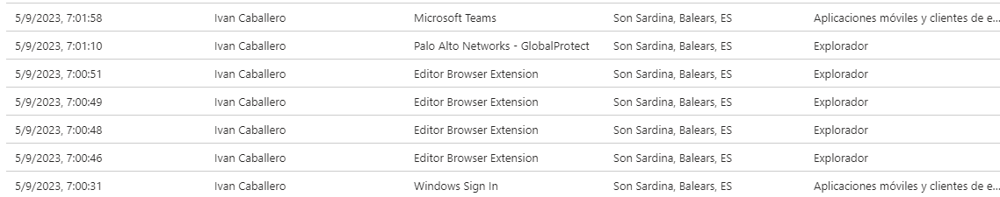
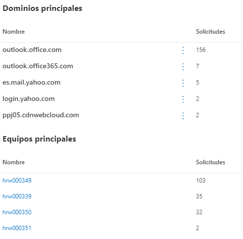
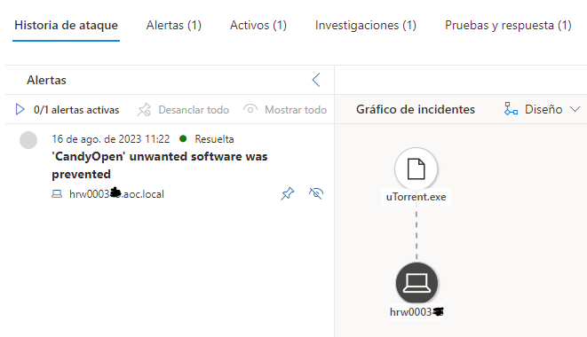
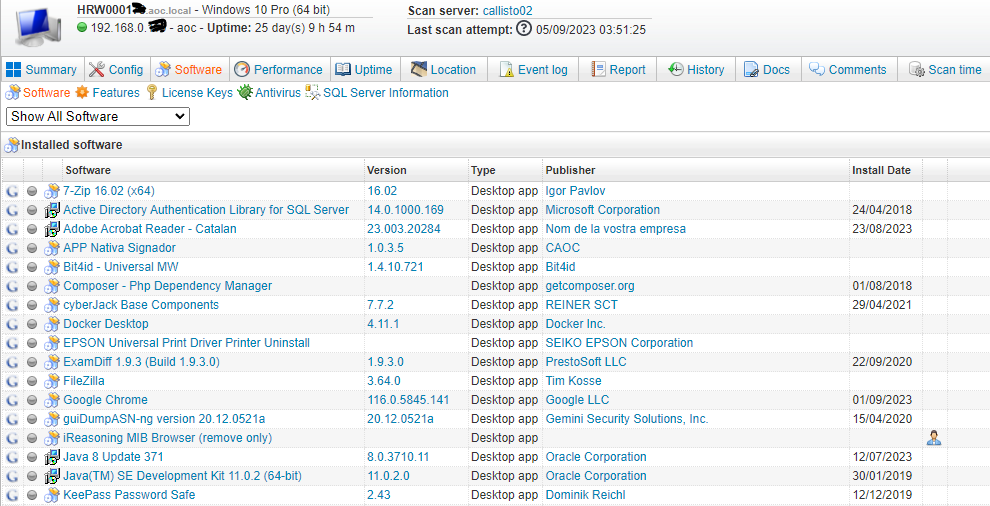
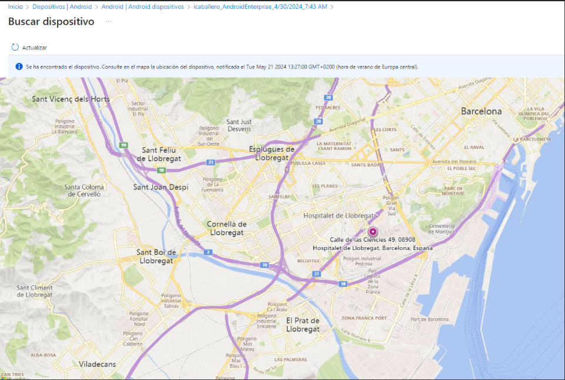

Seguretat : Seguretat aplicada en Equips de treball  

1.  [Seguretat](index.md)
2.  [Pàgina d'inici de la Unitat de Seguretat](15368362.md)
3.  [Arquitectura de Seguretat](Arquitectura-de-Seguretat_24216213.md)

Seguretat : Seguretat aplicada en Equips de treball
===================================================

Created by Ivan Caballero, last modified on 10 junio 2024

/\*<!\[CDATA\[\*/ div.rbtoc1749247708343 {padding: 0px;} div.rbtoc1749247708343 ul {list-style: disc;margin-left: 0px;} div.rbtoc1749247708343 li {margin-left: 0px;padding-left: 0px;} /\*\]\]>\*/

*   [Objecte del document](#SeguretataplicadaenEquipsdetreball-Objectedeldocument)
*   [Abast](#SeguretataplicadaenEquipsdetreball-Abast)
*   [Mesures de seguretat aplicades i tractament d'informació personal.](#SeguretataplicadaenEquipsdetreball-Mesuresdeseguretataplicadesitractamentd'informaciópersonal.)
    *   [Inicis de sessió](#SeguretataplicadaenEquipsdetreball-Inicisdesessió)
    *   [Registre i limitació en la navegació per internet.](#SeguretataplicadaenEquipsdetreball-Registreilimitacióenlanavegacióperinternet.)
    *   [Limitació en la instal·lació de programari i limitació en l’execució de programari quan es consideri programari poc segur.](#SeguretataplicadaenEquipsdetreball-Limitacióenlainstal·laciódeprogramariilimitacióenl’execuciódeprogramariquanesconsideriprogramaripocsegur.)
    *   [Escanegi del programari i les dades en busca de malware.](#SeguretataplicadaenEquipsdetreball-Escanegidelprogramariilesdadesenbuscademalware.)
    *   [Escaneig i inventari el programari instal·lat.](#SeguretataplicadaenEquipsdetreball-Escaneigiinventarielprogramariinstal·lat.)
    *   [Cerca del dispositiu](#SeguretataplicadaenEquipsdetreball-Cercadeldispositiu)
    *   [Esborrat de dades.](#SeguretataplicadaenEquipsdetreball-Esborratdedades.)

Objecte del document
--------------------

El Consorci AOC té l’obligació de protegir la informació i els serveis que presta, i per aquesta raó és necessari desplegar mesures de control sobre els dispositius i comunicacions del sistema d’informació.

El Consorci proporciona als treballadors, dispositius d’ús exclusiu per a l’exercici de les seves funcions. Aquest ús exclusiu pot comportar que, per part dels treballadors, es faci un ús privat dels medis informàtics i de les comunicacions facilitats pel Consorci.

Alhora, aquest ús pot privat pot crear una expectativa de confidencialitat en aquests usos; expectativa que no pot ser desconeguda, tot i que tampoc convertir-se en un impediment permanent del control pel Consorci quan sigui necessari per protegir la informació i serveis que presta. Tot i que el treballador té dret al respecte de la seva intimitat, no pot imposar aquest respecte quan utilitza un mitjà proporcionat pel Consorci en contra de les instruccions establertes per aquest per al seu ús i al marge dels controls previstos per a aquesta utilització.

L’article 87 de la Llei orgànica 3/2018, de 5 de desembre, de protecció de dades personals i garantia dels drets digitals (en endavant, LOPDGDD), estableix que l’ocupador pot accedir als continguts derivats de l’ús de mitjans digitals facilitats als treballadors a l’efecte de controlar el compliment de les obligacions laborals o estatutàries i de garantir la integritat dels dispositius esmentats. Si bé l’anterior s’ha de fer respectant el dret dels treballadors a la protecció de la seva intimitat en l’ús dels dispositius digitals que posi a la seva disposició.

Tenint en compte que es podria produir una confrontació de drets, per un costat el dret a la intimitat de l’empleat, i per l’altre el dret i obligació de control del Consorci, l’aplicació de mesures de control sobre els dispositius i comunicacions s’ha fet un judici de proporcionalitat per avaluar la prevalença d’un dret sobre l’altre.

Així, en virtut d'aquest judici de proporcionalitat, perquè les mesures de control siguin aplicables i garanteixin la seva licitud, sempre caldran que superin els tres (3) judicis següents:

*   **Judici d' idoneïtat:** que la mesura a adoptar sigui susceptible d' assolir l' objectiu perseguit.
*   **Judici de necessitat:** que no existeixi una altra mesura més moderada per assolir el propòsit perseguit.
*   **Judici de proporcionalitat,** en sentit estricte: que la mesura adoptada sigui proporcional al valor dels béns, actius o interessos en risc

Abast
-----

En aquest document es documenta la informació de caràcter tractada pel Consorci AOC, recollida de les estacions de treball.

S'entén per dispositius assignats a tots els dispositius propietat del Consorci AOC i custodiats per usuaris per l'exercici de les seves funcions:

*   Estacions de treball fixes.
*   Estacions de treball portàtils.
*   Telèfons mòbils (smartphones)
*   Tablets

Mesures de seguretat aplicades i tractament d'informació personal.
------------------------------------------------------------------

### Inicis de sessió

Es registra els inicis de sessió dels usuaris, la seva IP i ubicació (dada subministrada per l'operador d'Internet).

El temps de retenció és 1 mes.

Les dades tractades són necessàries per conèixer el context de l'inici de sessió de cada usuari. Si el context canvia sobtadament pot ser un indicatiu de robatori de credencials, per exemple si un usuari canvia de país des d'on es connecta.

### Registre i limitació en la navegació per internet.

La navegació per internet està limitada. Es bloquejaran els llocs poc segurs o inapropiats.

Les categories bloquejades són:

*   Cults
*   Juegos de azar
*   Desnudez
*   Pornografía/Sexualmente explícito
*   Educación sexual
*   Desagradable
*   Violencia
*   Imágenes de abuso de niños
*   Actividad Penal
*   Piratería
*   Odio e intolerancia
*   Fármaco ilegal
*   Software ilegal
*   Trampas escolares
*   Daño propio
*   Armas
*   Chat
*   Juegos
*   Mensajería instantánea
*   Redes sociales

Es registra la informació de navegació dels usuaris. 

La finalitat del tractament és tenir informació de a quines URLs s'accedeix des de l'organització.

La informació està anonimitzada i agregada. No indica usuaris ni horari d'accés.

Queda registrat els llocs web on han accedit les estacions de treball, però la informació està agregada per grups d'estacions de treball i categories. No es pot saber quantes vegades ha accedit cada estació de treball ni en quin moment.

El temps de retenció del registre és de 6 mesos.

La finalitat del tractament és la gestió dels incidents de seguretat i la detecció d'accessos indeguts.

### Limitació en la instal·lació de programari i limitació en l’execució de programari quan es consideri programari poc segur.

El usuaris no poden instal·lar programari en els dispositius assignats que no estigui aprovat. Hi haurà un llistat de programari acceptat que els usuaris sí podran instal·lar. 

L'execució de programari també estarà limitada al programari que estigui prèviament acceptat.

Es registrarà l'execució de programari no aprovat i s'identificarà el dispositiu i la persona que ho ha executat.

El temps de retenció del registre és de 6 mesos.

La finalitat del tractament és la gestió dels incidents de seguretat.

### Escanegi del programari i les dades en busca de malware.

Hi ha processos que escanegen el programari i les dades per detectar malware. Es registren els noms i ubicacions dels arxius on es troba malware.

El temps de retenció del registre és de 6 mesos.

La finalitat del tractament és la gestió dels incidents de seguretat.

### Escaneig i inventari el programari instal·lat.

Hi ha processos que escanegen el programari instal·lat. Es registra tot el programari instal·lat, data d'instal·lació, freqüència d'ús del programari.

El temps de retenció és mentrestant el dispositiu estigui actiu.

La finalitat del tractament és tenir un inventari de programari i detectar programari no aprovat pel Consorci AOC.

### Cerca del dispositiu

Es pot obtenir la ubicació en temps real del dispositiu.

El dispositiu avisa de que s'està cercant. 

La informació que s'obté és la ubicació exacte del dispositiu en aquell moment:

La finalitat és la localització del dispositiu en cas de pèrdua o robatori.

### Esborrat de dades.

El Consorci AOC té la possibilitat d'esborrat remot de dades.

L'esborrat també es produeix automàticament si hi ha 10 intents erronis d'accés al dispositiu.

La finalitat és la protecció de les dades en cas de robatori del dispositiu.

  

Attachments:
------------

 [image2023-9-5\_16-1-23.png](attachments/100010434/100010476.png) (image/png)  
 [image2023-4-28\_16-58-47.png](attachments/100010434/100010477.png) (image/png)  
 [image2023-9-5\_15-23-1.png](attachments/100010434/100010478.png) (image/png)  
 [image2023-9-5\_15-34-56.png](attachments/100010434/100010479.png) (image/png)  
 [image2024-5-22\_8-33-17.png](attachments/100010434/100010497.png) (image/png)  

Document generated by Confluence on 07 junio 2025 00:08

[Atlassian](http://www.atlassian.com/)