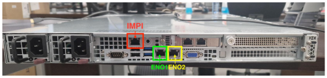
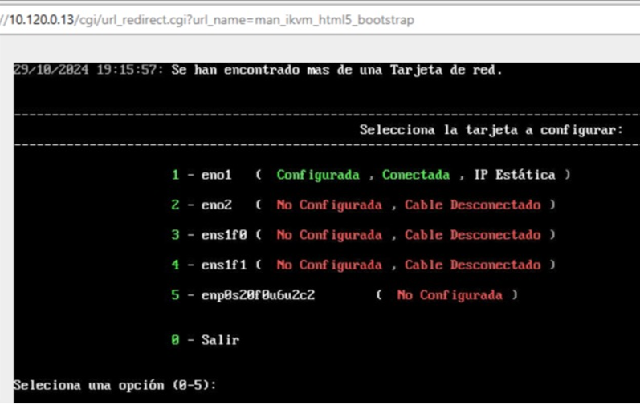
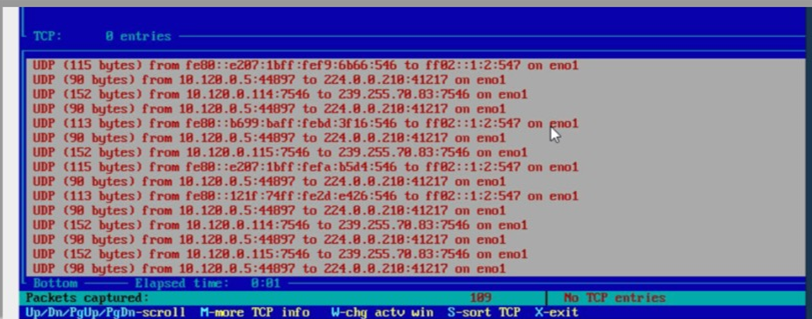
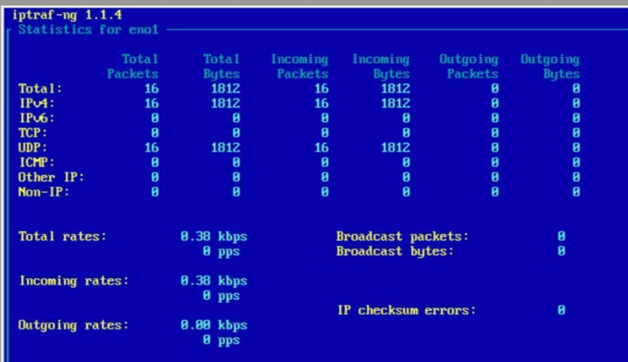

Seguretat : Sonda Sat-Inet  

1.  [Seguretat](index.md)
2.  [Pàgina d'inici de la Unitat de Seguretat](15368362.md)
3.  [Projectes Unitat de Seguretat](Projectes-Unitat-de-Seguretat_41517821.md)
4.  [Servei CiberSOC](Servei-CiberSOC_113311785.md)

Seguretat : Sonda Sat-Inet
==========================

Created by Ivan Caballero on 19 marzo 2025

Connectivitat.
--------------

El ports són els següents:

IMPI: Gestion de ICA CAOC (10.120.0.13)

ENO1: Gestion CCN-CAOC (10.120.0.12)

ENO2: PORT-MIRROR. Monitorització de les comunicacions.

Els 2 ports no utilitzats es poden fer servir per monitoritzar altres segments de xarxa si no es poden enrutar pel Sat-Inet.

  

En el setup de la sonda es pot veure la configuració de xarxa:

  

La sonda veu només la xarxa 10.120.0.0/24

El CCN ens ha confirmat que veu molts pocs paquets i són insuficients per considerar-la en producció.

Attachments:
------------

 [image2025-3-19\_7-53-36.png](attachments/127598593/127598594.png) (image/png)  
 [image2025-3-19\_7-54-56.png](attachments/127598593/127598595.png) (image/png)  
 [image2025-3-19\_7-55-19.png](attachments/127598593/127598596.png) (image/png)  
 [image2025-3-19\_7-55-39.png](attachments/127598593/127598597.png) (image/png)  

Document generated by Confluence on 07 junio 2025 00:08

[Atlassian](http://www.atlassian.com/)