Seguretat : Tractament de malware  

1.  [Seguretat](index.md)
2.  [Pàgina d'inici de la Unitat de Seguretat](15368362.md)
3.  [Procediments Unitat de Seguretat](Procediments-Unitat-de-Seguretat_81856210.md)

Seguretat : Tractament de malware
=================================

Created by Ivan Caballero, last modified on 11 abril 2025

/\*<!\[CDATA\[\*/ div.rbtoc1749247721761 {padding: 0px;} div.rbtoc1749247721761 ul {list-style: disc;margin-left: 0px;} div.rbtoc1749247721761 li {margin-left: 0px;padding-left: 0px;} /\*\]\]>\*/

*   [Equips d'usuari](#Tractamentdemalware-Equipsd'usuari)
    *   [Política d'escaneig en equips d'usuari.](#Tractamentdemalware-Políticad'escaneigenequipsd'usuari.)
    *   [Extreure reports](#Tractamentdemalware-Extreurereports)
    *   [Protocol d'actuació en esdeveniments de malware.](#Tractamentdemalware-Protocold'actuacióenesdevenimentsdemalware.)
        *   [Avisos de l'eina i/o revisió al quadre de comandament](#Tractamentdemalware-Avisosdel'einai/orevisióalquadredecomandament)
        *   [Categories, origens i estats de les alertes](#Tractamentdemalware-Categories,origensiestatsdelesalertes)
        *   [Administració de les alertes](#Tractamentdemalware-Administraciódelesalertes)
        *   [Assignació del incident](#Tractamentdemalware-Assignaciódelincident)
        *   [Cicle de vida dels incidents de seguretat](#Tractamentdemalware-Cicledevidadelsincidentsdeseguretat)
*   [Normativa de referència.](#Tractamentdemalware-Normativadereferència.)

Equips d'usuari
---------------

### Política d'escaneig en equips d'usuari.

La documentació oficial de Microsoft: [https://learn.microsoft.com/en-us/microsoft-365/security/defender-endpoint/schedule-antivirus-scans?view=o365-worldwide](https://learn.microsoft.com/en-us/microsoft-365/security/defender-endpoint/schedule-antivirus-scans?view=o365-worldwide)

L'escaneig està configurat com a la "Baseline de seguretat" d'Intune.

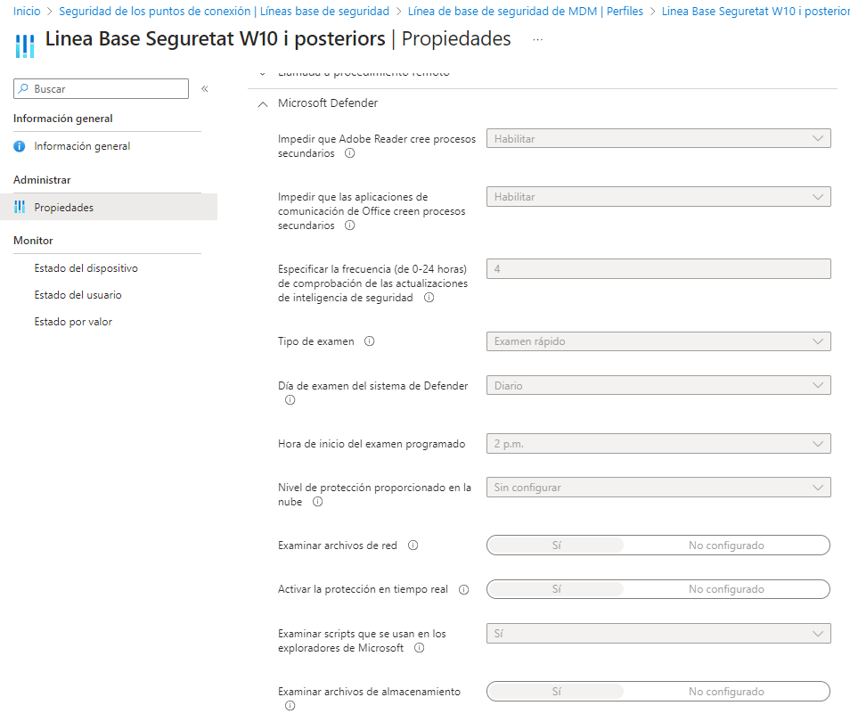

  

L'opció escollida d'escaneig és la que recomana Microsoft, "Quick Scan" + "Always-on real-time protection":

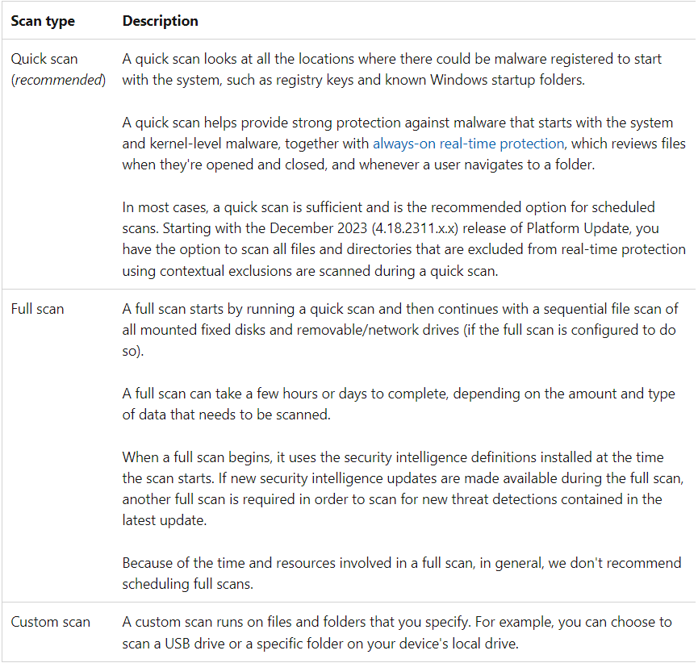

### Extreure reports

Es pot extreure un report complert des de l'Intune:

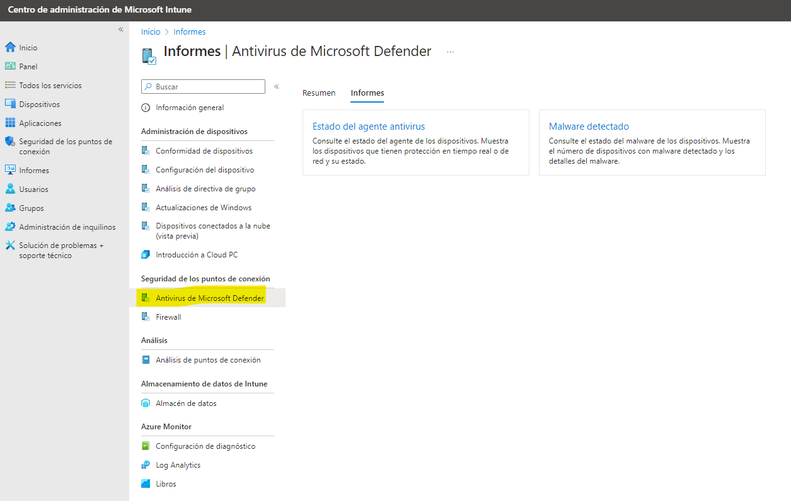

### Protocol d'actuació en esdeveniments de malware.

#### Avisos de l'eina i/o revisió al quadre de comandament

Al dashboard del Microsoft 365 Defender tenim visibilitat dels incidents i alertes identificades: [https://security.microsoft.com/alerts?tid=37a8a0b9-1874-4e5d-b1f5-11040c1c07fc](https://security.microsoft.com/alerts?tid=37a8a0b9-1874-4e5d-b1f5-11040c1c07fc)

#### Categories, origens i estats de les alertes

Les alertes tenen diverses categories

*   evasió de defensa
*   compliance manager
*   command and control
*   accés a credencials
*   descobriment
*   execució
*   vulnerabilitat
*   impacte
*   accés inicial
*   moviment lateral
*   malware
*   persistència
*   activitat sospitosa
*   administració d'amenaces
*   software no desitjat

I també la detecció de les alertes tenen diferents origens:

*   Microsoft Defender for Identity
*   Microsoft Defender for Cloud Apps
*   Microsoft Defender para punt de connexió:
    *   investigació automatitzada
    *   detecció personalitzada
    *   defender XDR
    *   TI personalitzada
    *   TI de tercers
    *   SmartScreen
    *   Antivirus
    *   EDR
*   Microsoft Defender XDR
*   Microsoft Defender per a Office 365
*   Govern d'aplicacions
*   AAD Identity Protection
*   Prevención de pérdida de datos de Microsoft

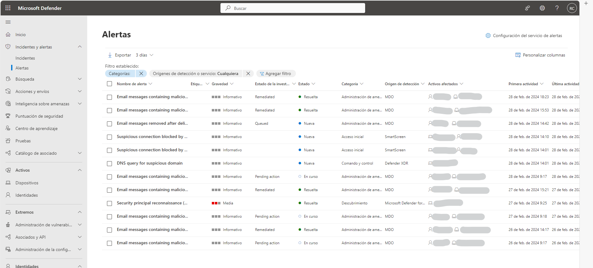

  

Les alertes tenen també tenen Estat per tal de poder ser gestionades, són:

*   Nova
*   En curs
*   Resolta

  

#### Administració de les alertes

Així doncs, un cop identificada una nova alerta no gestionada encara en estat Nova, es selecciona i al detall es pot administrar per poder assignar-la:

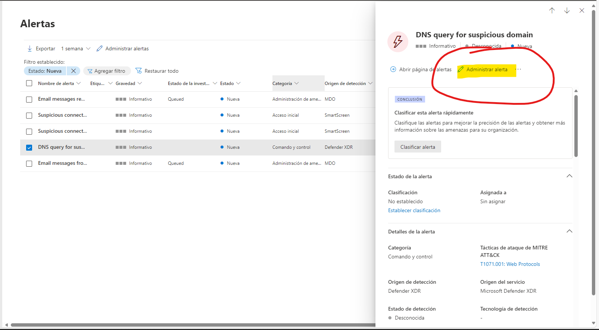

  

#### Assignació del incident

Es canvia l'estat a En curso, s'assigna a un analista, la clasificació es pot canviar si tenim prou informació o potser es modifica després d'analitzar el cas, i a comentaris caldria obrir una tasca al JIRA en categoria "incidents de seguretat":

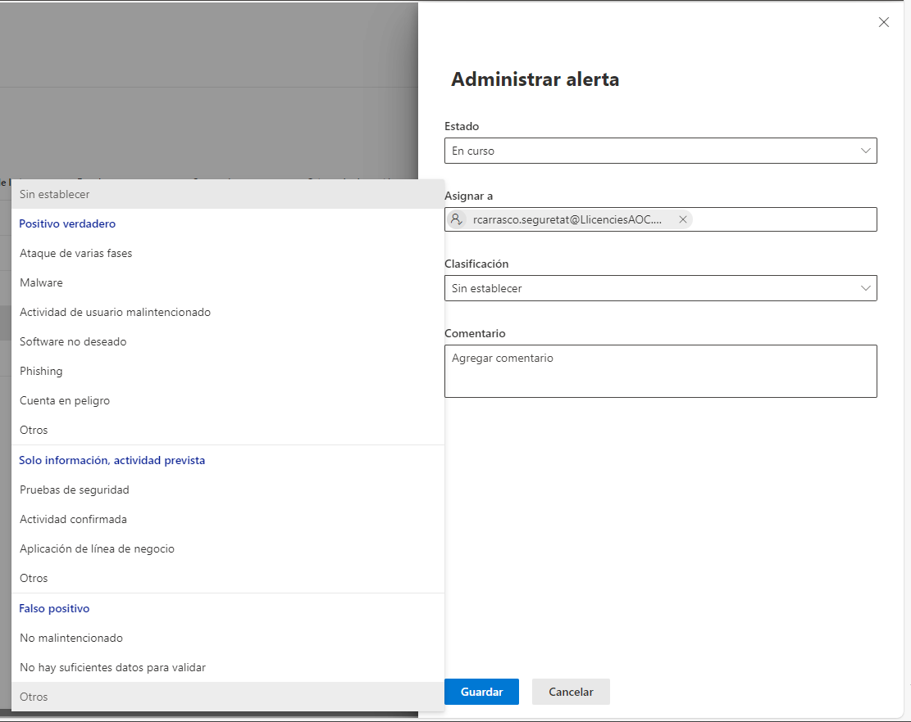 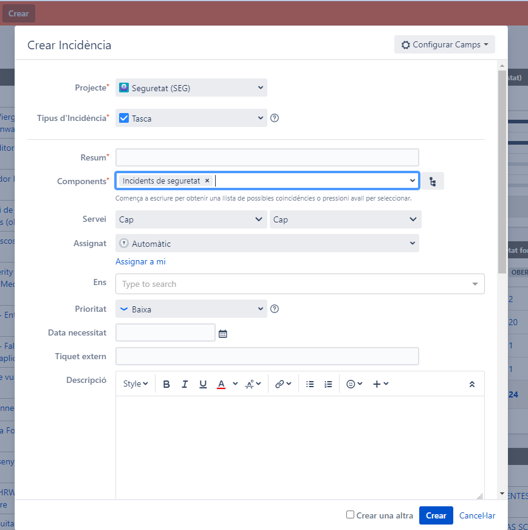

  

#### Cicle de vida dels incidents de seguretat

Fase de detecció.

En la fase de detecció s'ha de valorar la gravetat i impacte de l'incident. S'haurien de tindre en compte diverses consideracions:

*   la gravetat de l'incident i el seu impacte
*   si està relacionada amb altre incident recent del mateix dispostiu i/o usuari (es pot revisar aquí mateix a la consola)
*   si potser també pot estar basat en una campanya actual de malware, phising o similars (caldria consulta diverses fonts internes i externes, com el SOC, el DRP, l'ACC, CCN-CERT, ...)

  

Tractament per incidents de criticitat ALTA

Si la gravetat de l'incident és ALTA, hi ha sospites fundades de que hi ha un atac en execució, ha tingut impacte en algun actiu o informació, o hi ha sospita que l'amenaça continua activa o no es pot determinar l'impacte potencial que pot tenir, s'ha de seguir el procediment de seguretat AOC PROC 01 Incidents de seguretat: [AOC PROC 01 Gestió d'incidents de seguretat - Informació corporativa - Intranet Consorci Administració Oberta de Catalunya](https://intranet.aoc.cat/pages/viewpage.action?pageId=34505424)

*   Es crearà un ERI (Equip de Resposta a Incidents) format per integrants de Manteniment Intern i Seguretat.
*   Es crearà un tiquet a Seguretat o Manteniment Intern per centralitzar la documentació.
*   Es registrarà l'incident en el Registre d'incidents: [INCIDENTS DE SEGURETAT](https://llicenciesaoc.sharepoint.com/:f:/s/CiberseguretatAOC/Epo1cLkGLJ1ZkGNqgDwLFuwBhWsVB9k-IA_bfOwgQwzxag?e=npd04j)
*   Informar al Responsable de Sistemes de Seguretat que és la persona designada per notificar als afectats i autoritats.
*   Es prendran mesures de contenció de la incidència.

  

Fase d'anàlisi

A la fase d'anàlisi caldria tindre en compte:

*   si els events han pogut ser corregits automàticament per Microsoft Defender
*   revisar els components que intervenen, com ara fitxers locals, processos, endpoints i adreces locals i de xarxa privada, i altres endpoints, noms i adreces d'internet incloent les comunicacions i protocols emprats
*   si podem tenir accés als Hash dels fitxers i potser no tenim informació a la consola, sempre caldria comprovar el Hash a eines com Virustotal
*   si podem tindre accés al fitxer i en el cas de que tinguem a disposició una eina de Sandbox, caldria fer la detonació de la mostra per cercar més informació

Fase de tractament

Coordinació amb Manteniment Intern

Si en la fase de tractament o contenció,

*   si l'incident és de nivell ALT: si es prenen decisions que afecten a l'usuari final, com per exemple bloquejar l'equip o l'usuari de domini, sempre que sigui possible **caldrà informar abans** a Manteniment Intern i a l'usuari afectat. Si la criticitat de l'incident és de nivell ALT, la notificació es farà a posteriori.
*   si l'incident no és de nivell alt: abans de prendre accions que afectin a l'usuari s'informarà a manteniment intern i a la usuari.

  

Un cop aplegat tot el recull d'informació, mètriques/telemetria, comportament, històric, i tenim en compte la gravetat del incident i el seu estat (és a dir si no s'ha resolt automàticament), tenim diverses accions a prendre:

*   en tots el casos caldria documentar l'incident al JIRA obert.
*   Si la gravetat de l'incident és ALTA, o es pensa que el dispositiu pot estar compromès, caldria fer la contenció de l'incident aïllant al dispositiu. Si és possible, informar abans a Manteniment Intern i a l'usuari afectat.

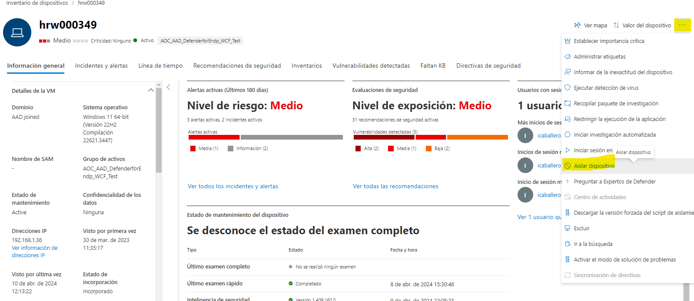

  

  

  

  

  

  

  

  

  

  

  

  

  

  

  

*   Si hi ha sospites de que la identitat de l'usuari pot estar compromesa, fer una revocació de sesions i forçar el canvi de contrasenyes. Aquestes accions s'ha de demanar a Manteniment Intern.
*   revisar si tenim un control com ara un Excel per tindre els casos relacionats.
*   es convenient compartir l'informació amb la resta del equip per ajudar a determinar si potser és un cas aïllat, repetitiu i no identificat, proves de seguretat, un fals positiu o potser no tenim prou informació per prendre una acció.
*   podria donar-se el cas que calgui reportar l'incident a un tercer, com ara alguna agència o ens públic, per ajudar a determinar si potser un correu origen és realment una mostra positiva.
*   també podria valorar-se informar a l'Agència de Ciberseguretat de Catalunya.
*   si el cas és clar que potser cal una eliminació d'algun fitxer resident a dispositiu, caldria notificar el usuari afectat o bé al propietari del dispositiu afectat, informant-li que cal prendre alguna acció com potser eliminar algún fitxer relacionat amb l'incident, com exemple un correu posant en còpia a la bústia de Seguretat i al responsable de sistemes de seguretat:  
    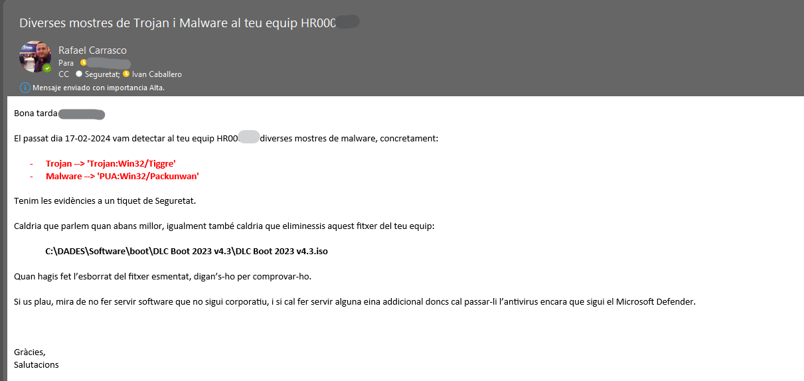

  

En el cas de que per les accions de contenció, l'equip de l'usuari estigui inutilitzable, caldrà demanar a Manteniment Intern que li assigni un equip de substitució.

  

*   un cop feta la possible neteja, caldria executar un anàlisi complert del equip, aixì es fa a la consola a Dispositus, es cerca l'equip involucrat al incident i es planifica un anàlisi complert:  
    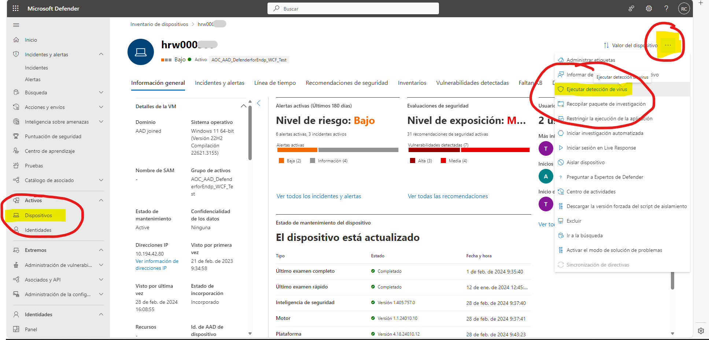  
    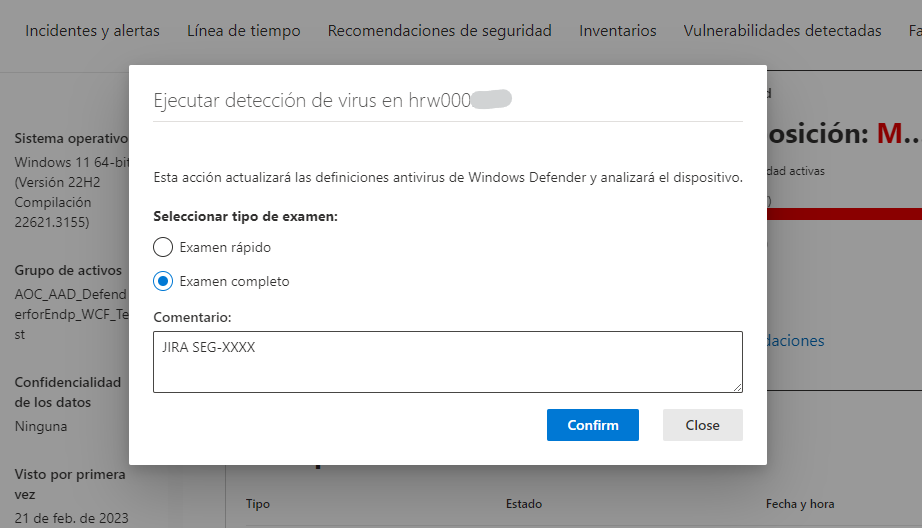

  

  

*   també pot donar-se el cas que es determini que calgui blocar el tràfic a un nom o adreça d'internet, cal anar a la configuració de dispositius a la mateixa consola, deixem un exemple de bloqueig:  
    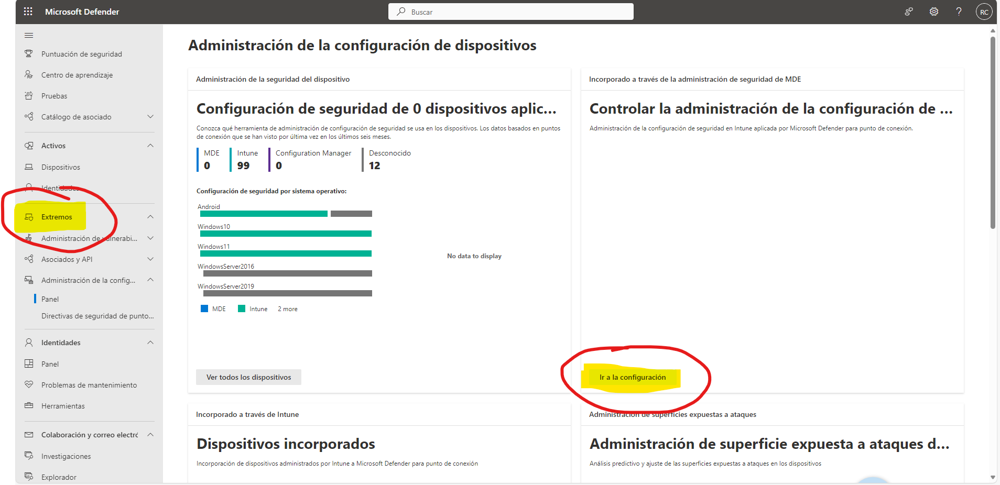  
    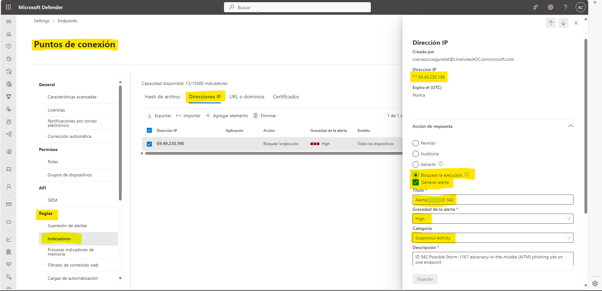

  

Fase de revisió

*   revisar de nou el resultat del anàlisi efectuat al dispositiu per:
    *   si l'incident ha quedat MITIGAT doncs potser tancar l'incident informant al usuari i tancant l'alerta a la consola del Microsoft Defender i al JIRA relacionat
    *   si l'incident no ha quedat MITIGAT o bé han sorgit d'altres alertes relacionades arrel de les troballes del anàlisi del dispositiu, caldrà tornar a aplicar al cicle inicial dels incidents de seguretat (investigació, anàlisi, tractament i revisió).
    *   hi pot haver una variant que potser l'incident no es considera mitigat al 100% però es determina que les tasques fetes arriben a assolir una protecció adequada, en aquest cas estaríem parlant d'ACCEPTACIÖ en l'estat final del incident.

  

Normativa de referència.
------------------------

Aquest procediment haurà d'estar sempre alineat amb el Procediment de Seguretat AOC PROC 01 Gestió d'incidents de seguretat i violacions de seguretat: [AOC PROC 01 Gestió d'incidents de seguretat - Informació corporativa - Intranet Consorci Administració Oberta de Catalunya](https://intranet.aoc.cat/pages/viewpage.action?pageId=34505424)

  

  

  

Attachments:
------------

 [image2024-2-28\_15-19-39.png](attachments/100009548/100009549.png) (image/png)  
 [image2024-2-28\_15-24-29.png](attachments/100009548/100009550.png) (image/png)  
 [image2024-2-28\_15-34-16.png](attachments/100009548/100009552.png) (image/png)  
 [image2024-2-29\_0-22-49.png](attachments/100009548/100009554.png) (image/png)  
 [image2024-2-29\_1-10-27.png](attachments/100009548/100009555.png) (image/png)  
 [image2024-2-29\_1-19-3.png](attachments/100009548/100009556.png) (image/png)  
 [image2024-2-29\_1-19-37.png](attachments/100009548/100009557.png) (image/png)  
 [image2024-2-29\_1-32-41.png](attachments/100009548/100009558.png) (image/png)  
 [image2024-2-29\_1-34-33.png](attachments/100009548/100009559.png) (image/png)  
 [image2024-2-29\_1-39-26.png](attachments/100009548/100009560.png) (image/png)  
 [image2024-2-29\_1-40-40.png](attachments/100009548/100009561.png) (image/png)  
 [image2024-2-29\_2-2-10.png](attachments/100009548/100009564.png) (image/png)  
 [image2024-2-29\_2-5-36.png](attachments/100009548/100009565.png) (image/png)  
 [image2024-2-29\_18-3-22.png](attachments/100009548/100009579.png) (image/png)  
 [image2024-4-10\_12-18-59.png](attachments/100009548/100010076.png) (image/png)  

Document generated by Confluence on 07 junio 2025 00:08

[Atlassian](http://www.atlassian.com/)