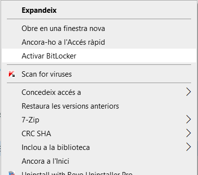
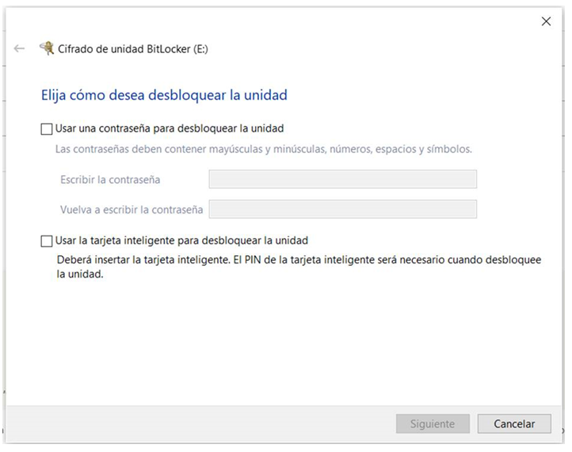
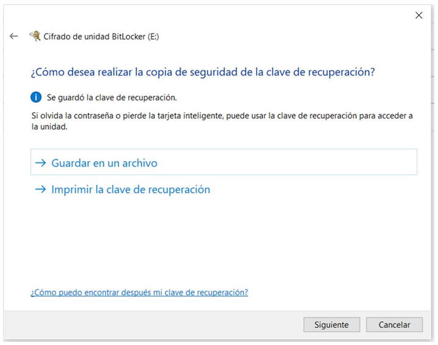
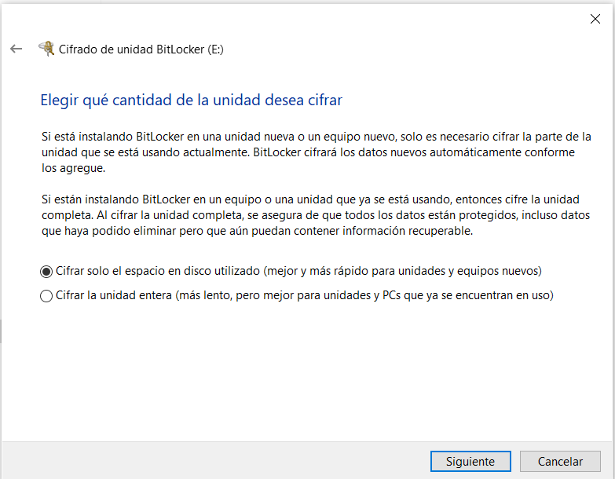
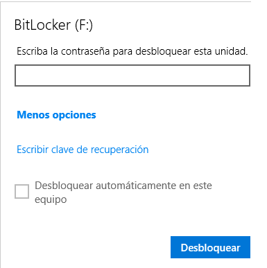

Seguretat : Xifrat de discos externs  

1.  [Seguretat](index.md)
2.  [Pàgina d'inici de la Unitat de Seguretat](15368362.md)
3.  [Projectes Unitat de Seguretat](Projectes-Unitat-de-Seguretat_41517821.md)
4.  [Seguretat en Office 365](Seguretat-en-Office-365_64979340.md)
5.  [Desplegament d' Intune](64979693.md)
6.  [Xifrat de discos](Xifrat-de-discos_64979701.md)

Seguretat : Xifrat de discos externs
====================================

Created by Ivan Caballero, last modified on 28 febrero 2022

El xifrat de discos genera:

*   Una contrasenya per desbloquejar la unitat
*   Un arxiu de recuperació amb una clau per si es perd la contrasenya

Cal guardar els 2 elements de mabnera separada i evitar que es perdin.

Botó dret sobre la unitat:

  

Escollir una opció i guardar la contrasenya en lloc segur.

La clau de recuperació s'ha de guardar i conservar. Properament es guardarà automàticament en Azure.

No deixa guardar en un disc xifrat, per tant no es pot guardar a la C: Es recomana guardar en \\\\endreca, encara que sigui de manera temporal.

  

  

Accés al disc extern
--------------------

L'accés al disc es pot fer des de qualsevol dispositiu fent ús de paraula de pas o el codi de recuperació.

  

  

Attachments:
------------

 [image2022-2-22\_21-48-29.png](attachments/64980320/64980340.png) (image/png)  
 [image2022-2-22\_21-49-2.png](attachments/64980320/64980341.png) (image/png)  
 [image2022-2-25\_10-28-1.png](attachments/64980320/64980439.png) (image/png)  
 [image2022-2-28\_21-43-2.png](attachments/64980320/64980504.png) (image/png)  
 [image2022-2-28\_21-53-2.png](attachments/64980320/64980505.png) (image/png)  

Document generated by Confluence on 07 junio 2025 00:08

[Atlassian](http://www.atlassian.com/)