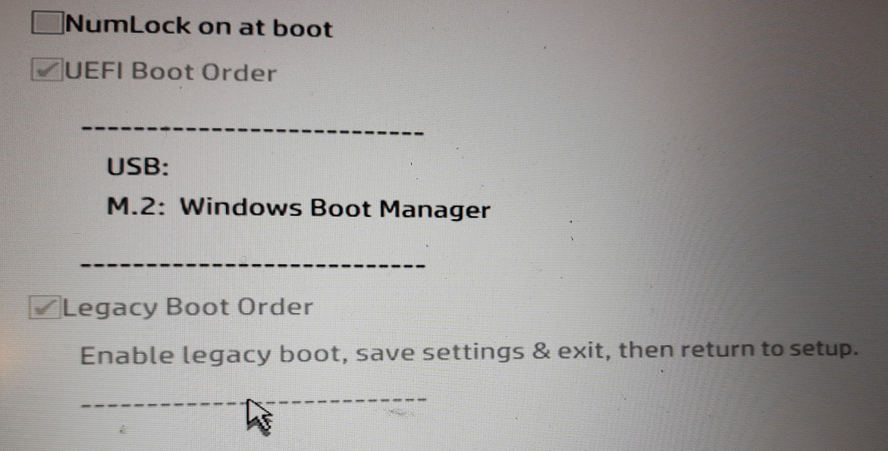
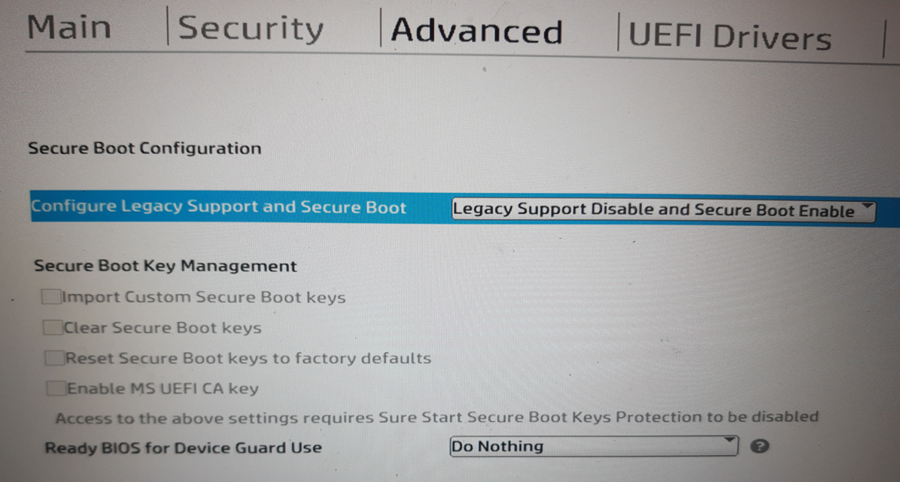
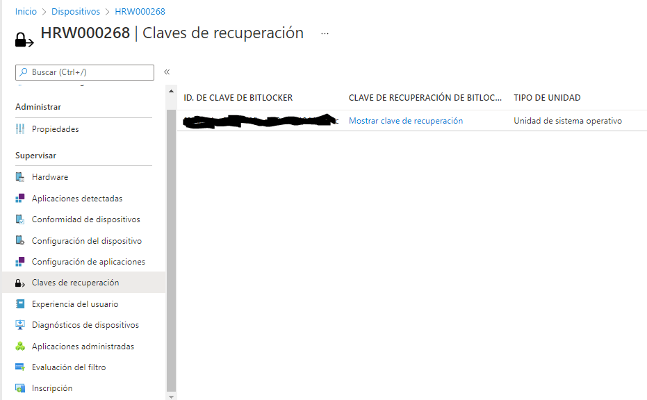

Seguretat : Xifrat de discos  

1.  [Seguretat](index.md)
2.  [Pàgina d'inici de la Unitat de Seguretat](15368362.md)
3.  [Projectes Unitat de Seguretat](Projectes-Unitat-de-Seguretat_41517821.md)
4.  [Seguretat en Office 365](Seguretat-en-Office-365_64979340.md)
5.  [Desplegament d' Intune](64979693.md)

Seguretat : Xifrat de discos
============================

Created by Ivan Caballero, last modified on 17 febrero 2022

Prerequisits
------------

  

  

Xifrat  de màquines

*   TPM: és un xip que porten els PCs per guardar els certificats de xifrat.
*   S'ha de revisar la protecció de BIOS actual per si entra en conflicte
*   Xifrat de discos interns
*   Xifrat de discos externs:

*   Directiva de exigir xifrat
*   Directiva de poder llegir però no escriure (per discos personals)

*   Nosaltres tindrem la clau de desxifrat

  

*   Xifrat de discos SO:

*   Requerir clau a l'inici. És necessari per mantenir la seguretat en cas de robatori. Però es pot habilitar al TPM per a que posi la clau, per tant l'usuari no la posa.
*   Quan un equip no té TPM no s'encipta. Es pot posar un PIN d'inici.
*   L'algoritme de xifrat pot ser XTS (solo windows) CBC (Android, Windows, MAC)

*   Xifrat de discos no SO:

*   Igual que discos SO

*   Discos extraibles:

*   Algoritme CBC per si s'ha de llegir des de Linux
*   Desbloqueo por PIN
*   No permet escriptura en discos no xifrats. Sí la lectura.

Recuperació de clau
-------------------

Per recupera la clau de xifrat d'un equip:

Anar a Intunes - Tots els dispositius: [Dispositivos - Centro de administración de Microsoft Endpoint Manager](https://endpoint.microsoft.com/#blade/Microsoft_Intune_DeviceSettings/DevicesMenu/mDMDevicesPreview)

Cercar la màquina - Claves de recuperación:

  

Attachments:
------------

 [UEFI 1.jpg](attachments/64979701/64979702.jpg) (image/jpeg)  
 [UEFI 2.jpg](attachments/64979701/64979703.jpg) (image/jpeg)  
 [image2022-1-25\_8-41-26.png](attachments/64979701/64979704.png) (image/png)  
 [image2022-1-25\_8-42-6.png](attachments/64979701/64979705.png) (image/png)  
 [image2022-2-17\_12-19-47.png](attachments/64979701/64980276.png) (image/png)  

Document generated by Confluence on 07 junio 2025 00:08

[Atlassian](http://www.atlassian.com/)