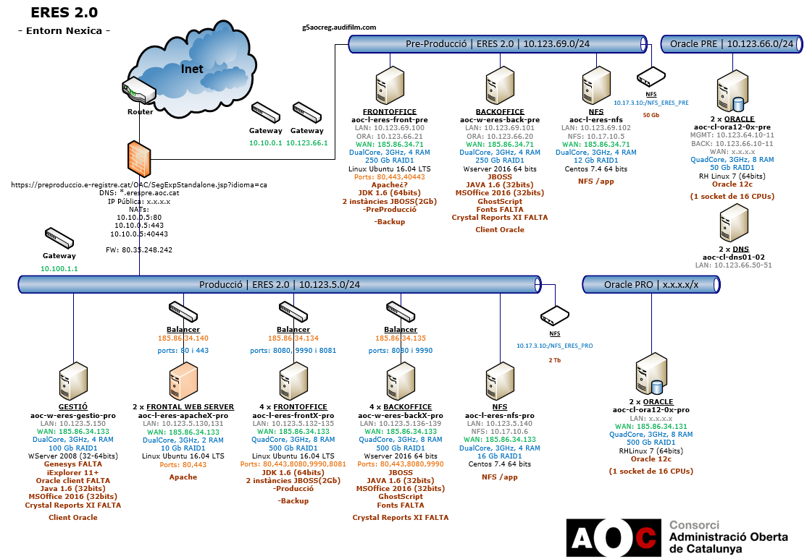

Sistemes : Diagrama de xarxa ERES 2.0 \[Nexica\]  

1.  [Sistemes](index.md)
2.  [Sistemes](Sistemes_13893749.md)
3.  [Arquitectura](Arquitectura_30869606.md)

Sistemes : Diagrama de xarxa ERES 2.0 \[Nexica\]
================================================

Created by Kenneth Capseta, last modified on 14 enero 2020

Attachments:
------------

 [eres.png](attachments/30869628/30869632.png) (image/png)  

Document generated by Confluence on 07 junio 2025 00:13

[Atlassian](http://www.atlassian.com/)